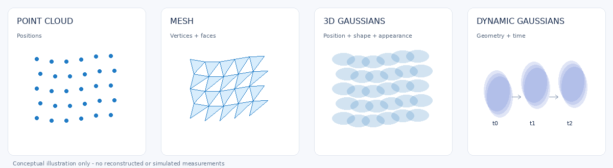
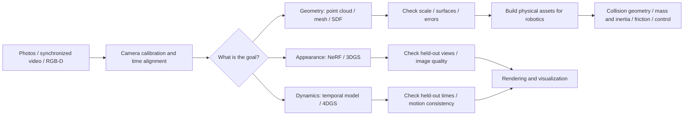
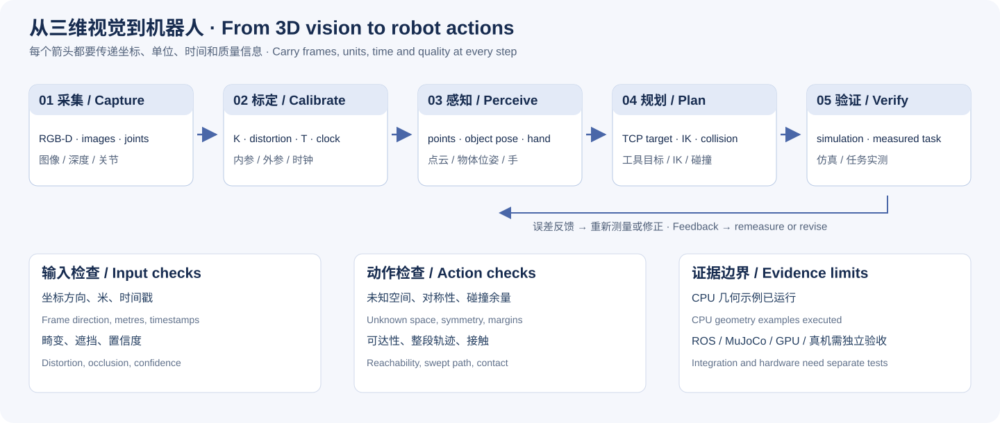

# 3D Vision · Zero to Hero

[简体中文](README.md) | **English**

From an image to a 3D scene: understand representations, choose tools, follow the workflow, and know what your results demonstrate.

> A complete Chinese and English introduction and practical handbook for readers with an engineering background who are new to 3D vision and robot perception.
> Documentation checked on 2026-10-03. Software changes; use the documentation and `--help` for your selected version.



## Where to start

| Your question | Start here | What you should be able to explain or check |
|---|---|---|
| What are point clouds, Gaussians, and meshes? | [01 Foundations](docs/en/01_foundations.md) | How coordinates, cameras, depth, representations, and files relate |
| How does a depth image become a model? | [02 Point clouds and meshes](docs/en/02_pointcloud_mesh.md) | Unprojection, cleaning, registration, surface reconstruction, and errors |
| How does MANO generate a hand? | [03 Hand models](docs/en/03_mano_hand.md) | Parameters, joints, vertices, 21-point conventions, fitting, and licensing |
| How are NeRF and 3DGS trained? | [04 Neural reconstruction and 3DGS](docs/en/04_nerf_3dgs.md) | Representations, rendering, losses, gradients, and training versus display |
| What if the scene moves? | [05 4DGS](docs/en/05_4dgs.md) | Time, deformation, synchronized capture, and dynamic reconstruction limits |
| What should I install, and in what order? | [06 Complete workflows](docs/en/06_workflows.md) | Inputs, tools, outputs, and checks from capture through export |
| Why does a command fail or a model look wrong? | [07 Troubleshooting and acceptance](docs/en/07_troubleshooting.md) | Hardware, dependencies, coordinates, scale, cameras, and training |
| How does a camera point become a robot-frame point? | [08 Frames, time, and calibration](docs/en/08_robot_frames_calibration.md) | Intrinsics, extrinsics, optical frames, transform direction, hand-eye calibration, and independent checks |
| How do point clouds and hand models support grasping and retargeting? | [09 From perception to action](docs/en/09_robot_perception_action.md) | Object poses, tool frames, collision geometry, MANO retargeting, and error evaluation |
| How do I connect ROS 2 and MuJoCo? | [10 Software integration](docs/en/10_ros2_mujoco.md) | Timestamped data, tf2, visual and collision assets, and simulation/hardware validation boundaries |
| What does a technical term mean? | [Glossary](docs/en/glossary.md) | Chinese/English concepts and distinctions that are easy to miss |

## One complete route



Not every task passes through every representation. A depth camera can provide a point cloud directly; a known parametric hand model can generate a mesh directly; Gaussian rendering does not require a usable physical mesh first.

## Start with three exercises that need no GPU

Use Python 3.9+ from the repository root. Only the standard library is required; no models or datasets are downloaded.

```bash
python3 examples/rigid_transform_demo.py
python3 examples/depth_to_robot_demo.py
python3 examples/grasp_pose_demo.py
python3 -m unittest discover -s examples -p 'test_*.py' -v
```

Practice coordinate transforms, depth unprojection into a robot base frame, and the object-to-tool-to-flange pose chain. Inputs are explicit synthetic numbers, and outputs can be compared with analytical answers. See the [example guide](examples/README.en.md) for commands, expected outputs, and optional PLY export. These exercises verify geometry calculations. See the [validation record](VALIDATION.en.md) for the status of ROS 2, MuJoCo, GPU, and real-robot workflows.

## From vision to robotics



Start with Chapter 08 to specify each observation's frame, units, and acquisition time. Continue with Chapter 09 to construct pose or retargeting targets and check errors, reachability, and collisions. Then use Chapter 10 to connect ROS 2 data streams and MuJoCo assets. Each chapter defines inputs, outputs, minimum examples, common mistakes, and further exercises.

## Learning path

### Zero: explain the concepts

- Distinguish software, algorithms, model representations, and file formats.
- Draw the transform from a camera frame into a world frame.
- Explain why 3D position, depth, surface shape, and contact force are different kinds of information.

### Builder: run a workflow and check it

- Complete a depth-unprojection exercise with unit checks.
- Complete a point-cloud-to-mesh exercise and check normals and surface error.
- Run a static reconstruction workflow on compatible hardware and save versions, commands, and outputs.
- Separate training inputs from held-out evaluation and explain failures instead of selecting only attractive screenshots.

### Practitioner: produce defensible results

- Design calibration, synchronization, and quality checks for your capture setup.
- Choose a method for a dynamic scene and explain the limits of monocular data, multiple views, and occlusion.
- Validate visualization assets separately from robot collision and dynamics assets.
- Provide reproducible inputs, versions, settings, outputs, and limitations.
- Explain the interfaces between visual targets, motion planning, control, and contact validation.

## What each tool does

| Tool | Typical responsibility | Do not mistake it for |
|---|---|---|
| Open3D | Point-cloud, mesh, and geometry-processing scripts | Ground truth for every occluded surface |
| CloudCompare / MeshLab | Point-cloud comparison, cleaning, and mesh processing | Neural-network training frameworks |
| COLMAP | Camera-pose estimation and SfM/MVS | A universal solution for arbitrary moving hands |
| Blender | Viewing, editing, and rendering 3D assets | An instrument that measures true contact forces |
| MANO + a compatible decoder | Parametric human-hand geometry | A point-cloud format or tactile sensor |
| Official 3DGS / Nerfstudio Splatfacto | Static Gaussian reconstruction and rendering | CUDA training programs that run on every Mac |
| 4DGS research implementations | Particular dynamic reconstruction methods | One standard or one universal application |
| MuJoCo | Physics simulation with specified models and parameters | Automatic identification of all physical properties from photographs |
| OpenCV / ROS 2 tf2 / MoveIt 2 | Calibration, timestamped coordinate transforms, and motion planning | A guarantee of a safe grasp from one pose |

See the chapters for installation details, official sources, and hardware limits. Keep historical CUDA environments from different projects separate.

## Acceptance checks matter more than screenshots

- **Visual quality:** does it remain plausible at views/times excluded from training?
- **Geometric quality:** are scale, coordinates, occlusions, normals, and surface distances trustworthy?
- **Dynamic quality:** are time alignment, trajectories, and deformation consistent?
- **Physical quality:** have collision, inertia, friction, and contact been independently validated?

Looking realistic answers only part of the question. Real-time rendering does not establish real-time reconstruction, training, or robot control.

## Evidence and execution status

The handbook distinguishes three states:

- **Documentation checked:** based on the linked official papers, code, or documentation.
- **Example code:** educational material; without an explicit execution record, it has not been established as executed.
- **Executed:** requires environment versions, commands, inputs, outputs, and acceptance results.

This version runs the standard-library CPU geometry examples and their tests. GPU reconstruction, ROS 2, MuJoCo, and hardware workflows remain documentation or syntax checks; end-to-end integration has not been tested. All figures are original conceptual illustrations, not scans or training outputs. See the [validation record](VALIDATION.en.md) for environments, commands, and scope.

## Contributing

Corrections, compatibility reports, and reproducible cases are welcome through Issues and Pull Requests. Include the OS, GPU, software versions, minimum steps, and expected and actual results. Do not submit passwords, keys, private photographs, or restricted models.

Third-party software, models, and data retain their own licenses. This repository does not distribute MANO models, restricted datasets, or full papers. Use the linked official sources and check the terms for your intended use.
