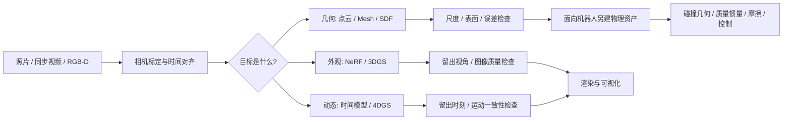

# 3D Vision · Zero to Hero

**简体中文** | [English](README.en.md)

从一张图像到三维场景：理解表示，选对工具，跑通流程，知道结果能证明什么。

> 完整中英文入门与实践手册。适合有工程背景、刚接触三维视觉与机器人感知的读者。
> 文档核查日期：2026-10-03。软件持续变化，具体命令以对应版本和 `--help` 为准。


## 从哪里开始

| 你想解决的问题 | 阅读入口 | 完成后应能解释或检查 |
|---|---|---|
| 点云、高斯、mesh 到底是什么？ | [01 基础](docs/01_foundations.md) | 坐标、相机、深度、表示和文件之间的关系 |
| 深度图怎样变成模型？ | [02 点云与网格](docs/02_pointcloud_mesh.md) | 反投影、清洗、配准、表面重建和误差 |
| MANO 怎样变出一只手？ | [03 手部模型](docs/03_mano_hand.md) | 参数、关节、顶点、21点约定、拟合与许可 |
| NeRF、3DGS 怎样训练？ | [04 神经重建与3DGS](docs/04_nerf_3dgs.md) | 表示、渲染、loss、梯度和训练/显示的区别 |
| 场景动起来怎么办？ | [05 4DGS](docs/05_4dgs.md) | 时间、变形、同步拍摄与动态重建的局限 |
| 应该装什么，按什么顺序运行？ | [06 完整工作流](docs/06_workflows.md) | 从采集到导出，每步输入、工具、产物和检查 |
| 为什么运行失败或模型看起来不对？ | [07 排错与验收](docs/07_troubleshooting.md) | 硬件、依赖、坐标、尺度、相机、训练问题 |
| 相机里的点怎样变成机器人坐标？ | [08 坐标、时间与标定](docs/08_robot_frames_calibration.md) | 内外参、光学坐标、变换方向、手眼标定与独立检查 |
| 点云、手模型怎样参与抓取与重定向？ | [09 从感知到动作](docs/09_robot_perception_action.md) | 物体位姿、工具坐标、碰撞几何、MANO重定向与误差评测 |
| 怎样接到 ROS 2 和 MuJoCo？ | [10 软件接入](docs/10_ros2_mujoco.md) | 带时间戳的数据、tf2、视觉与碰撞资产、仿真与实机验收边界 |
| 专业词是什么意思？ | [术语表](docs/glossary.md) | 中英文概念与容易混淆的边界 |

## 一条完整路线



不是所有任务都要经过所有表示。深度相机可以直接提供点云；已知参数化手模型可以直接生成 mesh；高斯渲染也不要求先得到可用的物理网格。

## 先跑三个不需要 GPU 的练习

在仓库根目录使用 Python 3.9+；只需要标准库，不下载模型或数据。

```bash
python3 examples/rigid_transform_demo.py
python3 examples/depth_to_robot_demo.py
python3 examples/grasp_pose_demo.py
python3 -m unittest discover -s examples -p 'test_*.py' -v
```

依次练习坐标变换、深度反投影到机器人基座、物体到工具与法兰的位姿链。输入都是明确给定的合成数值，输出可与解析答案比较。运行方法、预期输出与可选 PLY 导出见 [示例说明](examples/README.md)。这些练习验证几何运算；ROS 2、MuJoCo、GPU 和真实机器人的运行状态见 [验证记录](VALIDATION.md)。

## 从视觉到机器人


先读第 08 章，把每份观测的坐标系、单位和采集时间说明白；再读第 09 章，构造位姿或重定向目标并检查误差、可达性与碰撞；最后按第 10 章接入 ROS 2 数据流和 MuJoCo 资产。每一章都给出输入、输出、最小示例、常见错误与进一步练习。

## 学习路径

### Zero：能说清楚
- 区分软件、算法、模型表示和文件格式
- 能画出相机坐标到世界坐标的变换
- 知道三维位置、深度、表面和接触力不是同一类信息

### Builder：能跑通并检查
- 完成一个带单位检查的深度反投影练习
- 完成一个点云→mesh小练习，检查法向和表面误差
- 在相容硬件上跑一个静态重建流程，保存版本、命令和产物
- 将训练输入与留出评估分开，解释失败而非只挑好看的截图

### Practitioner：能做出可信结果
- 为自己的采集方案设计标定、同步和质量检查
- 为动态场景选择方法，说明单目、多视角和遮挡的限制
- 把可视化资产与机器人碰撞/动力学资产分开验收
- 给别人一份可复查的输入、版本、配置、输出与局限说明
- 解释视觉目标、运动规划、控制和接触验证之间的接口

## 工具各自负责什么

| 工具 | 典型职责 | 不应误认为 |
|---|---|---|
| Open3D | 点云、网格与几何处理脚本 | 自动恢复所有遮挡表面的真值工具 |
| CloudCompare / MeshLab | 点云比较、清理及网格处理 | 神经网络训练框架 |
| COLMAP | 相机位姿估计、SfM/MVS | 动态手部的通用无条件解法 |
| Blender | 查看、编辑、渲染三维资产 | 自动提供真实接触力的测量仪器 |
| MANO + 对应解码库 | 参数化人手几何 | 点云文件格式或触觉传感器 |
| 官方3DGS / Nerfstudio Splatfacto | 静态高斯重建与渲染 | 可直接在所有Mac上运行的CUDA训练程序 |
| 4DGS研究实现 | 特定动态场景重建方案 | 一个统一标准、一个通用软件 |
| MuJoCo | 给定模型与参数下的物理仿真 | 从照片自动辨识所有物理参数的工具 |
| OpenCV / ROS 2 tf2 / MoveIt 2 | 标定、带时间戳的坐标转换、运动规划 | 从一个位姿直接保证安全抓取的工具 |

详细安装、官方来源与硬件限制见各章。不要将不同项目的历史CUDA环境混装到一个环境中。

## 验收比截图重要

- **视觉质量**：在未参与训练的视角/时刻是否仍然合理？
- **几何质量**：尺度、坐标、遮挡区域、法向、表面距离是否可信？
- **动态质量**：时间对齐、轨迹一致性和形变是否合理？
- **物理质量**：碰撞、惯量、摩擦与接触是否经过独立验证？

“看起来真实”只回答了其中一部分。实时渲染也不代表实时重建、实时训练或实时机器人控制。

## 证据与运行状态

本手册区分三种状态：

- **文档核查**：依据链接中的官方论文、代码或文档整理
- **示例代码**：教学用途；未明确给出运行记录时，不代表已经实跑
- **实测**：必须同时给出环境版本、命令、输入、输出与验收结果

本版本运行了标准库 CPU 几何示例与对应测试；GPU重建、ROS 2、MuJoCo及真机流程仍为文档核查或语法检查，不宣称已经完成集成测试。图示均为自制概念示意，不是扫描或训练结果。详细环境、命令与检查范围见 [验证记录](VALIDATION.md)。

## 参与完善

欢迎通过 Issue 或 Pull Request 提交纠错、兼容性记录与可复现案例。请说明操作系统、GPU、软件版本、最小步骤、预期与实际结果；不要提交密码、密钥、私人图片或受限模型。

第三方软件、模型与数据分别遵循各自许可。本仓库不分发 MANO 模型、受限数据集或论文全文；下载请使用文中官方入口并核对用途。
