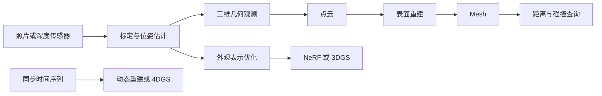

# 01 从机械直觉理解三维视觉

**简体中文** | [English](en/01_foundations.md)

[返回学习入口](../README.md) · 下一章：[点云与 Mesh](02_pointcloud_mesh.md) · [术语速查](glossary.md)

**目标**：能说清一个三维文件记录了什么，能把一个深度像素变成三维点，能检查单位和坐标有没有弄反。暂时不需要神经网络，也不需要 GPU。

**核验日期：2026-10-03。** 本章是公开教学资料。数值例子是人为构造的教学输入，不是扫描测量结果；示例未在读者机器运行。软件行为以文末注明的版本及官方资料为边界。

## 1 先把六个问题分开

拿到一个物体的照片，至少可以提出六种不同问题：

| 问题 | 需要的结果 | 常用表示或方法 |
|---|---|---|
| 表面在哪里？ | 一批三维位置 | 深度图、点云 |
| 表面如何连续连接？ | 顶点与面 | 三角网格 Mesh |
| 空间中的位置在物体内还是外？ | 内外关系与距离 | SDF、占据场 |
| 手指怎么弯、手型如何变化？ | 可控的手部几何 | MANO |
| 换一个相机位置会看到什么？ | 新视角图像 | NeRF、3D Gaussian Splatting |
| 场景随时间怎么变？ | 时变几何或时变外观 | 动态 Mesh、4D 表示、4DGS |

**表示**是保存对象的方式，**算法**是得到或处理它的方法，**软件**是运行算法的工具。点云是表示，ICP 是配准算法，CloudCompare 是可以执行配准的软件。三者不能混为一谈。



这张图是概念关系图，不是每个任务必须走完的唯一流水线。已有 CAD Mesh 可以直接渲染或计算距离；3DGS 也不要求先生成高质量 Mesh。

## 2 点云 Mesh SDF 到底差在哪里

### 2.1 点云是表面上的样本

把三坐标测量机测到的位置写成一张表，每行是一个点：

```text
x       y       z       [可选：r g b、nx ny nz、时间、置信度]
0.010   0.020   0.300
0.011   0.020   0.301
...
```

数学上可以记为 $P=\{\mathbf p_i\}_{i=1}^{N}$，每个 $\mathbf p_i\in\mathbb R^3$。这些点通常采样了可见表面，不自动代表实体内部。邻近两点之间是否有真实表面，需要另作判断；一个洞既可能是真孔，也可能是漏扫。

### 2.2 Mesh 在点之间增加连接关系

三角 Mesh 通常保存两个数组：

- `vertices`：`N × 3` 浮点坐标
- `faces`：`M × 3` 整数索引，例如 `[0, 3, 8]` 表示第 0、3、8 个顶点构成一个三角形

再加上法线、颜色、UV 或材质，就能用于展示。法线表示表面朝向；UV 把三维表面对应到二维纹理。Mesh 可以是开口的壳，也可以围成封闭表面。只有三角形不等于实体有效，更不等于 CAD 的尺寸、公差、曲面类型或装配约束都保留了。

**机械类比**：CAD 中的精确圆柱曲面离散成 Mesh 后是有限多个平面片；减小三角形能减小离散误差，但无法补回原本未测到的细节。[Open3D Mesh 教程](https://www.open3d.org/docs/0.19.0/tutorial/geometry/mesh.html)

### 2.3 SDF 保存到表面的有符号距离

本教程约定：物体外部为正、内部为负、表面为零。对封闭表面 $\partial\Omega$：

$$
\phi(\mathbf x)=
\begin{cases}
+d(\mathbf x,\partial\Omega),&\mathbf x\text{ 在外部}\\\\
-d(\mathbf x,\partial\Omega),&\mathbf x\text{ 在内部}
\end{cases}
$$

不同软件可能采用相反符号，读取时必须核对。SDF 可以存在体素网格里，也可以由神经网络计算；“隐式”不自动表示“深度学习”。占据场只回答内外或概率，未必提供实际距离。TSDF 将距离截断在表面附近，适合融合多帧深度观测。

对开口、相互穿插或不封闭的 Mesh，内外符号可能没有可靠定义。做碰撞或接触查询前先检查 Mesh；无符号距离本身不能告诉你是否穿透。[Open3D 距离查询及其假设](https://www.open3d.org/docs/0.19.0/tutorial/geometry/distance_queries.html)

### 2.4 SfM 和 MVS 是过程

- **SfM，Structure from Motion**：从重叠图像里的匹配特征，联合估计相机位置与少量三维特征点，常见结果是相机参数加稀疏点云
- **MVS，Multi-View Stereo**：利用多个已知或已估计位姿的视角恢复更密集的表面观测，常以深度图或稠密点云作为中间/最终结果
- **表面重建**：再由点、法线或体数据得到 Mesh

没有尺度参照的普通单目 SfM 存在全局尺度不确定性：把整个场景和相机平移量同时放大，投影图像仍然相同。要测毫米，需加入已知尺寸、已知基线或其他尺度信息，不能直接把重建坐标当成米。[COLMAP 流程](https://colmap.github.io/tutorial.html)、[COLMAP 模型对齐说明](https://colmap.github.io/faq.html)

## 3 坐标系和单位是第一张质检单

### 3.1 一个点要带上“在哪个坐标系里”

常见坐标系：世界 `W`、相机 `C`、物体 `O`、手部根节点 `H`、机器人基座 `B`。同一个物理点在不同坐标系有不同数字。本文采用列向量，并写：

$$
\mathbf p_A = R_{A\leftarrow B}\mathbf p_B+\mathbf t_{A\leftarrow B}
$$

读作“将 B 坐标下的点变到 A 坐标下”。对应齐次矩阵：

$$
T_{A\leftarrow B}=\begin{bmatrix}R&\mathbf t\\\\0&1\end{bmatrix},\qquad
\begin{bmatrix}\mathbf p_A\\\\1\end{bmatrix}=T_{A\leftarrow B}\begin{bmatrix}\mathbf p_B\\\\1\end{bmatrix}
$$

连续变换时：$T_{A\leftarrow C}=T_{A\leftarrow B}T_{B\leftarrow C}$。从右向左作用；反向变换用逆矩阵，不是简单把平移取负：

$$
T^{-1}=\begin{bmatrix}R^\top&-R^\top\mathbf t\\\\0&1\end{bmatrix}
$$

这里假设 $R$ 是旋转矩阵，即 $R^\top R=I$、$\det(R)=1$。若矩阵里含缩放或镜像，需要另外处理。

### 3.2 一个实用约定

本章相机坐标采用 $x$ 向图像右、$y$ 向图像下、$z$ 朝相机前方；图像坐标 $(u,v)$ 为列、行。这个约定与 COLMAP 相机坐标相符，和某些图形学相机约定不同。COLMAP 导出的位姿是 **world-to-camera**，相机中心为 $\mathbf C_W=-R^\top\mathbf t$；平移向量 `t` 不能直接当相机世界位置。[COLMAP 输出格式](https://colmap.github.io/format.html)

记录旋转时还要写清：轴角还是欧拉角？弧度还是角度？欧拉角顺序？四元数是 `wxyz` 还是 `xyzw`？四元数是否已归一化？

### 3.3 每份数据最少附这些信息

```text
length_unit: m
angle_unit: rad
point_frame: camera_0
camera_axes: x_right_y_down_z_forward
transform_name: T_world_from_camera
transform_direction: camera_to_world
vector_convention: column
image_size: width, height
pixel_center_convention: 明确说明
camera_model: 针孔/鱼眼等具体模型
intrinsics_and_distortion: 对应当前分辨率
color_depth_alignment: 是否配准；在哪个像素网格
```

这是一份教学元数据清单，不是通用软件标准。给文件起名叫 `meters.ply` 不能替代校验：用尺量一个已知长度，与文件中的对应长度比较。显示软件自动缩放视图后，毫米和米的模型看起来可能完全一样。

## 4 相机如何把三维点变成像素

### 4.1 先理解针孔投影

相机前方的点越远，在图像里越小。先把世界点变到相机坐标 $(X_C,Y_C,Z_C)$，再除以深度：

$$
u=f_x\frac{X_C}{Z_C}+c_x,\qquad
v=f_y\frac{Y_C}{Z_C}+c_y
$$

$u$ 是水平像素坐标，$v$ 是垂直像素坐标。$f_x,f_y$ 是以像素计的焦距；$c_x,c_y$ 是主点。无偏斜的内参矩阵为：

$$K=\begin{bmatrix}f_x&0&c_x\\\\0&f_y&c_y\\\\0&0&1\end{bmatrix}$$

组合写为 $Z_C[u,v,1]^\top=K[R\mid\mathbf t][X_W,Y_W,Z_W,1]^\top$。**内参**管“这台相机怎么投影”，**外参**管“它相对世界在哪”。只知道内参，不能获得世界坐标。

### 4.2 畸变不能用挪动相机来补偿

真实镜头存在径向畸变、切向畸变等。针孔公式应使用去畸变后的坐标，或配合所选相机模型的畸变函数。鱼眼模型不能默认套用普通针孔的系数。OpenCV 的 `calibrateCamera`、`undistort`、`projectPoints` 对应不同环节，不是同一个动作。[OpenCV 相机标定与投影模型](https://docs.opencv.org/4.13.0/d9/d0c/group__calib3d.html)

**缩放/裁剪图像后要同步更新内参**。例如只把宽高各缩为原来的一半，焦距和主点坐标也要按所用像素坐标约定变换；若先裁掉左侧 $a$ 列和顶部 $b$ 行，主点要相应减去 $(a,b)$。严格实现还需考虑像素中心约定，不能把不同库的采样约定混在一起。

### 4.3 标定的最小流程

1. 固定采集分辨率、焦距及对焦设置；打印并测量标定板实际格长
2. 在多个位置、方向和距离拍摄，覆盖画面边缘；保留清晰图，避免都正对相机
3. 提取标定点，估计内参和畸变；保存模型名称、单位、图像尺寸
4. 看每张图的重投影误差和误差分布，查边缘是否系统性偏差
5. 用未参与标定的图或已知尺寸做独立检查
6. RGB 与深度来自不同相机时，另外标定二者的相对位姿；动态场景还需同步时间

低平均重投影误差只是检查之一，不能单凭一个数字宣告空间测量达到毫米精度。[OpenCV 标定教程](https://docs.opencv.org/4.x/dc/dbb/tutorial_py_calibration.html)

## 5 深度不是任何意义上的距离

### 5.1 轴向深度与射线距离

针孔反投影里，**轴向深度** $z$ 是点沿相机 $Z$ 轴的坐标。**射线距离** $r$ 是相机光心到该点的直线长度，两者只有在光轴上才相等。

设去畸变后的归一化坐标 $x_n=(u-c_x)/f_x$、$y_n=(v-c_y)/f_y$：

$$
\mathbf p_C=z[x_n,y_n,1]^\top,\quad
r=z\sqrt{1+x_n^2+y_n^2}
$$

如果传感器给的是 $r$，应先算 $z=r/\sqrt{1+x_n^2+y_n^2}$。不同设备/文件的 `depth` 命名不能替代格式说明；视差、逆深度、归一化灰度深度也不能直接带入米制公式。

### 5.2 RGB-D 反投影

设原始深度为 `d`，每米对应 `s` 个存储单位，则：

$$
z=d/s,\qquad X_C=(u-c_x)z/f_x,\qquad Y_C=(v-c_y)z/f_y
$$

若 `d=1000` 表示 1 米，则 `s=1000`；若输入浮点数已经是米，则 `s=1`。Open3D 0.19.0 的 `create_from_depth_image` 明确使用该关系。[Open3D PointCloud API](https://www.open3d.org/docs/0.19.0/python_api/open3d.geometry.PointCloud.html#open3d.geometry.PointCloud.create_from_depth_image)

上色前必须确保 RGB 像素确实对应这个深度点。相同宽高不等于已配准；有 RGB-D 外参时，需要把点变到彩色相机坐标，再投影取色，并处理遮挡。多帧点云拼接前还需把各帧都变到共同坐标系。

## 6 小练习 A 手算再生成九个点

**输入**：教学相机 `fx=fy=100 px`、`cx=cy=1 px`，3×3 像素，所有轴向深度 `d=1000`，`depth_scale=1000`。这里整数像素坐标表示像素中心，无畸变、无额外外参。

**输出**：一个九点、无三角面的 ASCII PLY。只用 Python 标准库；不安装依赖，不下载数据。

### 步骤

1. 先手算中心像素 `(1,1)`：点应为 `(0,0,1)` 米
2. 手算右侧像素 `(2,1)`：点应为 `(0.01,0,1)` 米
3. 将下方原创教学代码保存为 `backproject_nine_points.py`，在独立练习文件夹中运行 `python backproject_nine_points.py`
4. 用 CloudCompare 或 MeshLab 打开生成文件，转动视角，检查它是平面上九个点

```python
from pathlib import Path
from math import sqrt

fx = fy = 100.0
cx = cy = 1.0
scale = 1000.0
points = []
for v in range(3):
    for u in range(3):
        z = 1000.0 / scale
        points.append(((u - cx) * z / fx, (v - cy) * z / fy, z))

assert points[4] == (0.0, 0.0, 1.0)
assert abs(points[5][0] - 0.01) < 1e-12
assert len(points) == 9
out = Path("nine_points_m.ply")
# x 模式：已有同名文件时停止，避免覆盖原始数据
with out.open("x", encoding="ascii") as f:
    f.write("ply\nformat ascii 1.0\ncomment length_unit_m\n")
    f.write("element vertex 9\nproperty float x\nproperty float y\n")
    f.write("property float z\nend_header\n")
    for p in points:
        f.write("%.8f %.8f %.8f\n" % p)
print("points:", len(points), "center:", points[4])
print("off-axis range:", sqrt(sum(a * a for a in points[5])))
```

**成功检查**：九个点，全部 `z=1`，`x/y` 只可能是 `-0.01、0、0.01`，边界宽高各 0.02 米；右侧点到光心距离略大于 1 米。数值是公式推导的预期，不是用户实验记录。本教程编写时已在独立临时环境运行该标准库例程并核对九点坐标及0.02米边界；未在读者机器运行，也未验证GUI显示。PLY 的点/面分离可参看 [Stanford PLY 工具说明](https://graphics.stanford.edu/software/vrip/plyusage.html)。

**故障排查**：看不到点时先重置相机/适配视图和增大点尺寸。这里本来没有面，导入 Mesh 工具后看不到实体表面是合理的。不要对九个点运行 Poisson，练习目的只是验证投影关系。

## 7 文件后缀没有告诉你的事

| 文件 | 常用内容 | 必查项目 |
|---|---|---|
| `.ply` | 点属性；也可含面及自定义属性 | header 是否有 `face`；属性名、数据类型、单位；普通点云与高斯参数不可混用 |
| `.obj` | 顶点、面、法线、UV；可引用 `.mtl` | 是否确实含面；索引规则；材质/纹理是否一起保存；轴与尺度 |
| `.stl` | 三角形表面 | 单位需要外部约定；通常不保留标准纹理/材质和装配语义；是否封闭 |
| `.npz` | 多个具名 NumPy 数组 | 每个 key 的含义、shape、dtype；坐标系、单位、关节顺序、时间；它不是专属 MANO 格式 |
| `.blend` | Blender 场景工程 | 外链资源、场景单位、版本、相机/灯光/对象变换 |

将 `.ply` 改名为 `.obj` 不会转换内容。一个 3DGS PLY 可能包含 `opacity`、`scale_*`、`rot_*`、`f_dc_*` 等训练参数，但具体字段、激活函数和约定依实现而定；普通点云查看器即使能读出 `x/y/z`，也没有因此正确渲染高斯。[NeRF 与 3DGS](04_nerf_3dgs.md)

NumPy 数组包可用 `np.load(path, allow_pickle=False)` 后检查 `files` 和各数组形状。默认拒绝 pickle 对象有安全意义；不要为打开来历不明的文件随手改成 `allow_pickle=True`。[NumPy savez](https://numpy.org/doc/stable/reference/generated/numpy.savez.html)、[NumPy load 安全说明](https://numpy.org/doc/stable/reference/generated/numpy.load.html)

## 8 从“看起来像”到“可以相信”

- 可视化回答“看起来是否合理”；测量回答“相对参考误差多少”；两者都需要
- 模型有物理单位，不代表已达到该单位量级的精度
- 密集点数不是精度；重复采样和插值也能增加点数
- 纹理逼真不代表几何准确；神经渲染可以在错误几何上解释训练图像
- 几何近接不等于接触力。相同可见形状可对应不同材料刚度、预载、摩擦与隐藏约束；要估计力，还需传感、材料/动力学模型及额外假设

**过关问题**：你能解释“1 米深度为什么不总是1米距离”“相机外参中的平移为什么不是相机位置”“同是 PLY 为什么有的有面、有的没有”吗？能，就进入 [点云与 Mesh 实操](02_pointcloud_mesh.md)。

## 来源与版本边界

以下均于 **2026-10-03** 核查。教材推导、数值练习和流程检查表为本教程编写；链接用于核实接口或约定，不表示已运行对应软件。

1. Open3D **0.19.0**：[点云 API](https://www.open3d.org/docs/0.19.0/python_api/open3d.geometry.PointCloud.html)、[Mesh 教程](https://www.open3d.org/docs/0.19.0/tutorial/geometry/mesh.html)、[距离查询](https://www.open3d.org/docs/0.19.0/tutorial/geometry/distance_queries.html)
2. OpenCV：`4.x` 标定 API 当日指向 **4.13.0**；[标定 API](https://docs.opencv.org/4.13.0/d9/d0c/group__calib3d.html)、[标定教程](https://docs.opencv.org/4.x/dc/dbb/tutorial_py_calibration.html)。不同相机模型及版本须核对参数
3. COLMAP 滚动官方文档：[教程](https://colmap.github.io/tutorial.html)、[输出格式](https://colmap.github.io/format.html)、[FAQ](https://colmap.github.io/faq.html)。复现实验应另存安装版本/commit
4. NumPy 滚动官方文档：[savez](https://numpy.org/doc/stable/reference/generated/numpy.savez.html)、[load](https://numpy.org/doc/stable/reference/generated/numpy.load.html)。本章不依赖最新新增接口
5. Stanford：[PLY 工具](https://graphics.stanford.edu/software/vrip/plyusage.html)、[扫描数据说明](https://graphics.stanford.edu/data/3Dscanrep/)
6. Blender：[导入导出官方手册](https://docs.blender.org/manual/en/latest/files/import_export/index.html)。文件读写能力、法线/材质保留方式应在实际使用版本中验证

---

[返回首页](../README.md) · [坐标与标定](08_robot_frames_calibration.md) · [机器人应用](09_robot_perception_action.md) · [ROS 2 / MuJoCo](10_ros2_mujoco.md)
