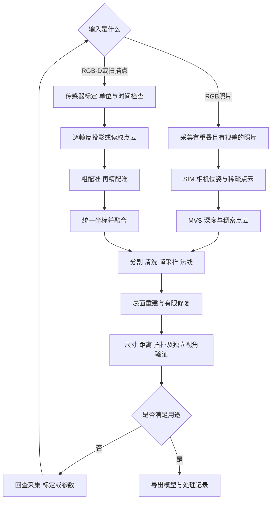

# 02 点云到 Mesh 的完整工作流

[返回入口](../README.md) · 前置：[三维基础](01_foundations.md) · 下一章：[MANO 手部模型](03_mano_hand.md)

**目标**：根据自己的输入选对路线，把数据采集、标定、配准、清洗、表面重建和验证连成一个可复查的过程。先跑一个无下载的小实验，再碰真实扫描。

**核验日期：2026-10-03。** 本章推荐的是学习路径，不是对任何读者硬件的性能保证。没有安装软件、下载扫描数据，也没有在读者机器运行例程。命令/API 对照官方资料编写；实际环境依赖仍须验证。

## 1 先选工具 不要一次装齐

| 工具 | 最适合的第一件事 | Windows | macOS | 边界 |
|---|---|---|---|---|
| CloudCompare | 打开点云、量尺寸、裁剪、配准、距离着色 | 官方支持；选择匹配的发布包 | 官方支持；核对下载包架构与系统要求 | 查看器 `ccViewer` 与完整 CloudCompare 功能不同；菜单和插件取决于版本 |
| MeshLab | 检查和清理 Mesh、重建表面、简化网格 | 官方提供 Win 64 包 | 官方下载页列 arm64 与 x86_64 | 保留处理前文件；滤波器可能改变尺寸或拓扑 |
| Open3D | 用 Python 重复处理点云和 Mesh | 0.19.0 文档列 Windows 10+ 64 位 | 0.19.0 文档列 macOS 10.15+；检查 Python 和架构 | 本章用 CPU 几何 API；能 import 不代表 GUI 或 GPU 后端正常 |
| Blender | 看表面、调整材质、布光、相机和动画 | 按官方硬件要求选择版本 | 5.x 要求 Apple Silicon；Intel Mac 查询 4.5 LTS | 适合建模与展示；渲染效果不是尺寸精度证明 |
| COLMAP | 从重叠照片恢复相机和稀疏结构 | 按官方构建/发布说明 | 可做相应的受支持步骤 | 官方内置稠密重建涉及 CUDA 条件；不要以“Mac 有 GPU”推断能运行 |

来源：[CloudCompare 官方项目](https://github.com/CloudCompare/CloudCompare)、[平台说明](https://www.cloudcompare.org/main.html)、[MeshLab 下载](https://www.meshlab.net/)、[Open3D 0.19.0 入门](https://www.open3d.org/docs/0.19.0/getting_started.html)、[Blender 硬件要求](https://www.blender.org/download/requirements/)、[COLMAP 无 CUDA 功能边界](https://colmap.github.io/faq.html#available-functionality-without-gpu-cuda)。

**本章的软件组合建议**：手动观察先选 CloudCompare 或 MeshLab 其中一个；自动化用 Open3D；需要演示图再加入 Blender。拍照重建另学 COLMAP。Mac 完全可以学习点云/网格和 CPU 几何处理；CUDA 依赖的研究训练应单独评估，不能把 GPU 后端混为一谈。

### 环境记录和最小检查

Open3D 例程按 **0.19.0** 编写，其安装页列出的 Python 范围是 3.8–3.12；学习时可先选受支持的 3.11 或 3.12。不要为了“新”随意升级到未列出的组合。若已经装好，可运行官方验证命令：

```bash
python -c "import open3d as o3d; print(o3d.__version__)"
```

这条命令只验证导入和版本，不验证全部算法或显示驱动。Windows 使用 `py`、macOS 使用 `python3` 的环境也很常见，但要确保解释器与安装包属于同一环境。安装方式以[官方安装页](https://www.open3d.org/docs/0.19.0/getting_started.html)为准，本教程没有替你安装。

每次实验保存：操作系统、CPU/GPU及驱动、Python、Open3D版本、输入校验值、单位、关键参数和输出统计。**文档版本不等于已经验证的环境锁文件**。

## 2 根据输入分两条主路线



### 路线 A 已有照片

1. **选择静态对象**：入门用不透明、纹理丰富、少反光的物体。透明、镜面、纯白或重复纹理会让匹配和深度恢复困难
2. **采集多角度**：相邻照片有明显共同区域，并包含能形成三角测量的视差。原地纯旋转适合全景，通常不足以恢复有可靠深度的完整物体
3. **保持成像一致**：减少运动模糊、曝光突变与焦距变化；覆盖顶部和侧面。不要只绕一圈就以为底面也被观测了
4. **做 SfM**：检查注册了多少图、是否分裂成多个模型、相机轨迹是否异常、匹配点是否主要落在背景
5. **做 MVS**：检查稠密点云，而不是只看最终带纹理展示。稀疏结构失败时先修正输入，继续做稠密重建通常无益
6. **建立尺度**：用独立已知长度或其他尺度信息；另外选未用于定尺度的长度验证
7. **保留相机参数**：后续做纹理、NeRF/3DGS 和独立视角评估都需要

转台拍摄中“背景固定、物体旋转”与常见静态场景假设存在冲突。可分割物体、采用适当采集设置并检查估计的相机，而不能把任意视频直接当理想输入。[COLMAP 官方教程](https://colmap.github.io/tutorial.html)

### 路线 B 已有 RGB-D 或扫描点云

1. 确认深度语义、单位、有效值/无效值、分辨率和内参；RGB-D 先检查是否配准
2. 拍摄前保持被扫对象静止，记录每帧时间及曝光设置；手指在多帧间运动会造成融合重影
3. 保留原始数据，只对工作副本做裁剪。先去背景和明显错误点，保留细小有效结构
4. 每帧反投影到自身相机坐标；用外参或估计位姿变到共同坐标
5. 没有可靠位姿时先粗配准，再用 ICP 精配准；多帧还要处理累积漂移和闭环
6. 选择点云拼接/融合，或由多帧深度积分形成 TSDF 再抽取 Mesh；二者不是完全相同的流程
7. 用未用于优化的帧和已知尺寸验证

Open3D 的 RGB-D 融合教程明确需要相机内参和每帧位姿；TSDF 不是无需标定的自动修复器。[RGB-D 融合示例](https://www.open3d.org/docs/0.19.0/tutorial/pipelines/rgbd_integration.html)

## 3 配准是“把同一个表面对齐”

### 粗配准与 ICP

**粗配准**给一个足够接近的初始位姿，可以来自标记、机械定位、多点对应或全局特征匹配。**ICP**则反复寻找对应点、估计小的刚体变换、再更新对应。它主要做局部优化，不保证从任意初值找到正确对齐。

点到点 ICP 的直观目标是让匹配点之间距离小：

$$\min_{R,\mathbf t}\sum_{(i,j)\in\mathcal C}\|R\mathbf p_i+\mathbf t-\mathbf q_j\|^2$$

点到面版本利用目标点的法线，约束沿表面法向的距离。法线方向和局部几何质量因此重要。[Open3D ICP 教程](https://www.open3d.org/docs/0.19.0/tutorial/pipelines/icp_registration.html)

**每次检查四件事**：

- 变换方向是否为 `source → target`
- 配准距离阈值是否与坐标单位一致
- 用于配准的重叠区域是否足够，背景是否在误导对齐
- 同时看匹配覆盖率、残差和空间分布，而非只看一个 RMSE

平面、圆柱和重复几何可能让某些运动方向约束很弱。错误对齐也可能有很低的残差；把一小块贴到另一小块上不等于整个物体配准正确。真实已知尺度的数据不要随意允许缩放去“改善对齐”，那会掩盖单位或标定错误。

## 4 清洗与法线 每一步都可能伤害真实细节

| 操作 | 目的 | 主要参数如何理解 | 常见误用 |
|---|---|---|---|
| 裁剪/分割 | 去除背景 | 区域与对象边界 | 把接触处或细长部件裁掉 |
| 体素降采样 | 降低密度并均匀化 | `voxel_size` 是空间长度 | 单位弄错；薄壁两侧被混合 |
| 统计离群点过滤 | 移除明显孤立噪点 | 邻居数量与统计阈值 | 真实稀疏结构被当成噪声 |
| 半径过滤 | 去除邻域点太少的点 | 邻域半径和最少邻居 | 对密度变化大的数据一刀切 |
| 法线估计 | 提供局部表面方向 | 邻域尺度 | 太小追噪声，太大跨越棱边 |
| 法线定向 | 使邻域朝向一致 | 相机位置或一致传播 | 点有法线但符号乱，重建翻面 |

先看原始点距和对象最小特征尺度再设参数。可以用点距的数倍作为初始尝试，但不存在对所有场景适用的固定毫米数。每步记录输入/输出点数、被删区域和尺度变化。[离群点处理](https://www.open3d.org/docs/0.19.0/tutorial/geometry/pointcloud_outlier_removal.html)、[点云与法线](https://www.open3d.org/docs/0.19.0/tutorial/geometry/pointcloud.html)

## 5 怎样从点云长出三角面

### 5.1 三种常见选择

- **Poisson**：根据有方向的法线恢复平滑表面。对连续表面很好用，但可能在未观测区域补出表面；产生了面不代表该处被真实看见
- **Ball Pivoting**：用给定半径的“球”在邻近点之间寻找可连接三角形，依赖点密度和法线；半径选择影响孔洞和跨接
- **TSDF 融合后抽面**：适合有相机位姿的多帧深度输入，利用各帧对空间的观测信息；误差位姿仍会产生厚边和重影

Open3D 还提供 Alpha Shapes。初学者先做一个方法并理解失败原因，不必同时调所有方法。[表面重建官方教程](https://www.open3d.org/docs/0.19.0/tutorial/geometry/surface_reconstruction.html)

### 5.2 重建后不是立即“补洞并平滑”

1. 检查缺面在哪里：真实孔、遮挡、反光失败，处理方式不同
2. 检查细杆、指缝、孔边是否被误连；用原始点叠加检查
3. 检查法线是否一致、自交、非流形边和重复面
4. 必须补洞时标明补的是推测表面；不能把它作为测量真值
5. 简化/平滑后重新量关键尺寸。平滑可能缩小物体，简化可能抹掉棱边
6. 针对用途输出：可视化可能允许开放表面；打印或某些距离/体积计算通常需要合适的封闭拓扑

## 6 小练习 B 用合成球完成 点云 到 Mesh

**输入**：程序生成半径 0.05 米的三角化球，再在表面采样 4000 个点。球是教学合成几何，没有数据许可下载步骤。

**输出**：`sphere_points.ply`、`sphere_reconstructed.ply` 和终端统计。练习只展示 API 串联与验证思路，不模拟真实传感器的误差分布。

**前置**：已自行准备可导入 NumPy 与 Open3D 0.19.0 的 Python 环境。代码参考官方[球体/采样 Mesh API](https://www.open3d.org/docs/0.19.0/python_api/open3d.geometry.TriangleMesh.html)及[Poisson 教程](https://www.open3d.org/docs/0.19.0/tutorial/geometry/surface_reconstruction.html)，由本教程组合；未在读者机器运行。

### 步骤

1. 建立新的空练习目录，将代码保存为 `sphere_to_mesh.py`
2. 运行 `python sphere_to_mesh.py`；无需 GPU，不触发示例数据自动下载
3. 在 MeshLab 或 CloudCompare 分别打开两个输出；一个没有面，另一个有面
4. 比较重建球与原始解析半径，记录统计值，不能只看是否“圆”
5. 可把 `depth=6` 改为 `5`，在新的输出目录运行，比较面数与误差；更高的值不一定值得其内存开销

```python
from pathlib import Path
import numpy as np
import open3d as o3d

# 每轮实验独立目录，已存在则停止，避免覆盖旧结果
out_dir = Path("sphere_run_depth6")
out_dir.mkdir(exist_ok=False)
print("Open3D:", o3d.__version__)
o3d.utility.random.seed(7)
radius = 0.05  # 教学约定：米
reference = o3d.geometry.TriangleMesh.create_sphere(
    radius=radius, resolution=40
)
reference.compute_vertex_normals()
pcd = reference.sample_points_uniformly(number_of_points=4000)
xyz = np.asarray(pcd.points)
# 合成球的中心和解析法线已知；真实数据不能照抄这一法线捷径
pcd.normals = o3d.utility.Vector3dVector(
    xyz / np.linalg.norm(xyz, axis=1, keepdims=True)
)
assert len(xyz) == 4000 and np.isfinite(xyz).all()
mesh, density = o3d.geometry.TriangleMesh.create_from_point_cloud_poisson(
    pcd, depth=6
)
mesh.compute_vertex_normals()
verts = np.asarray(mesh.vertices)
assert len(verts) > 0 and len(mesh.triangles) > 0
assert np.isfinite(verts).all()

radial_error = np.abs(np.linalg.norm(verts, axis=1) - radius)
print("points / vertices / faces:", len(xyz), len(verts), len(mesh.triangles))
print("reconstruction extent [m]:", mesh.get_axis_aligned_bounding_box().get_extent())
print("median / p95 radial error [m]:", np.quantile(radial_error, [0.5, 0.95]))
print("watertight:", mesh.is_watertight())
print("self_intersecting:", mesh.is_self_intersecting())
print("density range:", float(np.min(density)), float(np.max(density)))
assert o3d.io.write_point_cloud(str(out_dir / "sphere_points.ply"), pcd)
assert o3d.io.write_triangle_mesh(str(out_dir / "sphere_reconstructed.ply"), mesh)

# 可选：有正常图形环境时取消注释；数值处理不依赖此窗口
# o3d.visualization.draw_geometries([mesh])
```

### 成功检查

- 输出目录包含可重新打开的点云和 Mesh；点数为 4000，Mesh 有顶点和三角面
- 包围盒三个方向的长度应接近球的直径 0.10 米；径向误差应相对 0.05 米半径较小
- 将“95% 顶点径向误差小于半径的 5%”作为本练习的教学排查线，**不是软件保证或测量验收标准**；超出时检查单位、法线和异常连通分量
- 实际写下 watertight、自交和误差结果，不预设必然合格。源球本身也是三角化近似，会引入离散误差

Poisson 返回的 `density` 是重建中的支持密度量，不是传感器概率置信度。正式处理可参考官方低密度区域裁剪方法，但不要为了漂亮而自动删去真实薄结构。

随机种子API另见[Open3D v0.19.0 官方绑定源码](https://github.com/isl-org/Open3D/blob/v0.19.0/cpp/pybind/utility/random.cpp)。固定种子有助于重复采样，但不承诺跨版本、跨平台或并行求解逐位一致。

**可视化记录**：建议自己保存同一视角下的“采样点、重建 Mesh、误差着色”三张图，并写软件版本和参数。本仓库的流程图不冒充这次实验的实际渲染结果。

## 7 真正的验收清单

### 几何和测量

- 用至少一个未参与定尺度的已知长度检验比例
- 用未参与配准/重建的观测检查几何，防止只评估训练数据
- 报告距离分布：中位数、95分位、异常区域，而不只平均值
- 区分点到点距离和点到三角面的距离；采样密度不同会影响点到点值
- 如果用双向距离，分别说明观测到模型、模型到观测的方向；后一方向有助于发现虚构表面和覆盖不足，但遮挡区要单独解释

### 拓扑和下游用途

- 空面、孤立分量、重复面、非流形边、自交、法线一致性
- 面数与细节需求是否匹配，是否为了减少面数毁掉关键孔槽
- 碰撞模型与视觉模型可以使用不同分辨率，但要检查简化带来的间隙误差
- 计算体积/内外符号前核查封闭性，不能对任意点云直接声称实体体积

### 可复现性

- 原始数据只读保存；每个处理阶段使用新输出
- 参数以实际长度单位记录，保留软件版本和坐标变换
- 输出重新导入后复查单位、轴、颜色/纹理和面数
- 没有观测支持的补全区域明确标记

## 8 常见异常的第一检查项

| 症状 | 先检查 |
|---|---|
| 模型放大/缩小 1000 倍 | 米与毫米、深度缩放、导入导出尺度 |
| 物体出现双层边 | 帧间运动、错误位姿、时间不同步、深度-RGB 不对齐 |
| ICP 看似收敛但位置错 | 初值、对称性、重叠区域、背景对应 |
| Poisson 生出一层“盖子” | 没有观测的区域、法线方向、支持密度 |
| 薄片两侧被糊成一起 | 点距、体素大小、法线邻域、传感器分辨率 |
| 图形窗口不开但文件可生成 | 远程/无显示环境、显示驱动；区分数值计算与 GUI |
| Mesh 很漂亮但尺寸错 | 独立尺度验证是否缺失；平滑和重采样是否改形 |

更多跨工具问题见 [故障排查](07_troubleshooting.md)。

## 9 许可与发布

**代码许可、模型许可、采集数据许可、导出结果的使用约束是不同层次。** 一个库可公开下载，不代表它的示例扫描数据、预训练权重或第三方模型可以一起重新分发。公开仓库优先放原创教学代码、参数和下载说明；数据/模型只放官方链接，确认许可后再决定是否附带。

本章合成球不依赖第三方扫描数据。若改用 Stanford Bunny，先读[扫描仓库的使用说明](https://graphics.stanford.edu/data/3Dscanrep/)；不要以“在 Open3D 示例中出现过”代替许可审查。真人手部采集还要取得适当授权并处理隐私。

## 来源与版本边界

全部访问日期为 **2026-10-03**。

1. [Open3D 0.19.0 安装](https://www.open3d.org/docs/0.19.0/getting_started.html)：平台、Python 范围与验证命令
2. [PointCloud 教程](https://www.open3d.org/docs/0.19.0/tutorial/geometry/pointcloud.html)、[离群点教程](https://www.open3d.org/docs/0.19.0/tutorial/geometry/pointcloud_outlier_removal.html)：清洗与法线
3. [ICP 教程](https://www.open3d.org/docs/0.19.0/tutorial/pipelines/icp_registration.html)、[全局配准](https://www.open3d.org/docs/0.19.0/tutorial/pipelines/global_registration.html)：局部/全局配准
4. [表面重建](https://www.open3d.org/docs/0.19.0/tutorial/geometry/surface_reconstruction.html)、[RGB-D 融合](https://www.open3d.org/docs/0.19.0/tutorial/pipelines/rgbd_integration.html)、[TriangleMesh API](https://www.open3d.org/docs/0.19.0/python_api/open3d.geometry.TriangleMesh.html)：练习 API 与重建路线
5. [CloudCompare 官方 Releases](https://github.com/CloudCompare/CloudCompare/releases)：当日页面列 v2.13.2 为 latest stable，v2.14.beta 为预发布；未在本机核验任何 GUI 菜单
6. [MeshLab 官网](https://www.meshlab.net/)：当日下载区显示 2025.07，并列出 Windows/macOS 架构；软件升级后复核滤波器名称
7. [Blender 硬件要求](https://www.blender.org/download/requirements/)：5.0 起 macOS 为 Apple Silicon；4.5 LTS 为最后支持 Intel Mac 的系列。具体系统/GPU要求按相应版本检查
8. [COLMAP Tutorial](https://colmap.github.io/tutorial.html)、[FAQ](https://colmap.github.io/faq.html)：滚动文档，实际命令选项可能跨版本改变，本章不提供未经版本锁定的整套训练命令
