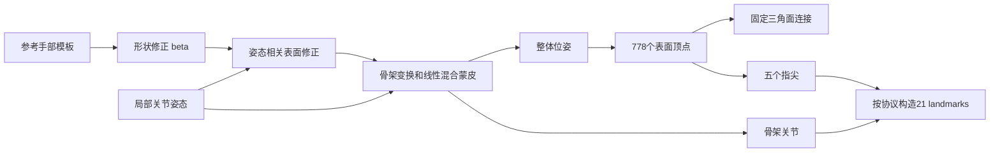

# 03 MANO 从参数到手部网格

[返回入口](../README.md) · 前置：[坐标与相机](01_foundations.md) / [点云与 Mesh](02_pointcloud_mesh.md) · 后续：[NeRF 与 3DGS](04_nerf_3dgs.md)

**一句话**：MANO 是一个学到的人手形状与姿态模型。给定手型、关节姿态和整体位姿，它生成拓扑固定的手部 Mesh；从照片估计这些参数，还需要另外的观测、预测器或拟合算法。

**核验日期：2026-10-03。** 下文以标准 MANO 拓扑和官方 `vchoutas/smplx` 的 MANO 实现为主要参照。示例未在读者机器执行；本教程不附带 MANO 模型文件，不替读者接受许可，不声称获得了真实手部测量结果。

## 1 先区分三个层次

| 层次 | 做什么 | 输入和输出 |
|---|---|---|
| MANO 模型 | 用少量参数生成合法拓扑的手部表面 | 参数 → Mesh 与骨架 |
| 手部估计网络 | 从图像猜参数或网格 | RGB/RGB-D → 参数、关键点或顶点 |
| 优化拟合器 | 调参数，使模型更符合观测 | 初值+图像/关键点/扫描 → 优化后的参数 |

下载 MANO 本体不会自动把手机视频变成正确的三维手。MANO 是可用于拟合的表示，前向生成和反向估计是两个问题。

它的机械直觉接近“骨架驱动的变形模板”：骨架负责运动，表面随骨架变形，同时用学到的修正项让弯指后的外形更像真人。它不是肌肉、肌腱和软组织有限元模型。[MANO 项目页](https://mano.is.tue.mpg.de/)

## 2 你实际控制哪些参数

| 参数 | 常见尺寸 | 直观含义 | 先查什么 |
|---|---|---|---|
| `betas` / $\beta$ | 常用 10 个数 | 手型变化，如指长、掌形等耦合变化 | 模型形状空间版本、组件数 |
| `hand_pose` / $\theta$ | 完整局部轴角常为 `15 × 3 = 45` | 五根手指共15个局部关节旋转 | 关节顺序、局部轴、弧度、均值姿态 |
| PCA 姿态系数 | `K` 个数 | 用低维组合表达相关的弯指方式 | `use_pca`、`num_pca_comps` |
| `global_orient` | 3 维轴角（此处实现） | 整只手的整体旋转 | 旋转中心与相机/世界变换 |
| `transl` | 3 个数 | 整只手的整体平移 | 与模型一致的长度单位和坐标系 |

`betas` 的分量一般不是“第一个就是食指长度”。它们是统计形状基的系数，单个分量可能同时影响多个区域。零系数表示参考形状，不表示所有人的平均真实尺寸都被精确恢复。

完整轴角姿态常被写成 **48 维**：3 维全局旋转 + 45 维局部旋转。平移的3维通常另外保存。有的包装器把这些字段拼在一起，有的使用旋转矩阵而不是轴角，所以不能只凭数组长度猜语义。

PCA 姿态是另一种输入方式：例如 `K=6` 不表示只剩6个关节，而是用6个系数共同控制45维局部姿态。轴角向量的方向是转轴，模长是旋转角；它不是三个独立的欧拉角。字段和均值处理以[官方 MANO 实现](https://github.com/vchoutas/smplx/blob/main/smplx/body_models.py)为准。

## 3 778 个顶点 16 个关节 21 个点

### 3.1 顶点不是关节

标准 MANO Mesh 有 **778 个顶点、1538 个三角面**。顶点是皮肤表面离散位置；关节是骨架运动学节点。顶点多不代表运动自由度也多。标准拓扑下，顶点索引可跨姿态对应，但“同编号”只是模板对应，不保证精确追踪某个真实皮肤材料点。[采用 MANO 的原始研究中对拓扑的说明](https://openaccess.thecvf.com/content/CVPR2021/papers/Hu_Model-Aware_Gesture-to-Gesture_Translation_CVPR_2021_paper.pdf)

### 3.2 16 与 21 并不矛盾

- **16 个骨架节点**：腕部根节点 + 5根手指各3个关节
- **21 个常见手部 landmarks**：上面16个 + 5个指尖表面点
- 指尖通常从指定 Mesh 顶点提取或按某种约定构造，不是又增加了5个独立运动关节
- 不同数据集会重新排列这21点。`[21,3]` 这个 shape 不能说明“第5个点是谁”

**实现级陷阱**：截至核验日，官方 `smplx` 的 `MANO.forward` 中，自动调用 `vertex_joint_selector` 追加指尖的两行处于注释状态，因此不能默认 `output.joints` 已经有21点。其 `vertex_ids.py` 另列出 MANO 指尖映射。使用时先检查形状，再按明确协议构造；不要重复追加。[MANO.forward 源码](https://github.com/vchoutas/smplx/blob/main/smplx/body_models.py)、[指尖映射](https://github.com/vchoutas/smplx/blob/main/smplx/vertex_ids.py)

本章练习采用自己的明确输出约定：**先16个原始 MANO 骨架点，后拇指、食指、中指、无名指、小指指尖**。这不是声称等同于任意数据集的21点顺序。

### 3.3 骨架点怎样得到

模型中的关节回归器用于从形状相关的静止模板得到骨架位置，之后按运动学链得到姿态下的关节。不能未经论证把同一个静止姿态回归器直接乘到任意已变形顶点上，就认为和模型输出的运动学关节完全相同。[MANO 论文模型章节](https://arxiv.org/html/2201.02610v1#S3.SS3)、[官方蒙皮实现](https://github.com/vchoutas/smplx/blob/main/smplx/lbs.py)

## 4 从直觉到一个公式

可以把前向过程理解为四步：



紧凑地写：

$$
T(\beta,\theta)=\bar T+B_S(\beta)+B_P(\theta),\qquad
V=\operatorname{LBS}(T,J(\beta),\theta,W)
$$

- $\bar T$：模板顶点
- $B_S$：手型变形
- $B_P$：弯曲等姿态引起的额外表面修正
- $J$：骨架，$W$：各顶点受各骨骼影响的蒙皮权重
- LBS：将骨骼变换加权作用于表面顶点

这解释了“调一个姿态参数，很多顶点一起移动”，也解释了“拓扑没变，形状却变了”。实际库可能已把整体旋转放进根节点、最后再加平移；接相机或世界变换时别再重复应用一次。[Romero 等，2017，Embodied Hands](https://arxiv.org/html/2201.02610v1)

## 5 软件路径与许可必须先讲清

### 5.1 三种工具的分工

1. **Python + 官方 `smplx` + PyTorch**：做参数前向、拟合和研究代码集成。先用 CPU 小批量前向，GPU并非理解模型所必需
2. **MeshLab / CloudCompare**：打开导出的静态 OBJ/PLY 检查几何；它们不会从这些文件自动恢复被丢掉的 MANO 参数
3. **Blender**：展示 Mesh、相机、材质和动画；直接导入静态 OBJ 不等于导入一个参数可编辑的 MANO 模型或完整绑定骨架

Windows 和 macOS 都应分别核对所用 Python、PyTorch、`smplx` 版本及依赖兼容性。本章不承诺旧 MANO 下载包或任意第三方实现可在所有新版本环境直接运行；不要看到文件加载报错就换来历不明的修正版模型。

### 5.2 公开代码不等于可随便商用和分发模型

- MANO 官网的模型/数据条款包含非商业使用限制及分发限制，下载/使用也可能构成对条款的接受
- 官方 `smplx` 仓库本身也有专门的非商业科研许可，不能默认成 MIT/Apache
- 一个第三方 wrapper 的开源代码许可，不能覆盖 MANO 权重、扫描数据、拟合参数或其他受限制内容的许可
- 生成的 Mesh、动画和拟合结果如何使用/传播也要查看适用条款，不能一概声称“导出后就没有限制”

本知识库只放说明和调用示例；**不上传 MANO `.pkl/.npz` 模型、第三方扫描、受限制的衍生成果或真人原始图像**。模型由读者自行从官网按适用条款取得并保存在受控位置。私有仓库也不是忽略分发条款的理由。[MANO 许可原文](https://mano.is.tue.mpg.de/license.html)、[smplx 许可原文](https://github.com/vchoutas/smplx/blob/main/LICENSE)

## 6 小练习 C 参数生成三只合成手

**目的**：只改变姿态或手型中的一个因素，观察输出变化；检查16/21点约定。它不是从照片重建，也不是人体真值生成。

**输入**：读者已经合法取得的 `MANO_RIGHT.pkl`；本地可用的 NumPy、PyTorch 和官方 `smplx` 环境。

**输出**：本地练习目录中的参数/顶点/landmark NPZ，以及三个静态 OBJ。输出受适用许可约束，不应直接提交到公开仓库。

**版本边界**：代码依据核验日的官方 `main` 接口编写，但 `main` 会变化；执行前记录实际包版本/commit。这里不提供未经验证的依赖锁文件，也不假装已经加载模型运行。

### 步骤

1. 先读并确认模型及实现的适用许可，再按官方流程准备模型；这一步由读者完成
2. 另建本地实验目录，确保 `private_models/mano/MANO_RIGHT.pkl` 指向自己的合法模型副本；不要将模型目录纳入公开版本控制
3. 保存代码为 `mano_forward_demo.py`，先运行只读版本检查：`python -c "import torch, smplx; print(torch.__version__); print(smplx.__file__)"`
4. 运行 `python mano_forward_demo.py`
5. 在 MeshLab/Blender 分别打开三个 OBJ，核对基线、姿态变化、手型变化；不要一次同时改变所有参数

```python
from pathlib import Path
from importlib.metadata import version
import numpy as np
import torch
import smplx
from smplx.vertex_ids import vertex_ids

model_dir = Path("private_models/mano")
assert (model_dir / "MANO_RIGHT.pkl").is_file(), "先自行准备合法的官方模型"
# 仅加载可信模型文件；PKL 本质上可执行反序列化代码
out_dir = Path("mano_forward_run")
out_dir.mkdir(exist_ok=False)
print("torch:", torch.__version__, "smplx:", version("smplx"))

model = smplx.MANO(
    model_path=str(model_dir), is_rhand=True,
    use_pca=False, flat_hand_mean=True,
    num_betas=10, batch_size=3
).cpu()

betas = torch.zeros((3, 10), dtype=torch.float32)
pose = torch.zeros((3, 45), dtype=torch.float32)
global_orient = torch.zeros((3, 3), dtype=torch.float32)
translation = torch.zeros((3, 3), dtype=torch.float32)
pose[1, 0] = 0.25  # 第一局部轴角分量，单位弧度；先核对其关节与轴含义
betas[2, 0] = 1.0  # 第一形状分量；不是“把某一根手指加长1米”

with torch.no_grad():
    result = model(
        betas=betas, hand_pose=pose,
        global_orient=global_orient, transl=translation,
        return_verts=True
    )
verts = result.vertices.detach().cpu().numpy()
j16 = result.joints.detach().cpu().numpy()
faces = np.asarray(model.faces, dtype=np.int64)
assert verts.shape == (3, 778, 3), verts.shape
assert j16.shape == (3, 16, 3), "接口/关节映射发生变化，先确认，勿盲目追加指尖"
assert faces.shape == (1538, 3), faces.shape
assert np.isfinite(verts).all() and np.isfinite(j16).all()
assert faces.min() >= 0 and faces.max() < 778

tip_names = ["thumb", "index", "middle", "ring", "pinky"]
tip_ids = [vertex_ids["mano"][name] for name in tip_names]
j21 = np.concatenate([j16, verts[:, tip_ids, :]], axis=1)
assert j21.shape == (3, 21, 3)
assert np.allclose(j21[:, 16:, :], verts[:, tip_ids, :])

np.savez(
    out_dir / "forward_demo.npz",
    vertices=verts, faces=faces, joints16=j16, landmarks21=j21,
    betas=betas.numpy(), hand_pose_axis_angle=pose.numpy(),
    global_orient_axis_angle=global_orient.numpy(), transl=translation.numpy(),
    handedness=np.array("right"), use_pca=np.array(False),
    flat_hand_mean=np.array(True), length_unit=np.array("model_native_verify_before_use"),
    landmark_order=np.array("MANO16_then_thumb_index_middle_ring_pinky_tips")
)
# OBJ 在这里仅保留静态几何，不带 MANO 参数、颜色或绑定
for i, label in enumerate(["baseline", "pose_changed", "shape_changed"]):
    with (out_dir / f"{label}.obj").open("x", encoding="ascii") as f:
        for v in verts[i]:
            f.write("v %.8f %.8f %.8f\n" % tuple(v))
        for tri in faces:
            f.write("f %d %d %d\n" % tuple(tri + 1))  # OBJ 正索引从1开始
print("vertices, faces, landmarks:", verts.shape, faces.shape, j21.shape)
print("pose vertex change:", np.max(np.abs(verts[1] - verts[0])))
print("shape vertex change:", np.max(np.abs(verts[2] - verts[0])))
```

### 成功检查

- 三只手的顶点数和面索引一致，修改姿态/手型后坐标改变
- 16个骨架点和追加的5个指尖可以分开检查；指尖正好落在指定顶点上
- 输出没有 NaN/Inf，面索引都在有效范围；手型变化量应非零
- `flat_hand_mean=True` 明确了零局部姿态的均值处理。切换成 `False` 后的零输入可能已经是平均弯曲姿态，不能直接与原结果混为一谈
- 本例将长度暂标为 `model_native_verify_before_use`，避免盲目赋予单位；接入真实相机或数据集前必须查模型来源、包装器缩放及合理手部尺寸，再统一成米

**注意**：模型文件版本也要记录。官网说明 MANO v1.1 修改了形状基尺度，v1.2 没有更改模型文件而修复了代码。相同 `beta` 数值在不匹配版本之间不可无条件复用。[MANO 版本记录](https://mano.is.tue.mpg.de/)

## 7 从真实图像或扫描拟合 MANO 的完整流程

### 7.1 从观测开始

1. **明确输入**：单目RGB、多视角RGB、RGB-D，还是三维扫描？它决定哪些量可观测、哪些需依赖先验
2. **采集与标定**：统一相机内参、外参、时间和单位；真人采集先处理知情授权与数据隐私
3. **分割与关键点**：得到手部区域、2D/3D关键点及其置信度；遮挡点保留“不确定”，不要伪装成可靠标注
4. **左右手与语义映射**：确认镜像、裁剪、数据集关节顺序；把观测点映射到明确的 MANO landmark 协议
5. **初始化**：给出大致全局位姿与合理姿态，可来自已有预测器或人工粗定位。前向模型本身不完成这一步

### 7.2 优化顺序

6. 先对整体位置和方向进行粗对齐，再逐步调整手指姿态
7. 有多帧同一人的数据时，共享或稳定估计手型参数；不要让 `beta` 每帧剧烈变化来吸收姿态误差
8. 加入合适的数据项和先验。例：2D重投影、3D关键点、扫描到模型距离、轮廓、姿态先验、时间平滑；每项要注明单位和权重
9. 手物交互时，额外建模物体几何、相对位姿和非穿透/接触约束；不要让被遮挡手指仅靠图像误差任意穿过物体
10. 检查每帧结果、遮挡时段、出画面和快速运动，记录失败帧而非只选最好看的帧

一个概念性目标函数可以写为：

$$
E=\lambda_{2D}E_{2D}+\lambda_{3D}E_{3D}
+\lambda_{shape}E_{shape}+\lambda_{pose}E_{pose}+\lambda_{time}E_{time}
$$

这只是组织思路，**不是可直接通用于所有数据的损失配方**。像素、米和无量纲先验不能直接比较数量级；应按观测噪声和具体实现归一化、选择权重。时间平滑降低抖动，也可能抹掉快速真实动作。

### 7.3 独立验证与导出

11. 用未参与拟合的视角/帧投影检查；只在输入图像上对得齐，不能证明3D正确
12. 分开报告关键点误差、表面误差、相机/尺度误差和接触区错误；标明采用什么坐标对齐
13. 报告绝对坐标误差还是腕部对齐/刚体对齐后的误差。允许额外旋转、平移甚至缩放对齐会改变指标含义
14. 导出参数时保存模型版本、手别、关节顺序、PCA/均值设定、单位、相机参数和时间戳；导出静态 Mesh 不能替代这些信息

**单目不确定性**：遮挡指节、绝对尺度、沿视线的深度和手型/姿态之间存在歧义。先验可以给出合理解释，但合理解释不是唯一真实状态。[MANO 论文及其失败案例](https://arxiv.org/html/2201.02610v1)

## 8 对机械和机器人任务 特别要防的误解

### MANO 参数不是机器人关节角

两者的关节轴、自由度、骨长、根坐标和关节限位不同。将 MANO 45维轴角直接填进机械手驱动器，语义上通常错误。动作重定向需要机器人运动学、任务目标、限位和碰撞约束；先确认目标是指尖轨迹、抓握形态还是任务接触。

### 手和物体很近 不能推出力是多少

表面距离可提出“可能接触”的候选，穿透可提出“模型不一致”的警告。两者都不足以唯一得到法向力、切向力、压力分布或摩擦状态。

一个简单反例：即使观测到同样的压缩量 $\delta$，在简化弹簧模型 $F=k\delta$ 中，不同刚度 $k$ 会给出不同的力；现实还可能有预载、黏弹性、隐藏支撑和动态效应。要做力估计，必须引入额外测量或明确的物理/统计假设，并单独验证。

### 778 顶点表面不是精细软组织真值

它有助于统一拓扑、表达姿态和组织数据，但指腹的局部接触形变、皮肤褶皱、指甲和个体异常形态可能超出其表示能力。细分 Mesh 只增加离散点，不能凭空增加观测证据或模型自由度。

## 9 出错时先看这些

| 症状 | 高优先级检查 |
|---|---|
| 零参数手不是伸直 | `flat_hand_mean`、PCA均值、输入是系数还是完整轴角 |
| 结果看起来镜像 | 左右模型、图像镜像、坐标变换是否含反射 |
| 手的位置差很多 | root-relative 与 absolute、重复全局旋转、平移单位 |
| 21点连线像打结 | 原始关节顺序与数据集目标顺序不一致 |
| 指尖点重复或有26点 | 包装器已经追加指尖，又追加了一次 |
| 贴合照片但背面手指不合理 | 遮挡与单目歧义；检查独立视角和先验 |
| 导出 OBJ 后不能调 beta | OBJ未保存参数；回到 NPZ 和对应版本模型 |
| PKL 加载失败 | 官方来源、文件版本、依赖兼容性；不要加载陌生 pickle 来“修复” |

## 来源与版本边界

全部访问日期为 **2026-10-03**。

1. Romero、Tzionas、Black，**2017**，*Embodied Hands: Modeling and Capturing Hands and Bodies Together*：[项目页](https://mano.is.tue.mpg.de/)、[论文全文](https://arxiv.org/html/2201.02610v1)。arXiv 上传年份2022不改变论文发表年份2017
2. 官方 `vchoutas/smplx`：[仓库](https://github.com/vchoutas/smplx)、[MANO 实现](https://github.com/vchoutas/smplx/blob/main/smplx/body_models.py)、[蒙皮代码](https://github.com/vchoutas/smplx/blob/main/smplx/lbs.py)、[指尖索引](https://github.com/vchoutas/smplx/blob/main/smplx/vertex_ids.py)。本章核对的是当日 `main`，实际运行应固定自己的版本/commit
3. Hu 等，CVPR 2021，*Model-Aware Gesture-to-Gesture Translation*：[CVF 原论文](https://openaccess.thecvf.com/content/CVPR2021/papers/Hu_Model-Aware_Gesture-to-Gesture_Translation_CVPR_2021_paper.pdf)，核实标准 MANO 拓扑数目
4. [MANO 模型/数据许可](https://mano.is.tue.mpg.de/license.html)、[smplx 代码许可](https://github.com/vchoutas/smplx/blob/main/LICENSE)。这里的说明不能替代许可原文；用途超出许可时需另行获得授权
5. [NumPy 安全加载说明](https://numpy.org/doc/stable/reference/generated/numpy.load.html)。本练习的数值NPZ可用 `allow_pickle=False` 读取，官方模型PKL只应来自可信且许可允许的来源
