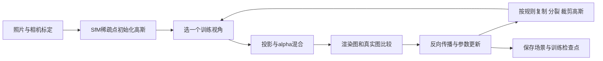

# 04｜NeRF 与 3D Gaussian Splatting：如何把照片变成可换视角的场景

**简体中文** | [English](en/04_nerf_3dgs.md)

> 面向机械背景：先把它理解为“调很多参数，使渲染图像接近实拍图像”的逆问题。本文的软件信息于 **2026-10-03** 核查；公式是教学简化，不是对特定 CUDA 内核逐行复述。

## 1. 它们究竟要解决什么

给定同一个静态场景的多张照片、每张照片的相机内参和位姿，学习一个场景表示，使相机移动到未拍摄的位置时也能生成图像。这叫**新视角合成**。

这和“求出每个零件的精确 CAD 曲面”不同。图像拟合得好，是重要证据，但不能单独证明尺寸、内部结构、质量或摩擦正确。

| 表示 | 主要存什么 | 生成图像的典型方法 | 你能直接拿它做什么 |
|---|---|---|---|
| 普通点云 | 离散位置，可选颜色/法线 | 画点、点片 | 测量、配准、几何处理 |
| 三角网格 mesh | 顶点、三角形连接、可选纹理 | 三角形光栅化 | 表面编辑、配合额外信息做碰撞 |
| 原始 NeRF | 神经网络参数 | 沿相机射线采样与体渲染 | 连续空间查询、新视角渲染 |
| 经典 3DGS | 一组带颜色、形状、透明度的高斯 | 投影为椭圆并混合 | 高质量视角浏览、视觉资产 |

不要把这个表理解成能力互斥：点云能用于渲染，网格能从照片估计，NeRF/GS 也能辅助提取几何；区别在于**默认优化目标和原生数据结构**。

## 2. NeRF：空间里放了一个可以查询的函数

原始 NeRF 可简写为：

$$
f_\theta(\mathbf x,\mathbf d)\to(\sigma,\mathbf c)
$$

- $\mathbf x=(x,y,z)$：在哪里查询
- $\mathbf d$：朝哪个方向看
- $\sigma$：体渲染中的消光/密度参数，不是材料的 kg/m³
- $\mathbf c$：这个位置沿该观察方向的颜色
- $\theta$：需要优化的网络参数

对一个像素，从相机发出一条射线，在若干深度采样。每个采样位置贡献颜色，前面的部分会遮挡后面的部分。将所有贡献累积，就得到像素颜色。用实拍颜色监督，逐步更新网络。

**机械类比：** 有限元里先选一个参数化场，再通过方程求系数；这里也选择一个场表示，但监督信号主要来自照片，目标通常是重现外观。这个类比不意味着 NeRF 求解了力学方程。

“原始 NeRF”不能代表所有后续方法。后续方法可能使用哈希网格、体素特征、小网络等加速；不能笼统说所有 NeRF 都只是一个大 MLP，也不能将某篇论文的速度当成所有实现的速度。[原始 NeRF 项目与论文](https://www.matthewtancik.com/nerf)

## 3. 经典 3DGS：一个高斯要存哪些参数

可以把一个高斯想成一团有方向、有大小、带颜色的半透明椭球雾。许多雾团投影后组成图像。它不是一颗真实粒子，也不是一个实体椭球碰撞体。

| 参数 | 记号 | 直觉 | 优化后可能发生什么 |
|---|---|---|---|
| 中心位置 | $\mu\in\mathbb R^3$ | 雾团放在哪里 | 移向更能解释图像的位置 |
| 三轴尺度 | $s_x,s_y,s_z>0$ | 长、宽、厚 | 铺成薄片或拉成长条 |
| 旋转 | 单位四元数 $q$ | 椭球朝向 | 与局部外观结构对齐 |
| 不透明度 | $o\in[0,1]$ | 中心附近能挡住多少背景 | 变透明或更显著 |
| 颜色系数 | 球谐 SH 系数 | 不同方向看时的颜色 | 近似视角相关外观 |

协方差矩阵用尺度和旋转构造：

$$
\Sigma=R(q)\,\mathrm{diag}(s_x^2,s_y^2,s_z^2)\,R(q)^T
$$

对应一个未归一化的空间核：

$$
G(\mathbf x)=\exp[-\tfrac12(\mathbf x-\mu)^T\Sigma^{-1}(\mathbf x-\mu)]
$$

这里的协方差首先控制形状，**不应自动解释为传感器测量不确定度**。形状参数也不是惯量张量。

经典实现常用三阶 SH，即每个颜色通道 16 个系数。若按存储标量数算，位置 3 + 尺度 3 + 四元数 4 + 不透明度 1 + SH 48 = **59 个标量/高斯**；实际文件、训练状态和显存还包含额外数据，四元数也有归一化约束，不能将 59 当成独立自由度数。

底层通常存对数尺度和 opacity 的 logit，使用 exp/sigmoid 得到合法范围。直接在 PLY 里把 `scale_0` 当“米”、把 `opacity` 当 0–1 修改，可能完全改错。[经典论文](https://arxiv.org/html/2308.04079v1)、[官方参数与 PLY 实现](https://github.com/graphdeco-inria/gaussian-splatting/blob/main/scene/gaussian_model.py)

## 4. 3D 高斯怎样变成一张图

### 4.1 投影：椭球变成屏幕上的椭圆

1. 用外参将高斯中心从世界坐标变到相机坐标
2. 用内参把中心投到像素坐标
3. 用投影函数的局部 Jacobian，把 3D 协方差近似变换为 2D 协方差

若 $R_{cw}$ 是世界到相机的旋转、$J$ 是 2×3 的透视投影 Jacobian：

$$
\Sigma_{2D}\approx J R_{cw}\Sigma R_{cw}^T J^T
$$

这是局部近似，不是说任何巨大椭球的透视投影都能被一个高斯精确描述。真实渲染器还处理滤波、数值稳定、视锥裁剪和屏幕分块。[gsplat 光栅化说明](https://docs.gsplat.studio/main/apis/rasterization.html)

### 4.2 混合：前面的雾团会挡住后面的

对像素 $p$，高斯的屏幕覆盖决定有效 alpha：

$$
\alpha_i(p)\approx o_i\exp[-\tfrac12(p-\mu'_i)^T\Sigma_{2D,i}^{-1}(p-\mu'_i)]
$$

按前到后处理：

$$
C(p)=\sum_i T_i(p)\alpha_i(p)c_i(\mathbf d)+T_{\rm end}(p)c_{\rm bg},\qquad
T_i(p)=\prod_{j<i}(1-\alpha_j(p))
$$

**手算：** 前层是红色、alpha=0.6；后层是蓝色、alpha=0.5；背景为黑色。结果为 0.6 红 + 0.4×0.5 蓝 = (0.6, 0, 0.2)。剩余 0.2 的背景透过率落到黑色背景上。交换前后顺序，结果会改变。

这说明：不能把重叠高斯的 RGB 直接平均。经典实现使用按块组织的深度排序与近似可见性处理，遇到交叉、很大或很长的高斯可能出现排序伪影。

## 5. 训练：没有逐点答案，主要是逐像素纠错

经典图像损失可写为：

$$
\mathcal L=(1-\lambda)\mathcal L_1+\lambda\mathcal L_{D\text{-}SSIM}
$$

L1 约束像素差异，D-SSIM 项约束局部结构相似度。不同实现可能额外使用深度、尺度、法线或其他正则项；不要把扩展版的损失反过来说成原始算法。

梯度的大意是：“某个参数稍微变化，图像误差会往哪边变？”例如，一个物体边缘偏右，优化器可能移动中心、改变尺度、不透明度或颜色来降低误差。**图像只能约束最终结果，所以有时不同的几何变化都能把同一个错误藏起来。** 这是外观拟合与可靠几何不等价的核心。

### 高斯数量也会改变

- **复制 clone：** 已有高斯较小、但仍解释不好局部细节时，增加表示能力
- **分裂 split：** 较大的高斯覆盖复杂区域时，拆成更小的高斯
- **裁剪 prune：** 删除贡献低等不合适的高斯，具体判据依实现而异
- **opacity reset：** 某些训练策略阶段性降低不透明度，帮助重新分配贡献

这些是梯度优化间穿插的离散策略，并非“反向传播自然产生一颗新点”。新增高斯也不是新获得的真实测量点。[官方密度控制代码](https://github.com/graphdeco-inria/gaussian-splatting/blob/main/scene/gaussian_model.py)、[训练循环](https://github.com/graphdeco-inria/gaussian-splatting/blob/main/train.py)

## 6. 训练、推理、在线重建分清楚

| 阶段 | 输入 | 是否更新场景 | 成本主要在哪里 |
|---|---|---|---|
| 训练/优化 | 许多照片、相机、初始点 | 是 | 反复渲染、梯度、优化器、增删高斯 |
| 推理/渲染 | 已训练场景、一个相机位姿 | 通常否 | 投影、排序、混合 |
| 在线重建/SLAM | 持续到来的图像与其他传感器 | 是 | 位姿估计、数据关联、地图更新等 |

经典官方 3DGS 一般使用已求好的相机位姿；“训练高斯”和“同时校正相机”不是默认同一件事。其他系统可能联合作优化，必须看实现。

论文标题中的 real-time 主要指既有模型的渲染。它不自动意味着训练实时、采集到出结果实时，更不意味着机器人控制具有确定的周期和最坏延迟。只有自己记录分辨率、GPU、场景规模、加载/排序成本以及尾延迟，才能讨论具体系统的实时性。

## 7. PLY、mesh 和机器人之间的三个误会

### PLY 不等于普通点云

PLY 是容器格式。一个文件可以只存 XYZ/RGB；可以有 `face` 元素成为网格；也可以把 SH、opacity、scale、rotation 存成自定义 vertex 属性，成为高斯资产。普通点云软件可能只显示高斯中心，丢掉外观；重新导出时还可能抹掉自定义属性。保留原件，先检查 header。

### GS 转 mesh 不等于恢复了完美实体

提取方法可能通过深度融合、密度等值面、表面约束或专用 Gaussian 表示得到网格。遮挡、浮点、视角相关外观、厚雾团和未知背面会影响曲面。即使输出闭合，也可能是算法补洞，不是观测到的事实。做计量或接触前，应使用尺度基准与独立几何测量验证。

### 视觉层不等于物理层

GS 可以负责“机器人相机看到什么”；MuJoCo 等物理仿真还需要碰撞几何、质量、惯量、关节、摩擦、接触参数等。将两层注册到同一坐标系后可以结合，但渲染损失不会自动给出真实接触力 ground truth。[MuJoCo 建模文档](https://mujoco.readthedocs.io/en/stable/modeling.html)

建议为资产分别记录：视觉质量证据、尺度/几何证据、物理参数来源。避免一个“重建成功”标签掩盖三个不同的验收问题。

## 8. 小练习

1. 画出一个扁高斯从正面与侧面投影的区别
2. 重算第 4 节两层 alpha 的前后交换，解释为什么颜色变了
3. 检查一个 PLY header：它是普通点云、mesh 还是高斯资产？仅凭 `.ply` 后缀能判断吗？
4. 想测量一个金属轴承直径，为什么高 PSNR 仍不够？写出你要增加的尺度和独立验证信息

下一步：[4DGS](05_4dgs.md) · [实际操作配方](06_workflows.md) · [排错](07_troubleshooting.md)

---

[返回首页](../README.md) · [坐标与标定](08_robot_frames_calibration.md) · [机器人应用](09_robot_perception_action.md) · [ROS 2 / MuJoCo](10_ros2_mujoco.md)
