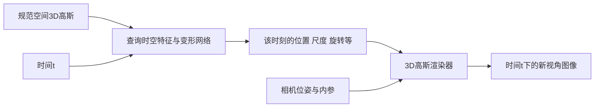

# 05｜4D Gaussian Splatting：让场景随时间变化

**简体中文** | [English](en/05_4dgs.md)

> 软件与论文核查日期：**2026-10-03**。本章解释方法族；[第 06 章](06_workflows.md#d-hustvl-4dgaussians先复现合成序列)给出具体实现的操作流程。不要用一个方法的安装命令去运行另一个同名方法。

## 1. 第四维是什么

这里通常是时间：$(x,y,z,t)$。你不再只问“从这个相机看过去是什么样”，还要问“在什么时刻”。

静态 3DGS 假设不同照片中的场景基本不变。如果一个人在走动，直接把整段视频按静态场景训练，可能得到重影、半透明的人或拖尾。增加训练步数不能修复这个模型假设错误。

4D 方法要从观测图像 $I_{v,t}$ 学习能同时依赖视角 $v$ 和时间 $t$ 的表示。**一段视频天然有时间，但未必提供足够的同一时刻多视角信息。**

## 2. “4DGS”至少有两种重要含义

### A. 规范空间的 3D 高斯 + 时间变形

先存一个规范状态的高斯集合，再用 $D_\theta(\mathbf x,t)$ 预测随时间的变化，例如：

$$
\mu_i(t)=\mu_i^0+\Delta\mu_i(t)
$$

尺度、旋转也可以变化；部分方法/设置允许颜色或不透明度变化。随后用普通 3D 高斯光栅化器渲染这个时刻。

[Wu 等人的 4D-GS](https://arxiv.org/html/2310.08528v3) 和 [hustvl/4DGaussians](https://github.com/hustvl/4DGaussians) 属于这条路线：使用时空特征平面与小型网络表达高斯变形。它不是简单地逐帧独立训练、保存一堆互不关联的 3DGS。

### B. 原生 4D 时空 Gaussian

另一条路线直接在时空里定义高斯：均值是四维，协方差是 4×4。时间与空间的交叉项表达运动联系。给定时间 $t$，通过条件分布得到要渲染的空间高斯，并结合它在该时间的权重。

将协方差按空间/时间分块，可用概率论的条件高斯公式理解：

$$
\mu_{x\mid t}=\mu_x+\Sigma_{xt}\Sigma_{tt}^{-1}(t-\mu_t)
$$

$$
\Sigma_{x\mid t}=\Sigma_{xx}-\Sigma_{xt}\Sigma_{tt}^{-1}\Sigma_{tx}
$$

对单个完整高斯，条件中心对时间是线性的；复杂运动可由许多时空高斯及相应建模机制共同表示。不要将这个公式当成任意 4DGS 的实现定义。[Yang 等人的原生 4DGS 项目](https://fudan-zvg.github.io/4d-gaussian-splatting/)、[论文](https://arxiv.org/html/2310.10642v2)

### 选论文时看这四件事

1. 四维究竟指输入坐标、神经特征，还是高斯本身的维数？
2. 高斯身份是否跨时间保持？其轨迹是否受物理/几何约束？
3. 输入要求是同步多相机、移动单相机，还是生成的视频？
4. 评价的是新视角、新时间、跟踪，还是可交互物理响应？

同名术语不保证相同数据格式、损失函数、导出文件或许可证。

## 3. 从机械实验角度安排采集

### 推荐初学者顺序

已提供标定的合成序列 → 固定相机的短同步多视角序列 → 更复杂运动 → 移动相机单目动态序列。

第一套自采实验可选：有纹理的物体做缓慢、有限幅度运动；相机固定，照明稳定，背景有足够纹理。不要第一次就选透明液体、镜面金属、快速挥手、滚动快门严重的视频和任意走动的手机。

### 采集检查表

| 项目 | 要记录/验证的内容 | 忽略它的后果 |
|---|---|---|
| 内参 | 各相机焦距、主点、畸变、分辨率；锁定变焦/对焦 | 视角无法对齐 |
| 外参 | 相机之间的位置与姿态，固定基座是否移动 | 模型把相机误差当形变 |
| 同步 | 硬触发/时间戳、时钟偏差、丢帧、曝光时刻 | 同一标签下是不同物体状态 |
| 曝光 | 快门长度、增益、白平衡与光源闪烁 | 运动拖尾、颜色不一致 |
| 视角覆盖 | 动态主体、接触处、背面是否被多机看到 | 遮挡区不可观测 |
| 尺度 | 标尺、已知基线或标定物尺寸 | 世界单位不等于米 |
| 数据身份 | camera_id、frame_id、时间戳和文件一一对应 | 排序错误或时间乱序 |

**同步误差的量级：** 若局部速度约 1 m/s，相机相差 10 ms，该点就可能错开约 1 cm。这是 $\Delta x\approx v\Delta t$ 的量级估算，不是任何具体相机的性能指标。

同名 `frame_00010.jpg` 不证明两台相机同步。分别对两个视频执行相同抽帧命令，也不证明同步。先用时间戳或共同可见事件对齐，再建立统一索引，并记录丢帧处理方式。

动态场景里的 SfM 还容易把运动物体当成相机运动。固定多机可以用同时刻画面、静态背景或独立标定估计相机；把全部动态帧一起丢进静态 COLMAP 并不是可靠通用解。

## 4. 单目动态重建为什么特别难

一个像素沿视线有很多可能深度。单相机在时间上看到物体变化时，图像变化可能来自：

- 相机在动
- 物体在动或变形
- 光照/反射在变
- 遮挡关系在变

多个解释可能生成很相似的训练图像。神经网络能利用平滑性、深度、光流、人体结构或其他先验选一个解释，但这不意味着该解释是唯一真实运动。

hustvl 论文也报告了单目动态场景中新视角过拟合与相机/物体运动相关性的限制。实际项目应把深度监督、标定、同步和独立验证视为解决可观测性问题的手段，而不是只寻找“更强的训练参数”。[论文限制讨论](https://arxiv.org/html/2310.08528v3)

## 5. 训练与导出：时间不是一个普通文件名

典型训练会交替抽取某个视角、某个时刻的图像，先求该时刻的高斯，再渲染并优化。它还可能使用时间平滑、空间正则与粗细两个阶段。

需要一起保存：

- 规范高斯参数
- 变形网络/时空特征的权重
- 时间归一化方式与相机参数
- 配置、代码版本与必要的数据路径信息

hustvl 的一个 `point_cloud.ply` 不足以恢复完整动态模型，还要有对应的变形模型文件。将每个时间戳导出成静态高斯 PLY 序列可以用于逐帧展示，但这些文件不等于原始动态模型，也不自动保证可插值、可编辑和跨帧对应。[官方保存/加载代码](https://github.com/hustvl/4DGaussians/blob/master/scene/__init__.py)、[逐时刻导出脚本](https://github.com/hustvl/4DGaussians/blob/master/export_perframe_3DGS.py)

## 6. 怎样验收一个 4D 结果

不要只看一条边转相机边走时间的漂亮视频。把两个变量拆开：

1. **固定时间、改变相机：** 检查是否只是训练视角的“纸片布景”
2. **固定相机、改变时间：** 检查闪烁、漂移、拖尾和突然消失
3. **独立相机 holdout：** 一台相机的所有监督图像都不进训练，检验新视角
4. **独立时间 holdout：** 留出某些时间段，说明是在插值还是外推
5. **几何/运动验证：** 与独立深度、标记点或其他测量比较，且声明尺度与对齐方法

特别注意：截至核查日，hustvl 的 `multipleview_dataset.py` 默认 test 选择的是同一批相机的少数时间点，而训练使用全部时间点。**默认 test 标签不等于独立留出集**。其输出指标不能直接作为泛化证明；需要显式修改划分并确认训练集中不存在这些样本。[数据划分源码](https://github.com/hustvl/4DGaussians/blob/master/scene/multipleview_dataset.py)

## 7. 和机器人、MANO、MuJoCo 的关系

- **与 MANO：** MANO 给手的参数化形状/姿态和网格结构；动态高斯可以表达更丰富外观。两者可组合，但需要明确绑定、坐标系和遮挡处理
- **与跟踪：** 变形网络输出的高斯轨迹不一定是同一真实表面材料点的轨迹；外观损失可能通过颜色、透明度或尺度变化“解释”运动
- **与 MuJoCo：** 重放“已经拍过的运动”不等于预测“施加一个新的力会发生什么”。真实交互还需要动力学、接触和控制模型
- **与 force GT：** 仅靠普通 4D 渲染训练不会产生可信的接触力真值。力传感器、已验证的动力学模型或其他测量仍需单独建立

小练习：如果一只手碰到杯子，列出仅凭视频无法唯一确定的三项物理量，再列出需要增加哪些传感器或实验约束。

---

[返回首页](../README.md) · [坐标与标定](08_robot_frames_calibration.md) · [机器人应用](09_robot_perception_action.md) · [ROS 2 / MuJoCo](10_ros2_mujoco.md)
