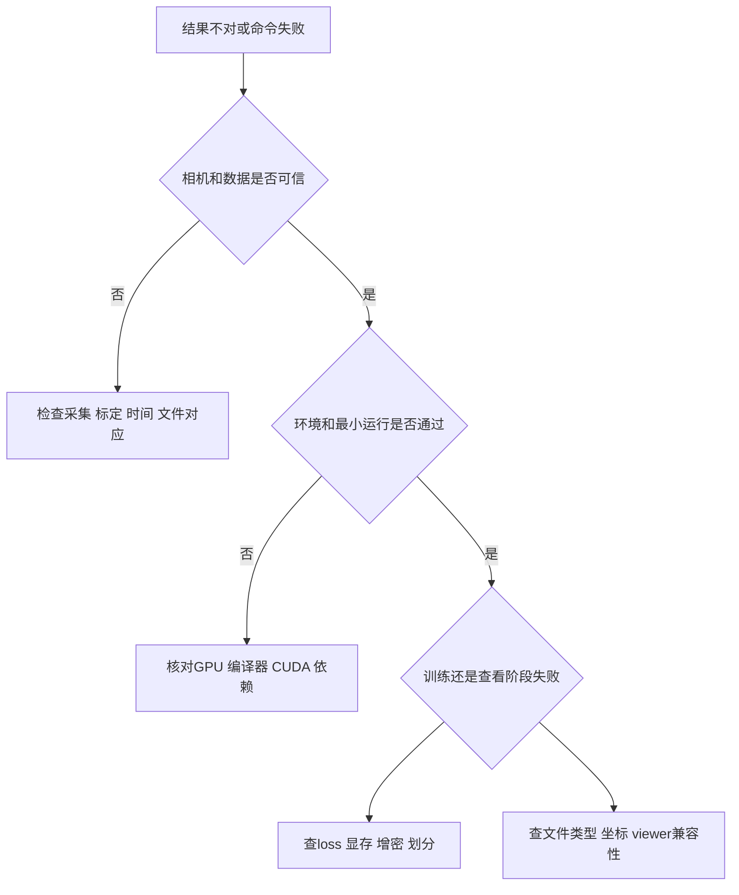

# 07｜排错：先找错在哪一层，再改参数

> 软件细节核查日期：**2026-10-03**。下面是诊断路径与检查命令，不是宣称本仓库已在你的机器复现了这些错误。



## 1. 相机与 COLMAP

| 症状 | 最先检查 | 下一步 |
|---|---|---|
| 只注册少量照片 | 是否模糊、重复、缺纹理、重叠不足 | 用清晰子集重建，补有视差的视角；不要直接训练 GS |
| 相机位置乱飞、分裂多个模型 | 是否有动态主体、变焦、重复纹理、转台背景 | 分离静态/动态问题，按真实相机分组内参，检查匹配 |
| 物体像纸片 | 是否只有原地转相机、基线太小 | 增加平移与上下视角；纯旋转不提供可靠三角测量深度 |
| 去畸变后训练仍错位 | 照片与内参是否来自同一输出 | 不要把原图和去畸变相机混合；缩放/裁剪后更新内参 |
| 模型方向/尺度不对 | 世界坐标定义、外参方向、尺度基准 | 单目 SfM 不天然有米制；用已知尺度和刚体变换统一 |
| `unrecognised option` | 安装版本与在线文档是否一致 | 查本机 `-h`，不要复制另一个版本的 flags |

核查日 COLMAP 文档用 `FeatureExtraction.use_gpu` 和 `FeatureMatching.use_gpu`；旧脚本可能仍传 `SiftExtraction.use_gpu` / `SiftMatching.use_gpu`。同样，一些通用选项如最大图像尺寸也可能迁移命名空间。只修改本机 help 明确对应的项。[COLMAP CLI](https://colmap.github.io/cli.html)、[graphdeco convert.py](https://github.com/graphdeco-inria/gaussian-splatting/blob/main/convert.py)

**重投影误差低也不保证一切正确。** 错误但自洽的重复纹理匹配、尺度自由度或弱基线仍可能通过某些数值检查；要同时看相机布局、点云和实际已知尺寸。

## 2. CUDA、编译与依赖

| 症状 | 常见层级 | 先做什么 |
|---|---|---|
| `torch.cuda.is_available()` 为 False | CPU wheel、驱动、GPU 不可见、环境错误 | 记录 torch/runtime、`nvidia-smi` 与当前 Python 路径 |
| 找不到 `nvcc` / `CUDA_HOME` | 未安装或未选择开发 toolkit | 区分运行库与编译工具包，按目标框架兼容表设置 |
| Windows 找不到 `cl.exe` | C++ 编译器环境 | 使用匹配的 x64 开发者终端；确认 `where cl` |
| `no kernel image` / 架构不支持 | GPU 架构与 wheel/扩展不匹配 | 核查目标架构是否被工具链支持；不能只加一个任意架构数字 |
| `undefined symbol` / 导入 CUDA 扩展失败 | torch/CUDA/编译 ABI 混用 | 同一环境重新构建对应扩展；先保留原环境和日志 |
| Conda/pip 解析失败 | 历史 Python 与新依赖不兼容 | 锁定所复现仓库的版本组合，别只逐个强行升级 |
| 第一次 Splatfacto 启动很久 | 可能在首次编译 gsplat | 看编译日志、CPU/GPU 活动；别将沉默直接判断为死机 |

```bash
# 在实际运行训练的同一终端、同一环境中检查
python -c "import sys; print(sys.executable)"
python -m pip check
python -c "import torch; print(torch.__version__); print(torch.version.cuda); print(torch.cuda.is_available())"
nvcc --version
nvidia-smi
```

不要从网上随便下载某个 CUDA `.so`/`.pyd` 替换。它可能和当前 ABI 不匹配，还可能有安全风险。官方 3DGS、Nerfstudio、hustvl 用三个独立环境；记录 commit 与子模块版本。[官方 3DGS 安装要求](https://github.com/graphdeco-inria/gaussian-splatting#optimizer)、[Nerfstudio 安装](https://docs.nerf.studio/quickstart/installation.html)

Mac 的 Metal/MPS 不等于 CUDA。把 `device='cuda'` 改成 `mps` 不能自动移植自定义 CUDA 光栅化器。

## 3. 显存不足：别先怀疑显卡坏了

显存会被图像缓存、可训练参数、梯度、Adam 状态、光栅化临时缓冲和增密占用。训练显存通常高于仅查看同一个最终模型所需的显存。

按风险由低到高尝试：

1. 关闭其他占用 GPU 的程序，确认失败是否总发生在同一阶段
2. 降低训练图像分辨率，检查仍能保留所需细节
3. 官方 3DGS 可用 `--data_device cpu` 降低输入图像缓存占用；这不是 CPU 训练
4. 减少初始点或使用小范围/短序列验证流程
5. 再检查增密频率、停止时刻和阈值等实现特定参数；修改后质量与论文设定都可能变化

如果开始能训练，增密后 OOM，重点检查高斯数量与缓冲峰值；如果刚加载图像就 OOM，先查图像缓存。不要一次同时改五个参数，否则难以判断原因。[graphdeco 内存相关说明](https://github.com/graphdeco-inria/gaussian-splatting#faq)

## 4. 训练能跑，图像却很差

| 症状 | 优先怀疑 | 不建议的第一反应 |
|---|---|---|
| 四周漂浮“云团” | 标定偏差、动态物体、弱纹理/遮挡区 | 无限制增密 |
| 针刺和长条高斯 | 观测不足、尺度退化、优化设置 | 把它们当真实细长几何 |
| 训练视角很好、侧面崩坏 | 过拟合、视角覆盖不足 | 只展示训练视角 |
| 边缘重影 | 模糊、曝光变化、相机错位、动态场景 | 只增加 SH 阶数 |
| 突然全黑或尺度爆炸 | NaN、背景/坐标/单位错误、异常输入 | 覆盖掉最后一个正常检查点 |
| 金属表面好看但几何怪 | 视角相关外观被非物理解法拟合 | 用渲染观感认证尺寸 |

Splatfacto 提供尺度正则等选项，但先修数据与标定；参数名按当前 `ns-train splatfacto --help` 核对。任何正则都不能凭空恢复没有拍到的背面。[Splatfacto 质量与正则说明](https://docs.nerf.studio/nerfology/methods/splat.html#quality-and-regularization)

## 5. 文件能打开，但显示不对

先看文件是什么，再问软件为什么“画错”。PLY 的 header 可以有这些特征：

- 只有 `x y z` 与 `red green blue`：常见普通彩色点云
- 有 `element face` 与顶点索引：可能是 mesh
- 有 `f_dc_*`、`f_rest_*`、`opacity`、`scale_*`、`rot_*`：常见 Gaussian PLY

这只是常见模式，不是整个生态统一标准。下面用标准库读取 header，不读取整个大型文件：

```python
from pathlib import Path
p = Path('exports/scene_demo/splat.ply')
with p.open('rb') as f:
    for _ in range(256):
        line = f.readline(4096)
        if not line:
            break
        print(line.decode('ascii', errors='replace').rstrip())
        if line.strip() == b'end_header':
            break
```

普通点云查看器只画高斯中心时，出现稀疏、颜色不对不一定是训练失败。普通 PLY 编辑器重新导出还可能丢掉 SH/scale 属性，始终保留原始模型。[官方 PLY 属性实现](https://github.com/graphdeco-inria/gaussian-splatting/blob/main/scene/gaussian_model.py)

其他常见问题：

- **只拷了 PLY：** 对动态模型，漏了变形网络；对某些 viewer，漏了配置或相机文件
- **移动模型后找不到照片：** 配置保存的是旧数据路径；重新指向数据，而不是伪造空目录
- **图像镜像、倒置、相机在场景外：** 检查 C2W/W2C、四元数分量顺序、轴方向与行列约定
- **导出 mesh 是空的：** 先确定当前训练方法支持该导出路线；不能对任意 GS 或 NeRF 调一个通用参数就得到可靠曲面

## 6. 动态结果：拖尾、抽搐和漂移

按顺序查：

1. camera_id 与帧路径是否严格对应？`cam01` 中是否有隐藏文件/缩略图影响帧数？
2. 各相机第 k 帧是否真是同一时刻？有没有丢帧与可变帧率？
3. 相机在录制期间是否移动、变焦、重新对焦？
4. 是否只对首帧去畸变，后续原图却仍带畸变？
5. 固定相机看时间是否稳定？冻结时间换相机是否稳定？
6. 相机轨迹与物体运动是否存在严重单目歧义？
7. 参数/正则调整是否只是让训练图更好，却使独立视角更坏？

hustvl 的通用 COLMAP loader 核查日以图像索引构造默认时间，它不是精确时间同步器；自定义 multipleview loader 也有共享焦距、固定外参和固定命名等假设。不要把“成功读入”当成“实验数据语义正确”。[dataset_readers.py](https://github.com/hustvl/4DGaussians/blob/master/scene/dataset_readers.py)、[multipleview_dataset.py](https://github.com/hustvl/4DGaussians/blob/master/scene/multipleview_dataset.py)

## 7. 指标与机器人集成的假阳性

- **PSNR 提高，但尺寸错误：** 图像指标不是尺度标定；增加独立尺寸/深度验证
- **test 指标很好：** 检查真正的训练/测试文件清单；名字叫 test 也可能与 train 重叠
- **渲染很快，所以能闭环控制：** 还没算传感器、状态估计、通讯、同步和控制尾延迟；必须测端到端预算
- **网格闭合，所以碰撞正确：** 检查接触面、简化误差、单位、碰撞体与质量惯量
- **高斯随手运动，所以有真实材料点轨迹：** 颜色、透明度与尺度变化也能解释图像，需独立跟踪证据
- **模拟有接触力，所以就是实测 GT：** 仿真输出依赖参数与模型，必须区分模拟标签和真实测量

将视觉渲染与 MuJoCo 物理层对齐时，至少记录同一个世界坐标系、米制单位、物体位姿、相机内外参，以及两条时间轴的关系。先用已知几何的小测试场景检验，再接入复杂资产。

## 8. 求助时给最小可诊断信息

公开 issue 可贴：系统、GPU、驱动/runtime/toolkit、Python/torch、仓库 commit、子模块 commit、完整执行命令、最早的错误和必要日志、输入目录结构、已做过的检查。

不要公开令牌、私有服务器地址、含个人信息的图像/日志或未获授权的数据。报错应从第一个异常开始，而不是只截最后一句“构建失败”。若分享最小数据集，先确认照片与模型授权。

回到：[操作工作流](06_workflows.md) · [3DGS 原理](04_nerf_3dgs.md) · [4DGS 原理](05_4dgs.md)
