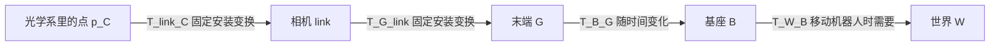

# 08｜机器人坐标、相机与手眼标定

[English](en/08_robot_frames_calibration.md) · [返回首页](../README.md) · 下一章：[09 感知到行动](09_robot_perception_action.md)

> 文档核查：2026-10-03。OpenCV API 依据官方文档；本章涉及 OpenCV 的片段仅作语法与接口说明，未执行，也未安装依赖。标准库练习见仓库 `examples/`；它们验证坐标运算，不代表完成了真实标定。

## 1. 先明确：这个三维点属于谁

“物体在 `(0.4, 0.1, 0.3)`”缺少坐标系、单位和时刻，不能直接发送给机器人。完整记录至少包含：数值、`frame_id`、米制单位、采集时间、估计误差和标定版本。一个坐标系是原点加三条有方向的轴；同一个实体点在不同坐标系下有不同数值。

| 符号 / 示例名称 | 原点与用途 | 常见误区 |
|---|---|---|
| `base` / `base_link` | 机器人基座或机体参考系 | 移动底盘的 base 会随时间移动 |
| `gripper` / `flange` | 手眼标定使用的刚性末端参考系 | 控制器给出的可能是 TCP，而非机械法兰 |
| `tcp` | 工具中心点，例如夹爪指尖中点 | 换工具后偏置需要重测 |
| `camera_link` | 相机安装结构参考系 | 不必与镜头光心重合 |
| `camera_optical_frame` | 投影模型使用的光学参考系 | 轴方向通常不同于机器人 link |
| `target` | 标定板的已定义原点和角点坐标 | 棋盘格格长、原点和编号须一致 |
| `object` | 物体局部坐标系 | 包围盒中心不一定是 CAD 原点或重心 |

统一采用右手坐标、长度米、角度弧度、时间秒。ROS 机体通常为 x 前、y 左、z 上；光学系为 x 右、y 下、z 前。具体驱动 frame 定义仍需检查。[REP-103 官方规范源码](https://raw.githubusercontent.com/ros-infrastructure/rep/master/rep-0103.rst)



图上的边表达点坐标变换；它们与 tf 树 parent/child 的显示方式不能只凭箭头方向混读。

## 2. 全章只用一种变换记号

点是**列向量**，`T_A_B` 表示“将 B 系坐标转换成 A 系坐标”，也表示 B 系在 A 系中的位姿：

```text
p_A = T_A_B p_B
      [ R_A_B  t_A_B ] [x_B]
      [ 0 0 0    1   ] [y_B]
                        [z_B]
                        [ 1 ]
```

`R_A_B` 的列是 B 的三条轴在 A 中的表示；`t_A_B` 是 B 原点在 A 中的位置。平移对点有效；法向、方向向量只用旋转。不要把点的最后一维 1 用在方向向量上。

组合时相邻中间标号抵消：

```text
T_A_C = T_A_B T_B_C
R_A_C = R_A_B R_B_C
 t_A_C = R_A_B t_B_C + t_A_B

inverse(T_A_B) = T_B_A
R_B_A = transpose(R_A_B)
t_B_A = -transpose(R_A_B) t_A_B
```

矩阵乘法不交换；逆变换的平移不是简单的 `-t`。刚体旋转必须满足 `RᵀR = I`、`det(R)=+1`；`det=-1` 是反射，不是合法旋转。尺度因子应在单位转换阶段处理，不塞进刚体变换。

**手算练习：** B 相对于 A 无旋转，原点在 A 的 `(1,0,0)` 米；C 相对于 B 无旋转，原点在 B 的 `(0,2,0)` 米。C 原点在 A 是 `(1,2,0)`。再给 B 加 z 轴 +90° 旋转，C 原点变为 `(-1,0,0)`；先转 C 的平移，再加 B 的平移。

### 光学系到 link 的最小轴转换

只有当两系原点重合、光轴与 link 的前向完全一致时，下式成立：

```text
[x_link]   [ 0  0  1 ] [x_optical]
[y_link] = [-1  0  0 ] [y_optical]
[z_link]   [ 0 -1  0 ] [z_optical]
```

光学系 `(0,0,1)` 表示前方 1 米，变为 link 的 `(1,0,0)`。若真实相机有安装平移/倾斜，还需对应外参。若驱动已发布 optical→link 变换，只使用一次；额外再乘这张矩阵会重复转换。

从仓库根目录运行标准库教学示例：

```bash
python3 examples/rigid_transform_demo.py
```

输入是脚本中的合成变换；输出是组合、逆变换和光学轴转换检查。先检查单位轴和往返误差，再接真实数据。具体运行记录见 [VALIDATION.md](../VALIDATION.md)。

## 3. 内参、外参与深度各解决什么

理想、无畸变的针孔相机：

```text
K = [fx  0 cx; 0 fy cy; 0 0 1]
u = fx X_C / Z_C + cx
v = fy Y_C / Z_C + cy

已知轴向深度 Z：
X_C = (u-cx) Z / fx
Y_C = (v-cy) Z / fy
Z_C = Z
```

`fx,fy,cx,cy` 是像素单位；Z 是米。内参决定像素到光线，外参决定光线上的三维点如何进入机器人坐标。镜头畸变需要对应模型；使用原始像素时先按相机模型去畸变，使用已校正图像时用校正后的投影参数。分辨率缩放、裁剪和数字变焦后应同步更新内参。投影模型与标定参数见 [OpenCV 官方相机模型](https://docs.opencv.org/4.x/d9/d0c/group__calib3d.html)。

深度通常是沿光学 z 的距离，不一定是到光心的欧氏距离。若设备给的是射线长度 `r`，则 `Z = r / sqrt(1+x_n²+y_n²)`，其中 `x_n=(u-cx)/fx`、`y_n=(v-cy)/fy`。先查设备定义，再反投影。

**数值检查：** `fx=fy=500`，`cx=320, cy=240`，像素 `(370,240)` 的 Z 为 1 米，则点是 `(0.1,0,1)` 米。它到光心的欧氏距离约为 1.005 米。若深度原值 1000 表示毫米，应只乘一次 0.001。

RGB 和深度并非天然同一像素网格。分割 RGB 的 mask 要用于深度，需要厂商提供的对齐图，或用两相机内参、外参做反投影→换帧→重投影并处理遮挡。即使尺寸一样，也不能假定对应。

### 最小离线接口

| 输入 | 检查 | 输出 |
|---|---|---|
| 已对齐的深度与 mask | 有效 Z、单位、像素索引 `(u,v)` 与数组 `[v,u]` | 光学系物体点集 |
| 与该图像模式匹配的 K | 正焦距、校正状态、尺寸/ROI | 可重投影的三维点 |
| 采集时刻的 `T_base_camera` | 刚体合法性、标定版本、时间匹配 | 基座系点集、边界与统计量 |

```bash
python3 examples/depth_to_robot_demo.py
```

该示例使用合成深度与 mask，不读取相机，不估计真实物体姿态。点集的中心或 AABB 只给位置/范围；完整 6D 位姿还需要几何、对应关系或姿态估计，见 [09](09_robot_perception_action.md)。

## 4. 时间也是外参的一部分

眼在手上时：

```text
p_base(t_capture) = T_base_gripper(t_capture) T_gripper_camera p_camera(t_capture)
```

图像是 10:00:00.000 的，末端位姿是 10:00:00.100 的，组合结果就不是同一瞬间。纯平移速度 0.5 m/s、延迟 0.1 s 已产生约 5 cm 位移；角速度也会把远处点放大成位置误差。这是量级估算，不能代替完整误差模型。

采集合同应写：曝光/采样时间如何产生、设备时钟怎样映射到机器人时钟、同步容差、最大数据年龄、丢帧策略。硬件触发减少曝光差，时钟同步处理时间基准；回调到达时间含传输与排队延迟，不能冒充采集时间。滚动快门的一帧各行时间不同，快速运动时单一刚体位姿仍可能不足。

机器人位姿若需要插值，平移与旋转应分别处理，旋转用合法的 SO(3) 插值；不要逐元素插值 4×4 矩阵。必须在有数据覆盖的时间内插值，外推需单独模型和误差界。在线按采集 stamp 查询 tf2，缺变换或数据过期就拒绝该次动作，详见 [10 ROS2 与 MuJoCo](10_ros2_mujoco.md)。

## 5. 眼在手上：相机装在运动末端

设 B=base，G=用于机器人读数的末端参考系，C=camera optical，Q=target。标定板固定于环境，相机刚性固定于 G。第 i 次观测提供：

- 机器人正运动学或控制器读数 `T_B_G_i`；确认是 flange 还是 TCP。
- 由标定板已知米制角点与图像估计 `T_C_Q_i`。
- 成对采集时间、角点质量、内参/畸变模型。

求固定的 `X=T_G_C`。每次都应有：

```text
T_B_Q = T_B_G_i X T_C_Q_i    （左侧在采集期间保持不变）
A X = X D
A = inverse(T_B_G_j) T_B_G_i
D = T_C_Q_j inverse(T_C_Q_i)
```

`AX=XD` 是消去未知固定板位姿后的约束；写出这个等式或验证合成矩阵并没有求得真实 X。

OpenCV `solvePnP` 的 `rvec,tvec` 给的是 target/object→camera，正好是 `T_C_Q`；若 `objectPoints` 用毫米，`tvec` 也是毫米，先转换到米。平面靶有歧义时检查解的可见深度、重投影与跨帧一致性。[官方 solvePnP 说明](https://docs.opencv.org/4.x/d5/d1f/calib3d_solvePnP.html)

以下仅为 **OpenCV + NumPy 语法/文档示例，未执行**。`T_B_G` 与 `T_C_Q` 是同长度、时间匹配的 4×4 NumPy 矩阵列表；每个 t 的单位为米：

```python
import cv2
import numpy as np

def split_rt(poses):
    return ([T[:3, :3] for T in poses],
            [T[:3, 3:4] for T in poses])

R_G2B, t_G2B = split_rt(T_B_G)
R_Q2C, t_Q2C = split_rt(T_C_Q)
R_C2G, t_C2G = cv2.calibrateHandEye(
    R_G2B, t_G2B, R_Q2C, t_Q2C,
    method=cv2.CALIB_HAND_EYE_PARK)
T_G_C = np.eye(4)
T_G_C[:3, :3] = R_C2G
T_G_C[:3, 3] = t_C2G.reshape(3)
```

输入 `gripper2base` 是 `T_B_G`，输入 `target2cam` 是 `T_C_Q`，输出 `cam2gripper` 是 `T_G_C`。方法选择并不修复反向输入、坏时间戳或错误格长。[calibrateHandEye 官方定义](https://docs.opencv.org/4.x/d9/d0c/group__calib3d.html)

## 6. 眼在手外：相机固定、标定板跟着末端

此时相机固定于 B，板刚性固定于 G；机器人移动板。未知量为 `X=T_B_C` 和固定安装 `Y=T_G_Q`：

```text
T_B_G_i Y = X T_C_Q_i
inverse(T_B_G_i) X T_C_Q_i = Y
```

第二行与上一节的“第一组位姿 × X × 第二组位姿为常量”完全相同，因此可以重新解释 `calibrateHandEye` 的坐标角色：**第一组传 `T_G_B_i`，第二组仍传 `T_C_Q_i`，返回值解释为 `T_B_C`**。这不是只交换函数参数；必须将每个完整刚体位姿求逆，旋转与平移一起处理。

以下仍为 **OpenCV + NumPy 语法/文档示例，未执行**，沿用上节 `split_rt`：

```python
def inv_rigid(T):
    out = np.eye(4)
    out[:3, :3] = T[:3, :3].T
    out[:3, 3] = -T[:3, :3].T @ T[:3, 3]
    return out

T_G_B = [inv_rigid(T) for T in T_B_G]
R_B2G, t_B2G = split_rt(T_G_B)
R_Q2C, t_Q2C = split_rt(T_C_Q)
R_C2B, t_C2B = cv2.calibrateHandEye(
    R_B2G, t_B2G, R_Q2C, t_Q2C,
    method=cv2.CALIB_HAND_EYE_PARK)
T_B_C = np.eye(4)
T_B_C[:3, :3] = R_C2B
T_B_C[:3, 3] = t_C2B.reshape(3)
```

这里变量名用实际物理方向命名；函数签名中的 `gripper/base` 名称并不会自动识别相机安装方式。用 `Y_i = inverse(T_B_G_i) T_B_C T_C_Q_i` 检查是否固定。若板也固定在环境，机器人运动不改变板观测，这套数据不能这样估计手眼；若已知 `T_B_Q`，可以直接由 `T_B_C = T_B_Q inverse(T_C_Q)` 求外参并独立验证。若 B 本身移动，应使用一个固定世界参考系重新建模。

## 7. 可观测性、采集与独立验收

OpenCV 给出的最低几何要求是至少两次具有非平行旋转轴的运动，即至少三个不同姿态；真实带噪采集需要更多姿态。只平移、只绕同一轴、变化极小，都可能使解退化或很不稳定。见 [官方手眼标定要求](https://docs.opencv.org/4.x/d9/d0c/group__calib3d.html)。

教学采集方案可从 15–25 个清晰姿态开始，这是练习建议，不是成功阈值。围绕两条以上不同轴改变姿态；同时改变距离和位置，让靶覆盖中心与边缘，避免角点出界/模糊。先停稳拍照可减少同步不确定性。保持安装刚性；板弯曲、自动变焦、松动支架会破坏假设。

将完整姿态分为拟合组和留出组；相邻几乎重复帧不构成有力的独立验收。保存以下证据：

| 验收 | 如何做 | 能发现什么 |
|---|---|---|
| 内参留出重投影 | 未拟合图像上的角点像素误差，按视角与区域统计 | 图像模型、角点/畸变问题 |
| 手眼闭环 | 留出姿态下计算眼在手上的 `T_B_Q_i` 或手外的 `T_G_Q_i` | 外参方向、机器人位姿、安装/同步不一致 |
| 独立空间测量 | 不同位置的已知点/距离，与独立测量或已知夹具比较 | 全局偏差、尺度与工作区外推风险 |
| 重复安装/采集 | 不同批次重估，比较 X 的平移与角度 | 重复性和机械稳定性 |

闭环可对一个**只从拟合组确定**的参考位姿 `T_ref` 求 `E_i=inverse(T_ref) T_i`。平移误差用 `||t_E||`，角度用 `acos(clamp((trace(R_E)-1)/2,-1,1))`。报告中位数、较高分位、最大值、样本数与对应工作区，不只报平均值。重投影验收应使用拟合组确定的安装量和机器人位姿来预测留出角点；仅在每张留出图上重新拟合 PnP 得到很低误差，不能独立证明手眼精度。

验收阈值来自任务的误差预算。例如夹取间隙、TCP误差、深度噪声、标定误差和时延都占用预算；“小于 1 像素”不能普遍保证“小于 1 mm”。真实机器人执行应另走 [09 的动作验收](09_robot_perception_action.md)。

## 8. 故障定位与练习

| 现象 | 首先检查 |
|---|---|
| 点云转过去后镜像/轴反了 | 手性、optical/link、重复轴变换 |
| 误差约 1000 倍 | 格长/机器人/深度是否混用 mm 与 m |
| 机械臂不动时正确，动起来漂移 | 采集 stamp、时钟映射、曝光/回调延迟 |
| 某些区域偏差特别大 | 畸变、裁剪 K、RGB-depth 对齐、工作区采样 |
| 输出矩阵存在但结果很差 | 非平行旋转、角点排序、板刚性、反向输入 |
| 位姿似乎只差工具长度 | flange/TCP 定义和工具安装偏置 |

1. 用单位轴检查 optical→link；加入 0.02 m 安装偏移并做逆变换往返。提交变换方向与误差。
2. 将上面的 `(370,240,1m)` 重投影回像素；再故意把 Z 当 1000 m，观察哪些检查能发现错误。
3. 写出眼在手上与眼在手外的完整闭环，逐个标号检查乘法顺序。说明为什么手外输入要逆机器人位姿。
4. 设计两组采集：只绕 z 轴和多轴运动；解释可观测性差异，提出留出姿态与独立尺量方案。
5. 在纸上估算 20 ms 延迟、0.2 m/s 平移会贡献多少误差：约 4 mm；再说明旋转与目标距离为何还需考虑。

完成标准：能给任一输出点写出 frame、单位、时间；能解释两类手眼输入/输出；能提供独立误差证据。下一步：[09｜从感知到机器人行动](09_robot_perception_action.md)。
