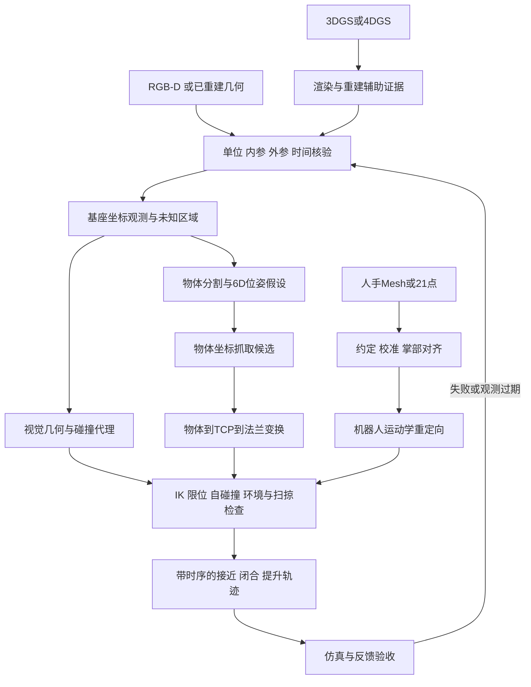

# 09 从三维感知到机器人动作

[中文](09_robot_perception_action.md) | [English](en/09_robot_perception_action.md)

[返回入口](../README.md) · 前置：[点云与 Mesh](02_pointcloud_mesh.md)、[MANO](03_mano_hand.md)、[坐标与标定](08_robot_frames_calibration.md) · 下一章：[ROS 2 与 MuJoCo](10_ros2_mujoco.md)

**目标**：把“看见物体/人手”变成可检查的机器人目标，知道几何、抓取、运动规划和接触之间还缺哪些条件。

**核验日期：2026-10-03。** 官方网页与代码已查阅。本文的矩阵数值是自编合成例子；CPU 脚本的实际验证状态见 [examples](../examples/README.md)。本文没有执行 GPU 训练、MANO 推理、MoveIt 集成、真实机器人控制或外部 API 集成，也不把数学例子称作已完成抓取。

## 1 先写清每一步交付什么

一张深度图只能提供观测。机器人需要带坐标、单位、时间和有效性说明的目标，还需要自身模型与当前状态。不要把 `N×3` 点集直接作为运动指令。



本图是本教程的流程设计。下面表格是建议的数据合同，不是某个库的固定 API。

| 阶段 | 输入 | 输出与必须附带的信息 | 第一项检查 |
|---|---|---|---|
| 观测转几何 | 深度、有效掩码、内参、相机外参、曝光时间 | 基座坐标点云；米；时间戳；观测覆盖范围 | 无效深度被剔除，已知长度正确 |
| 分割与位姿 | RGB-D/点云、物体 CAD 或明确模型假设 | 实例标识、`T_B_O`、候选/置信度、对称约定、残差 | 目标与背景没有混合；模型原点正确 |
| 碰撞资产 | 观测、CAD、机器人模型、已知桌面 | 障碍物、未知区策略、碰撞代理、裕量、更新时间 | 未观测背面没有被默认为空 |
| 抓取候选 | 物体几何、夹爪尺寸、任务要求 | `T_O_TCP`、开口宽度、接近方向、预抓取距离、评分 | 宽度/手指长度是否适合；评分含义明确 |
| 运动规划 | 候选、`T_F_TCP`、当前关节、限位、碰撞场景 | 关节路径及时间、失败原因、使用的场景版本 | 整条路径和抓住后的物体都受检查 |
| 手部重定向 | 命名关键点、掌部位姿、机器人运动学 | 按关节名排列的 `q(t)`、残差、约束违规 | 正向运动学回算后再验收 |
| 动作验收 | 指令、关节/视觉/接触反馈 | 实际误差、任务成败、恢复/终止原因 | 成功标准在实验前确定 |

`B` 是机器人基座，`C` 是相机，`O` 是物体，`F` 是法兰，`TCP` 是工具中心点。贯穿本章：**`T_A_B` 将 B 中的列向量坐标变到 A 中**，即 `p_A = T_A_B p_B`。位姿不是只有一个三维位置。

## 2 深度与 Mesh 怎样成为可用几何

### 2.1 先得到正确的观测点

对已去畸变、深度为光轴方向 `z` 的针孔模型：

$$z=d/s,\quad x=(u-c_x)z/f_x,\quad y=(v-c_y)z/f_y,\quad \bar p_B=T_{B\_C}\bar p_C.$$

这里 `s` 是每米包含的原始深度单位。Open3D 0.19.0 的 `create_from_depth_image` 使用这个深度反投影关系；该 API 的 `depth_scale` 是除数。把已经是米的深度再次除以1000会使场景缩小1000倍。不同数据格式可能把同名字段定义为乘数，应查原始协议。[Open3D 深度 API](https://www.open3d.org/docs/0.19.0/python_api/open3d.geometry.PointCloud.html#open3d.geometry.PointCloud.create_from_depth_image)、[BOP 深度格式](https://github.com/thodan/bop_toolkit/blob/master/docs/bop_datasets_format.md)

**最小合成检查**：令 `fx=fy=500`、`cx=320`、`cy=240`，像素 `(u,v)=(370,240)` 的有效深度为 `z=0.8 m`，则 `p_C=(0.08,0,0.8) m`。中心像素得到 `(0,0,0.8)`。若数值是 `800`，先解释它代表毫米还是米；不要靠“看起来像物体”判断尺度。完整坐标练习见 [depth_to_robot_demo.py](../examples/depth_to_robot_demo.py)。

分割、离群点剔除、降采样与 Mesh 重建见第02章。这里追加机器人需求：保存被剔除区域、遮挡范围与时间戳；过滤后的平滑表面可能丢失细杆或把狭缝封住。单帧重建的背面没有证据；多帧融合也要检查标定和运动重影。

### 2.2 视觉几何与碰撞几何分开验收

**视觉几何**服务于查看与渲染，可以有高分辨率纹理和大量三角形。**碰撞几何**服务于距离/接触查询，需要明确的形状、尺度、位姿和覆盖范围。质量、惯量、摩擦、执行器和接触参数另属动力学模型。MuJoCo 的 geom 属性分别控制碰撞、摩擦与质量相关设置；漂亮纹理不能补全这些字段。[MuJoCo geom 参考](https://mujoco.readthedocs.io/en/stable/XMLreference.html#body-geom)

入门先用测量过的盒子、球、圆柱/胶囊等简单代理。复杂刚体可由多个凸部件逼近：杯子的凸包会填满杯口，环的凸包会堵住孔。若任务要插入或抓住把手，就必须保留任务相关凹处。MuJoCo 普通 mesh geom 的碰撞使用凸化几何，不能据渲染中的凹形推断其碰撞也有凹形；其 rigid flex 等其他路径另有建模条件，见第10章。[MuJoCo 建模说明](https://mujoco.readthedocs.io/en/stable/modeling.html)

**练习代理**：对一个 `60×40×30 mm` 合成盒，视觉表面可用 Mesh，碰撞先用同尺寸盒。另设明确的演示裕量 `3 mm`，将保守代理的全尺寸扩为 `66×46×36 mm`；记录这是人为裕量，不是真实尺寸。对机械手指、相机支架和电缆也检查覆盖。裕量应依据深度误差、标定误差、模型误差和跟踪误差选取；本例3毫米不是通用推荐值。裕量过大也会挡住合法抓取，应分别处理目标接触与避障。

### 2.3 未知空间不等于自由空间

点云“这里没有点”可能表示空，也可能表示遮挡、距离越界、反光无返回或被过滤。占据地图应区分**占据、已观测自由、未知**；OctoMap 明确建模这三类信息。只沿有效测量射线、在可靠传感器模型下更新自由区域；物体后方和无效深度不应直接清为空。[OctoMap 官方说明](https://octomap.github.io/)

本教程的保守策略是：计划进入未知区时先补观测，或将该区设为禁止进入区域。其他任务可以采用明确、经过验证的探索策略，但必须在日志中注明。插值填洞只产生估计，不能把补洞后的 Mesh 当作背面已被测到。

**扫掠体积**是机器人和携带物体沿整条路径占据的空间并集。起点与终点无碰撞，中途手肘仍可能撞桌子；旋转一个长物体时，其角部会扫过很大的范围。检查接近、闭合和提升，抓住后更新附着物体的几何。离散路径检查会受采样间隔影响；当前 MoveIt OMPL 文档说明默认运动碰撞检查采用离散中间状态，过粗分辨率会漏过细小障碍。[MoveIt OMPL 配置](https://moveit.picknik.ai/main/doc/examples/ompl_interface/ompl_interface_tutorial.html)

## 3 物体6D位姿怎样产生抓取候选

### 3.1 位姿、实例与置信度

“6D”指三维平移加三维旋转自由度；旋转也可以由四元数或矩阵编码，不是必须存6个数。已知 CAD 时，可从图像对应点估计初值，再与深度/点云对齐；ICP 只是在相应条件下细化对齐，不能自动解决误分割或所有对称歧义，见[第02章](02_pointcloud_mesh.md)。无模型流程也必须定义物体参考系和尺度。

一个无纹理圆柱绕轴转动可能无法从当前观测区分；盒子也可能存在离散旋转对称。保存多个等价假设或对称集合 `S`，把 `T_B_O S` 作为可能的等价位姿，而不是把任意一个 yaw 当作精确测量。BOP 的模型元数据分别提供离散与连续对称描述。[BOP 模型格式](https://github.com/thodan/bop_toolkit/blob/master/docs/bop_datasets_format.md)

抓取与任务还要判断“对称是否有用”：圆柱侧面夹取可能允许多个 yaw，插入带键槽零件却需要辨识键槽。几何对称不代表材料、负载或语义完全对称。实例 ID 应随时间保持一致；两个外观相同盒子的位姿估计正确，也可能抓错目标。

输出应包含观测时间、可见比例、配准/重投影残差、失败标志和适用的置信度说明。网络分数不能未经校准就当作“90%抓取成功概率”。低残差也可能是对称或背景误配准。用留出数据检查分数与实际错误的关系；不满足阈值时重观测或返回失败。

### 3.2 候选是一组条件，不是成功证明

先在**物体坐标系**描述候选，例如：从盒顶接近、两指夹住两侧、开口比物体宽一点。每个候选保存 `T_O_TCP`、夹爪开口、局部接近轴、预抓取距离、预期接触面和任务约束。算法评分必须注明是几何评分、学习分数还是仿真结果。对合成盒，若夹取宽度0.06米、指令开口0.07米、最大开口0.08米，只通过了宽度检查；手指间隙和闭合接触仍需检查。

第一轮筛选用夹爪开口与手指长度排除尺寸不适合的候选，再检查接近途中是否会碰桌面、目标以外物体和未知区域。对平行夹爪，两个接触点与法线可以提供几何启发；仅有两个靠近的点不能证明摩擦、力矩平衡或稳定接触。仿真也依赖所设摩擦、质量、控制与接触模型。[MuJoCo 接触与滑移说明](https://mujoco.readthedocs.io/en/stable/modeling.html#preventing-slip)

## 4 从物体目标算到TCP与法兰

### 4.1 链的含义

感知给 `T_B_O`，候选给 `T_O_TCP`。工具标定给固定的 `T_F_TCP`：TCP 相对法兰的位置与方向。因此：

$$T_{B\_TCP}=T_{B\_O}T_{O\_TCP},\qquad
T_{B\_F}=T_{B\_TCP}(T_{F\_TCP})^{-1}.$$

如果控制器已配置TCP并接收TCP目标，传 `T_B_TCP`；如果接口接收法兰目标，才用 `T_B_F`。先查目标 link/frame，避免应用工具补偿两次。逆矩阵为：

$$[R,t]^{-1}=[R^\top,-R^\top t].$$

### 4.2 带非零旋转的手算例子

全部长度为米，旋转为右手主动旋转、作用于列向量。取：

$$T_{B\_O}=[R_z(90^\circ),(0.40,0.20,0.10)],$$
$$T_{O\_TCP}=[R_x(90^\circ),(0.02,0,0.06)],$$
$$T_{F\_TCP}=[R_y(90^\circ),(0,0,0.10)].$$

相乘得到：

$$R_{B\_TCP}=\begin{bmatrix}0&0&1\\1&0&0\\0&1&0\end{bmatrix},\quad
t_{B\_TCP}=\begin{bmatrix}0.40\\0.22\\0.16\end{bmatrix}.$$

工具补偿后：

$$R_{B\_F}=\begin{bmatrix}1&0&0\\0&0&-1\\0&1&0\end{bmatrix},\quad
t_{B\_F}=\begin{bmatrix}0.40\\0.32\\0.16\end{bmatrix}.$$

注意 TCP 的局部 `+x` 在基座里是 `+y`；工具偏移也经旋转，因此法兰位置不能简单写成 TCP 的基座 `z` 减0.10。验算 `T_B_F T_F_TCP = T_B_TCP`，并检查 `RᵀR=I`、`det(R)=1`。这是坐标计算，尚未求逆运动学或验证碰撞。[grasp_pose_demo.py](../examples/grasp_pose_demo.py) 与 [rigid_transform_demo.py](../examples/rigid_transform_demo.py) 提供 CPU 练习；脚本具体数据以源码为准。

若本例规定从 TCP 局部 `-z` 后退0.05米，则 `T_O_TCP_pre=T_O_TCP [I,(0,0,-0.05)]`。`R_B_TCP` 的第三列是基座 `+x`，所以预抓取 TCP 位置为 `(0.35,0.22,0.16)`。将“后退方向”明确写入候选，不要假设所有夹爪的接近轴都叫 `z`。

## 5 目标位姿还不是可执行轨迹

逆运动学（IK）输入机器人运动学、目标 link 位姿和初始关节状态，输出可能的关节解。解不存在、求解器超时、解落在限位外，或不同初值找到不同分支，都要报告。MoveIt 的官方例子将求解成功与关节限位检查分别展示；其 `setJointGroupPositions` 本身不强制限位。[MoveIt 运动学例子](https://moveit.picknik.ai/main/doc/examples/robot_model_and_robot_state/robot_model_and_robot_state_tutorial.html)

建议逐关检查：

1. 对预抓取、抓取、提升位姿求 IK；记录使用的末端 link、种子和容差，用正向运动学回算目标误差。
2. 检查关节限位、自碰撞、环境碰撞和路径约束；同时考虑手掌、手肘、工具和抓住后的物体。IK成功只通过了运动学这一关。
3. 从当前关节状态规划整条路径，检查扫掠空间和未知区；接近路径必须满足你定义的方向，不是两端姿态满足就够。
4. 加入速度、加速度和执行器能力限制，得到带时间的关节轨迹；静态路径可行不代表任意速度可执行。
5. 更新观测和当前状态，检查感知到执行的延迟，再由反馈判断闭合、接触、提升与滑落。

MoveIt Planning Scene 区分自碰撞与环境碰撞，环境检查可使用 padding；Allowed Collision Matrix 会让指定碰撞被忽略。只允许明确的指尖/目标接触，不要为了让规划成功而宽泛关闭碰撞。[MoveIt Planning Scene](https://moveit.picknik.ai/main/doc/examples/planning_scene/planning_scene_tutorial.html)

**开环限制**：一次估计位姿后照搬整段轨迹，无法自行修正物体移动、标定偏差、执行误差或滑移。入门可先在合成静态场景验证坐标与路径；接触阶段另需要恰当的关节、视觉或力/触觉反馈及终止逻辑。距地面5厘米的成功截图也不能证明物体已被稳定抓住；应按预定时间、负载和扰动条件验收。

## 6 MANO/21点怎样重定向到机器人手

### 6.1 先确认数据约定

MANO 的皮肤 Mesh、运动学骨架点与机器人关节命令是三种不同数据。标准模型的16个骨架节点加5个指尖可组成一种21点协议，但 `[21,3]` 不说明顺序。核验时官方 `smplx` 的 `MANO.forward` 自动追加指尖的调用仍被注释；检查实际输出和 mapper，不能默认已经有21点。[官方 MANO forward](https://github.com/vchoutas/smplx/blob/main/smplx/body_models.py)

若使用第03章的“原始16点后追加5指尖”约定，官方指尖顶点映射按拇指、食指、中指、无名指、小指为 `744,320,443,554,671`；该映射依赖标准拓扑。另一套21点数据应通过**名字**映射，不能直接照抄数组下标。[官方指尖映射](https://github.com/vchoutas/smplx/blob/main/smplx/vertex_ids.py)

输入合同至少记录：左右手、点名与顺序、坐标系、米/毫米、全局旋转是否已应用、时间戳、逐点置信度、被遮挡点、模型版本。单目预测的尺度不应直接当物理测量。模型获取与许可见第03章；本库不包含 MANO 模型或真人图像。

### 6.2 校准尺度与掌部朝向

先把观测点转到共同坐标，扣掉腕部平移，再用可靠掌宽或指段长度确定尺度。人手与机器人指长比例可能不同，目标是实现任务要求，不是逐点等比例复制。

一种明确的自编掌部约定是：`x` 从小指 MCP 指向食指 MCP；将腕部到中指 MCP 的向量投影到 `x` 的垂直平面，归一化为 `y`；`z=x×y`。三个轴组成右手旋转矩阵。左右手分别校准，固定掌法线的期望方向。点缺失或近共线时返回无效，不要让噪声决定翻转180度。

输入是命名掌部点与机器人参考张手姿态；输出是人手掌坐标到机器人掌坐标的固定对齐、尺度规则和校准残差。用未参与校准的“张手、握拳、捏合”检查：张手应伸展，捏合应让正确两指靠近，掌部转动不应变成手指弯曲。上面的轴约定是教学选择，不能声称等于 MANO 或任意数据集的原生约定。

### 6.3 用机器人正向运动学优化

机器人手的自由度、关节轴、耦合/腱传动和运动范围与人手不同。不要将 MANO 的局部轴角直接写进机器人关节。用机器人 URDF/MJCF 的正向运动学 `f_i(q)`，匹配经校准的目标点或指尖间向量：

$$\min_q \sum_i w_i\|f_i(q)-\hat p_i\|^2
+\lambda\|q-q_{t-1}\|^2,\quad q_{\min}\le q\le q_{\max}.$$

这是教学目标函数；实际还要加入掌部位姿、耦合约束、速度约束、自碰撞距离及物体接触约束。`w_i` 可降低被遮挡点影响；平滑项会增加滞后，需量化。按名称导出关节，转给驱动器/仿真前重新排列；`dex-retargeting` 官方 README 特别提醒不同 URDF 使用方可能得到不同关节顺序。[dex-retargeting](https://github.com/dexsuite/dex-retargeting)

**最小无资产练习**：自造命名的腕部、MCP和指尖坐标；令两节平面机器人指长 `l1=0.04 m`、`l2=0.025 m`，关节 `q1=q2=π/4`。正向运动学给指尖：

$$x=l_1\cos q_1+l_2\cos(q_1+q_2)=0.028284,\quad
y=l_1\sin q_1+l_2\sin(q_1+q_2)=0.053284.$$

把目标改为距根部0.09米，就超过最大伸长0.065米，应报告不可达。把限位改成 `q2≤π/6` 后，原姿态也违规；直接截断 `q2` 会改变指尖位置，必须回算残差。这一练习不需要 MANO 权重或手部视频，也不表示已实现完整灵巧手重定向。

### 6.4 保留接触比只匹配外形更困难

人手捏合位置靠近某个物体表面，不代表机器人同样能碰到该面。用物体坐标保存接触点、法线、涉及的手指和接触时间段，在重定向后检查指尖到表面的距离、穿透和接触切换。机械手必须在自身运动范围内满足这些目标；无法同时满足时报告任务残差。

表面相交是几何事件，稳定持物还涉及法向力、摩擦、重心、力矩、执行器和控制。人体软组织也不能由刚性指尖代理自动复现。下一步应在有明确物理参数的仿真中检查接触和滑移，并区分期望接触、估计接触、仿真接触与实测接触。[MuJoCo 接触参数](https://mujoco.readthedocs.io/en/stable/XMLreference.html#body-geom)

## 7 3DGS与4DGS可以帮助到哪里

3DGS 原始方法面向辐射场与新视角渲染，可帮助展示重建、查看场景和检查视角覆盖。原始4DGS方法加入时间相关变形来渲染动态场景，可提供时间上的可视化证据。它们需要各自的数据和训练条件，详见第04/05章。[3DGS 原始项目](https://repo-sam.inria.fr/fungraph/3d-gaussian-splatting/)、[4DGS 原始项目](https://guanjunwu.github.io/4dgs/)

根据这两个方法的输出定义，本教程作如下工程判断：高斯中心、协方差和不透明度不是现成的实体碰撞体；渲染相似不保证接触表面精确。4DGS 中的变形轨迹也不能自动证明持久物体身份、无穿透或接触力。若从它们另提取深度/表面/分割，应保存提取算法与阈值，再对尺度、表面和未知区独立验收；若需要身份跟踪、碰撞或物理参数，分别建立并验证。不能把“Gaussian”中的协方差直接当作机器人测量不确定度。

## 8 软件与最小实践顺序

| 层级 | 需要什么 | 最小输入 → 输出 | 完成证据 |
|---|---|---|---|
| CPU坐标练习 | Python；以仓库脚本依赖为准 | 合成矩阵/深度 → 点与TCP/法兰目标 | 正反变换、数值与单位一致 |
| 几何处理 | Open3D；可选 CloudCompare/MeshLab | 小点云/已知CAD → 清理结果与简单碰撞代理 | 尺寸、覆盖、表面误差记录 |
| 抓取与规划 | 机器人URDF/SRDF、工具标定、MoveIt 2 | 候选+当前关节+场景 → IK/路径或失败 | FK误差、限位、完整路径碰撞检查 |
| 手部重定向 | 合法手部输入、命名映射、运动学与优化器；可参考 dex-retargeting | 校准关键点 → 机器人关节序列 | 残差、限位、自碰撞、时间滞后 |
| 接触验证 | MuJoCo模型、质量/惯量/摩擦/执行器、控制器 | 轨迹与模型 → 仿真状态/接触/成败 | 多次重复、参数扰动与失败日志 |

工具职责参考：[Open3D](https://www.open3d.org/docs/0.19.0/getting_started.html)、[MoveIt 2](https://moveit.picknik.ai/main/doc/examples/robot_model_and_robot_state/robot_model_and_robot_state_tutorial.html)、[dex-retargeting](https://github.com/dexsuite/dex-retargeting)、[MuJoCo](https://mujoco.readthedocs.io/en/stable/modeling.html)。这是分阶段所需软件，不要求一次全部安装；平台与版本条件见第02/06/10章。

从仓库根目录尝试：

```bash
python3 examples/rigid_transform_demo.py
python3 examples/depth_to_robot_demo.py
python3 examples/grasp_pose_demo.py
```

具体选项、产物与已执行状态见 [examples/README.md](../examples/README.md)。先保存CPU结果，再搭一个合成桌面与盒子的仿真场景。这个顺序的产物是“数值正确的目标”和“指定模型下的规划/仿真证据”；仍不能替代真实机器人的标定、驱动、反馈与验收。

## 9 如何评价整条链

以下是本教程建议的实验设计。阈值由物体尺寸、夹爪容差和任务要求确定，实验前写入记录。

| 维度 | 应报告的量 | 容易漏掉的部分 |
|---|---|---|
| 几何 | 已知长度误差；表面距离中位数/尾部；覆盖率；代理误差 | 漂亮纹理、单向点云距离可能掩盖缺面 |
| 位姿 | 平移误差；考虑对称的旋转/表面误差；失败率与置信度校准 | 相同几何并不保证相同任务方向 |
| 时间 | 曝光到指令的延迟分布；同步误差；数据过期比例 | 平均延迟掩盖长尾与丢帧 |
| 重定向 | 指尖/向量误差；掌部误差；限位/自碰撞率；接触保留；滞后 | 只看手势相似，忽略机器人约束 |
| 规划 | IK成功率；FK误差；最小距离；路径与时间限制违规 | 只检查目标TCP，遗漏机械臂和附着物 |
| 任务 | 成功次数/总次数；规定持物时长；放置误差；滑落/碰撞/恢复次数 | 挑选单次成功视频，混用仿真和实测结果 |

BOP 实现了考虑对称的 MSSD（表面距离）、MSPD（投影距离）以及关注可见表面的 VSD 等位姿误差。应选择适合观测和任务的协议，并记录可见性与阈值；图像投影误差小不能单独证明抓取的三维裕量足够。[BOP 位姿误差实现](https://github.com/thodan/bop_toolkit/blob/master/bop_toolkit_lib/pose_error.py)

**时间小算例**：若物体以 `0.1 m/s` 移动，感知到执行延迟 `0.2 s`，仅平移就可能产生 `20 mm` 偏移。这个简单匀速估计还没包含旋转、抖动和制动距离。将观测时间与执行时间记录为不同字段。

### 故障表：先定位哪个合同失效

| 现象 | 可能原因 | 用什么证据定位 | 下一步 |
|---|---|---|---|
| 物体位置差1000倍 | 深度或CAD单位混用 | 已知长度与原始数值 | 修正单位后重算全部变换 |
| TCP对准，法兰却偏移 | 工具旋转/逆变换错误或补偿两次 | `T_B_F T_F_TCP`回算 | 对照接口目标link和工具标定 |
| 位姿在等价角度间跳动 | 对称与遮挡 | 多假设、可见面、任务特征 | 对称感知筛选或补拍特征 |
| 两端无碰撞，中途撞桌 | 路径采样太粗或只检查TCP | 中间状态与全机器人扫掠 | 细化检查并重新规划 |
| 机器人伸入点云空白处 | 未知区域当作自由 | 原始深度与射线覆盖 | 补观测或禁止进入 |
| 杯口无法插入 | 单个凸包填满凹处 | 同时显示视觉与碰撞资产 | 使用合适的多部件代理并重验 |
| IK成功但动作不可用 | 限位/碰撞/分支/速度问题 | FK、约束、完整轨迹 | 更换候选/种子或降低任务要求 |
| 人手张开，机械手乱动 | 顺序、左右手或掌部轴错误 | 命名点和逐关节动作 | 修正映射并重复校准检查 |
| 手指逼近但夹不住 | 指长、接触、摩擦或负载不匹配 | 表面距离、接触、滑移日志 | 调整任务目标与物理模型 |
| 画面漂亮，动作仍漂移 | 尺度、身份或时间未验证 | 独立测量、跟踪、时延 | 分别验收后再连入动作链 |

## 10 练习与交付清单

1. **坐标**：复算第4节，故意交换两个矩阵或直接减基座 `z`，解释错误。交付原矩阵、目标、回算误差与示意图。
2. **未知与扫掠**：只保留盒子正面点云，把背面标为未知；画出携带长盒转弯的扫掠范围。比较进入未知区与补观测两种结果。
3. **对称抓取**：给圆柱生成多个绕轴候选，再给圆柱加键槽任务。说明哪些候选在几何上等价、哪些在任务上不等价。
4. **重定向**：用自造点完成掌部校准，再做两节手指练习；添加不可达目标与限位。交付按名字排列的关节、FK残差、失效标志和时间记录。
5. **仿真计划**：在第10章环境中选择盒子、简单夹爪代理和合成桌面，预先规定持物时间与成功标准。记录所用物理参数与实际执行状态；未运行的步骤明确标为未运行。

一份可复查交付应包括输入来源/校验值、版本、坐标与单位、时间语义、标定残差、未知区策略、视觉/碰撞资产、抓取候选、路径与约束结果、接触/任务日志以及失败案例。没有执行的GPU训练、真实机器人或外部接口保留为后续验证项。
