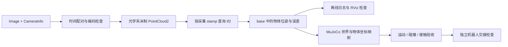

# 10｜把三维感知接到 ROS2 与 MuJoCo

[English](en/10_ros2_mujoco.md) · [返回首页](../README.md) · 前置：[08 坐标与标定](08_robot_frames_calibration.md)、[09 感知到行动](09_robot_perception_action.md)

> 文档核查：2026-10-03。所有 ROS2、NumPy、cv_bridge 和 MuJoCo 片段均为语法/文档示例，未执行；没有安装依赖，没有连接或驱动机器人。标准库离线示例的运行情况见 [验证记录](../VALIDATION.md)。

## 1. 先跑离线，再连接消息和物理模型

本章目标是让“感知结果”具有可检查的输入输出：相机消息→米制点云→指定时刻的机器人坐标→物体/工具位姿→仿真回放与验收。ROS2 负责消息、时钟和坐标关系；MuJoCo 负责给定模型下的运动与接触仿真。真实的质量、摩擦与控制器参数需要另外测量。



先运行 [08](08_robot_frames_calibration.md) 的标准库坐标/深度练习，再运行：

```bash
python3 examples/grasp_pose_demo.py
```

输入是合成的物体位姿、抓取相对位姿和工具安装偏置；输出为 TCP/法兰变换检查。它不会求 IK、规划轨迹或发送控制命令。

## 2. 软件与版本合同

本章以 **ROS2 Jazzy API 分支**说明 Python 接口。Jazzy 在 Ubuntu 24.04 的 amd64/arm64 属于官方 Tier 1 平台；这不等于所有相机/机器人驱动都支持该组合。发行版、操作系统、Python、RMW、驱动、消息包和 tf2 应按同一发行版核对；不要把 Rolling 或其他发行版示例机械混用。[REP-2000 官方平台矩阵](https://raw.githubusercontent.com/ros-infrastructure/rep/master/rep-2000.rst)

| 软件 | 职责 | 需要记录 |
|---|---|---|
| ROS2 / `rclpy` / `sensor_msgs` | 节点与消息 | 发行版、系统、RMW、包版本 |
| `image_geometry` / `cv_bridge` / `image_pipeline` | 图像解释、相机模型、校正 | 编码、raw/rectified、ROI、对齐方式 |
| `tf2_ros` / `tf2_sensor_msgs` | 按时间转换坐标 | frame 树、静态标定、缓存范围 |
| `sensor_msgs_py` | PointCloud2 序列化/读取 | 字段类型、步长、NaN 策略 |
| MuJoCo 官方 `mujoco` Python 包 | MJCF 模型与仿真 | 精确版本、XML、资产、步长/求解器 |

这里不提供统一安装命令；先查目标发行版与硬件驱动说明。MuJoCo `stable` 在线页会变化，采用其中语法时记录本机版本并核对相应版本文档，不能把“当前网页支持”写成“所有安装版本都支持”。

## 3. 三种消息，三份检查

### `sensor_msgs/Image`

`header.stamp` 是图像采集时间，`header.frame_id` 应为对应光学系；`height,width,encoding,is_bigendian,step,data` 定义像素布局。不能直接把任意 `data` 当连续 float 数组；行可能有 padding、编码可能为整数或不同通道数。Image 与 CameraInfo 的 frame 不一致时先拒收并排查。[官方 Image 消息源码](https://raw.githubusercontent.com/ros2/common_interfaces/jazzy/sensor_msgs/msg/Image.msg)

REP-118 的规范深度是 32 位浮点、光学 Z、米；其 OpenNI 16 位无符号表示为毫米，0 无效。现实驱动可能公布设备特定尺度；`16UC1` 只说明存储类型，仍需核对驱动合同。[REP-118 官方源码](https://raw.githubusercontent.com/ros-infrastructure/rep/master/rep-0118.rst)

**cv_bridge + NumPy 语法/文档示例，未执行。** 输入为已明确单位合同的深度 Image；输出是米制二维数组和有效 mask：

```python
import numpy as np
from cv_bridge import CvBridge

bridge = CvBridge()

def decode_depth(msg, uint16_scale_m):
    raw = bridge.imgmsg_to_cv2(msg, desired_encoding="passthrough")
    if msg.encoding == "32FC1":
        z_m = raw.astype(np.float32)  # 本接口约定 float 深度已是米
    elif msg.encoding == "16UC1":
        if not np.isfinite(uint16_scale_m) or uint16_scale_m <= 0:
            raise ValueError("missing/invalid driver depth scale")
        z_m = raw.astype(np.float32) * uint16_scale_m
    else:
        raise ValueError(f"unsupported depth encoding: {msg.encoding}")
    valid = np.isfinite(z_m) & (z_m > 0)
    return z_m, valid
```

`uint16_scale_m=0.001` 只适用于确认原值是毫米的驱动。再按设备有效距离过滤；不把无效值填成近距离障碍或可信物体表面。

### `sensor_msgs/CameraInfo`

原始图像使用 `k` 和匹配的 `d/distortion_model`；校正图像使用 `p` 的有效内参，并正确处理 `r`、ROI、binning。`k[0]==0` 可指示未标定，拒绝按可靠内参反投影。不能拿彩色相机的 K 反投影未对齐的深度图。[官方 CameraInfo 消息源码](https://raw.githubusercontent.com/ros2/common_interfaces/jazzy/sensor_msgs/msg/CameraInfo.msg)

下面最小反投影 **NumPy + ROS2 语法/文档示例，未执行**，只适用于已对齐的单目校正深度、无 ROI/binning、`p[3]=p[7]=0`；其他模式用经过验证的相机模型：

```python
from sensor_msgs_py.point_cloud2 import create_cloud_xyz32
from std_msgs.msg import Header

def rectified_cloud(depth_msg, info, z_m, valid):
    if (not depth_msg.header.frame_id
            or depth_msg.header.frame_id != info.header.frame_id):
        raise ValueError("Image/CameraInfo frame mismatch")
    if (z_m.shape != (info.height, info.width) or valid.shape != z_m.shape
            or not np.isfinite(info.k[0]) or info.k[0] <= 0):
        raise ValueError("image size or calibration mismatch")
    if info.binning_x not in (0, 1) or info.binning_y not in (0, 1):
        raise ValueError("this example does not handle binning")
    if info.roi.width or info.roi.height or info.p[3] or info.p[7]:
        raise ValueError("this example requires full-frame monocular P")
    fx, fy, cx, cy = info.p[0], info.p[5], info.p[2], info.p[6]
    if not np.isfinite([fx, fy, cx, cy]).all() or fx <= 0 or fy <= 0:
        raise ValueError("invalid rectified focal length")
    v, u = np.nonzero(valid)
    z = z_m[v, u]
    xyz = np.column_stack(((u-cx)*z/fx, (v-cy)*z/fy, z))
    header = Header(stamp=depth_msg.header.stamp,
                    frame_id=depth_msg.header.frame_id)
    return create_cloud_xyz32(header, xyz)
```

采集配对应在调用前完成；这段函数并未实现同步器。由校正旋转得到的坐标应与输出 frame 的定义一致；不要给校正系点集贴上另一个未旋转光学系名称。

### `sensor_msgs/PointCloud2`

点云是带 `fields`、`point_step`、`row_step`、大小端和 header 的二进制消息，不能默认每点正好 12 字节。组织点云可以有 height>1；过滤/重建后未必保留像素索引。`is_dense` 不能替代实际有效性检查。[官方 PointCloud2 定义](https://raw.githubusercontent.com/ros2/common_interfaces/jazzy/sensor_msgs/msg/PointCloud2.msg)

用 `sensor_msgs_py.point_cloud2` 解析字段。当前 Jazzy Python 源码的 `read_points` 返回结构化 NumPy 数组，与一些旧教程的生成器写法不同；按所用版本核对。[官方 Python 点云工具源码](https://raw.githubusercontent.com/ros2/common_interfaces/jazzy/sensor_msgs_py/sensor_msgs_py/point_cloud2.py)

## 4. 同步、QoS 与 tf 树

RGB、深度、CameraInfo、机器人状态都要有时间合同。同 stamp 的消息可用精确同步；近似同步允许一个明确的时间窗，但不会修复设备时钟偏差。先将时钟映射到相同基准，再配对，并记录实际配对差。[官方 message_filters Jazzy 源码](https://raw.githubusercontent.com/ros2/message_filters/jazzy/src/message_filters/__init__.py)

CameraInfo 若被驱动每帧发布，就与图像配对；若是静态标定缓存，要验证 frame、模式、分辨率和标定版本，不能因其发布较早就当无效，也不能无条件沿用旧模式参数。

传感器 QoS 通常使用 best effort 和有限队列。订阅者请求 reliable 而发布者只提供 best effort 时可能收不到消息；同步器两侧的 QoS 也必须相容。队列过深会增加数据年龄。检查实际 topic 的 publisher/subscriber QoS，而非仅看节点都已启动。[官方 QoS 文档源码](https://raw.githubusercontent.com/ros2/ros2_documentation/jazzy/source/Concepts/Intermediate/About-Quality-of-Service-Settings.rst)

tf 树保持单一父节点和唯一发布责任：

```text
base_link --动态--> flange --固定标定--> camera_link --固定--> camera_optical_frame
                                  或
base_link --固定标定--> camera_link --固定--> camera_optical_frame
```

末端→相机安装变换可静态发布；运动中的 base→末端必须随采样时刻更新。ROS `TransformStamped` 中 parent=`header.frame_id`、child=`child_frame_id` 对应本书的 `T_parent_child`。不要将已存在的 optical 轴变换再编码进手眼安装量，然后在 tf 树里乘第二次。

具体桥接：令 G=`flange`，C=`camera_optical_frame`，L=`camera_link`。[08](08_robot_frames_calibration.md) 的眼在手上标定输出 `T_G_C`；若驱动已有 `T_L_C`，安装边应发布：

```text
T_G_L = T_G_C inverse(T_L_C)
核对：T_G_L T_L_C = T_G_C
```

这样 G→L→C 的组合才等于标定结果。若不使用 L，且 C 没有既有父节点，也可直接发布 G→C 的 `T_G_C`；不得给 C 同时设置两个父节点。眼在手外同理：`T_B_L = T_B_C inverse(T_L_C)`。

## 5. 按采集时刻运输点云

`lookup_transform(target, source, time)` 给出本书的 `T_target_source(time)`；零时间表示 latest。运动相机要查图像/点云采集 stamp，而不是 `Time()`。[官方 tf2 Buffer Jazzy API 源码](https://raw.githubusercontent.com/ros2/geometry2/jazzy/tf2_ros_py/tf2_ros/buffer.py)

下面为 **ROS2 语法/文档示例，未执行**；输入为已有光学系米制点云，输出为同采集时刻的 base 点云。它在 TF 暂不可用时直接丢弃；实际系统可用有界队列/异步等待，并在等待后重新检查年龄。200 ms 是教学配置，不是机器人通用阈值。

```python
import rclpy
from rclpy.node import Node
from rclpy.time import Time
from rclpy.duration import Duration
from rclpy.qos import qos_profile_sensor_data
from sensor_msgs.msg import PointCloud2
from tf2_ros import Buffer, TransformListener, TransformException
from tf2_sensor_msgs.tf2_sensor_msgs import do_transform_cloud

class CloudTransport(Node):
    def __init__(self):
        super().__init__("cloud_transport_demo")
        self.buffer = Buffer(node=self)
        self.listener = TransformListener(self.buffer, self)
        self.pub = self.create_publisher(
            PointCloud2, "/perception/cloud_base", qos_profile_sensor_data)
        self.sub = self.create_subscription(
            PointCloud2, "/camera/points", self.on_cloud,
            qos_profile_sensor_data)
        self.last_now_ns = None

    def on_cloud(self, msg):
        now_ns = self.get_clock().now().nanoseconds
        reset = self.last_now_ns is not None and now_ns < self.last_now_ns
        self.last_now_ns = now_ns
        if reset:
            self.buffer.clear()
            self.get_logger().warning("clock reset: discard observation")
            return
        stamp = Time.from_msg(msg.header.stamp)
        age_ns = now_ns - stamp.nanoseconds
        if (not msg.header.frame_id or stamp.nanoseconds == 0
                or age_ns < 0 or age_ns > 200_000_000):
            self.get_logger().warning("missing, future, or stale input")
            return
        if not {"x", "y", "z"}.issubset({f.name for f in msg.fields}):
            self.get_logger().warning("missing xyz fields")
            return
        try:
            tf = self.buffer.lookup_transform(
                "base_link", msg.header.frame_id, stamp,
                timeout=Duration(seconds=0.0))
        except TransformException as exc:
            self.get_logger().warning(f"drop: transform unavailable: {exc}")
            return
        out = do_transform_cloud(msg, tf)
        out.header.frame_id = "base_link"
        out.header.stamp = msg.header.stamp  # 保存观测时间
        self.pub.publish(out)

# 在已有的 Jazzy 环境中才可运行；本仓库未执行此入口。
def main():
    rclpy.init()
    node = CloudTransport()
    try:
        rclpy.spin(node)
    finally:
        node.destroy_node()
        rclpy.shutdown()
```

零采集时间在仿真起始时可能合法，但会被 tf2 解释为 latest；此教学接口选择等仿真时钟非零后再处理。ROS 时钟与消息 stamp 必须同域：bag/仿真使用 `use_sim_time` 与 `/clock`，真实设备需完成时钟映射。时钟回退后还要清空图像配对队列、跟踪器历史与待执行动作，重新取得静态/动态 TF 与标定状态。上例只显示点云/tf 部分。

`do_transform_cloud` 转换 xyz 并保留其他字段；如果消息有法向或速度向量，这些字段还需要相应旋转，不能以为 helper 已完成全部语义转换。[官方 tf2_sensor_msgs 实现](https://raw.githubusercontent.com/ros2/geometry2/jazzy/tf2_sensor_msgs/tf2_sensor_msgs/tf2_sensor_msgs.py)

同样的规则用于一个 `PointStamped`：填原始光学 frame 与采集 stamp，查询 `base_link ← optical`，再用 `tf2_geometry_msgs.do_transform_point`；保留观测 stamp。不要只改 header 而不变换坐标。把旧点变到“现在的移动机体”是另一问题，需明确 source/target 时间、固定世界系与对象运动假设；一个 exact-stamp TF 查询不会预测物体运动。

## 6. MuJoCo：asset、body 与 geom 不同

| 元素 | 作用 | 接入要求 |
|---|---|---|
| `<asset><mesh>` | 可复用的三角网格资源 | 尺度、文件许可、局部原点、法向 |
| `<body>` | 局部运动学坐标、质量/惯量载体 | 父子关系、关节、物体位姿 |
| `<geom>` | 引用资源/基本体，供显示与碰撞 | 相对 body 的局部位姿、碰撞选择 |
| `<inertial>` | 质量、重心与惯量 | 独立测量或明确估计方式 |
| `<site>` | 工具/目标/传感器参考位置 | 不能当实体碰撞几何 |

标准 mesh 碰撞使用网格的**凸包**，显示仍可为非凸网格；杯子的洞、托盘凹槽和手指间隙可能被凸包填满。用多个凸块或基本体组合表示碰撞形状，并检查关键间隙。SDF 插件等有另外的要求，不能据此假定普通三角 mesh 支持准确凹面接触。[官方碰撞与凸分解说明](https://mujoco.readthedocs.io/en/stable/computation/index.html#collision-detection)

MJCF `body.pos/quat` 相对于父 body，geom 的位姿相对于所属 body；asset 的 scale 只缩放几何，不自动修复所有机器人长度/质量参数。mesh 编译还有居中与惯量主轴处理，读取原始顶点与运行时位姿时须考虑编译偏置。`box size` 是半尺寸。[官方 XML mesh/geom/body 定义](https://mujoco.readthedocs.io/en/stable/XMLreference.html)

### ROS 位姿进入仿真前

```text
T_world_object = T_world_base T_base_object
T_world_geom = T_world_object T_object_geom
```

`T_world_base` 必须明确测量或定义，不把 ROS base 数值直接当世界坐标。也要确认感知 `object` 原点与仿真 body 原点的关系。MuJoCo `quat` 为 **w x y z**；ROS Quaternion 的字段通常按 **x y z w** 写入数组。先读命名字段、重排、归一化，并拒绝近零或非有限四元数。`q` 和 `-q` 表示同一旋转。[MuJoCo 官方姿态说明](https://mujoco.readthedocs.io/en/stable/modeling.html#frame-orientations)

## 7. 最小 mocap 回放：运动学检查

仓库 [examples/mujoco_pose_demo.xml](../examples/mujoco_pose_demo.xml) 是可选 MJCF 文档示例，**未由 MuJoCo 编译或运行**。mocap body 必须是 world 子节点且无关节，其位姿来自 `data.mocap_pos/quat`。这种物体的位置由输入指定，不能用其跟随目标的成功来证明控制器、质量或接触模型可信。

下面独立模型为 **MuJoCo MJCF 语法/文档示例，未执行**；同一 body 的蓝色显示 box 与透明碰撞 box 分开，明确惯量避免显示几何参与质量重复计算：

```xml
<mujoco model="pose_replay_demo">
  <compiler angle="radian" inertiafromgeom="auto"/>
  <option timestep="0.002" gravity="0 0 -9.81"/>
  <worldbody>
    <geom name="floor" type="plane" size="1 1 0.1"/>
    <body name="tracked_object" mocap="true" pos="0.4 0 0.2">
      <inertial pos="0 0 0" mass="0.1"
                diaginertia="0.00003 0.00003 0.00003"/>
      <geom name="object_visual" type="box" size="0.03 0.02 0.02"
            contype="0" conaffinity="0" group="2" rgba="0.2 0.6 1 1"/>
      <geom name="object_collision" type="box" size="0.03 0.02 0.02"
            contype="1" conaffinity="1" group="3" rgba="1 0.2 0.2 0"
            friction="0.6 0.005 0.0001"/>
    </body>
  </worldbody>
</mujoco>
```

显式 `<contact><pair>` 可另行启用接触；若希望视觉 geom 完全不接触，也不要在显式 pair 中引用它。group 方便显示检查，不替代碰撞开关。上面所有质量、摩擦、步长值都是教学占位值；floor 与 mocap box 的几何回放不是动力学接触 benchmark。

以下 **MuJoCo 语法/文档示例，未执行**，以仓库 XML 中同名 `tracked_object` 为输入，离线指定一条已在世界系中的轨迹：

```python
import math
import mujoco

model = mujoco.MjModel.from_xml_path("examples/mujoco_pose_demo.xml")
data = mujoco.MjData(model)
body_id = mujoco.mj_name2id(model, mujoco.mjtObj.mjOBJ_BODY, "tracked_object")
if body_id < 0:
    raise ValueError("tracked_object not found")
mocap_id = int(model.body_mocapid[body_id])
if mocap_id < 0:
    raise ValueError("body is not mocap")

for k in range(500):
    t = k * model.opt.timestep
    data.mocap_pos[mocap_id] = [0.4, 0.05 * math.sin(t), 0.2]
    data.mocap_quat[mocap_id] = [1.0, 0.0, 0.0, 0.0]  # wxyz
    mujoco.mj_step(model, data)
mujoco.mj_forward(model, data)  # 更新到最终状态对应的派生量
final_pos = data.xpos[body_id].copy()
print(final_pos)
```

`mj_forward` 更新当前状态的派生量，不推进时间；`mj_step` 推进仿真。需要保存轨迹时 `.copy()`，否则 Python 数组视图可能随着仿真变化。[官方 Python API](https://mujoco.readthedocs.io/en/stable/python.html)

要评估自由物体的落体/滑动/抓取，使用具有合适关节与质量惯量的动态 body，动作由真实的 actuator/controller 产生；mocap 可作为参考目标，不能每步覆盖被测动态物体的 pose。驱动一个不受力反馈限制的运动学物体进入其他物体可能产生不现实的接触。

## 8. 从看起来对到可测量的结果

先验收单位、原点、轴、工具长度与可见/碰撞几何，再评估动力学。NeRF/3DGS/MANO 等视觉资产没有自动提供经过辨识的质量、惯量、摩擦或执行器参数。

| 层级 | 记录的量 | 可复查的实验 |
|---|---|---|
| 位姿运输 | 平移/角度误差、时延、丢弃原因 | 已知单位轴、固定点、移动相机回放 |
| 碰撞 | 间隙、穿透、接触 geom 对 | 凹槽、桌边、两指之间的凸块检查 |
| 动力学 | 重心、质量、落体/滑动轨迹 | 已知质量物体，独立真实测量作比较 |
| 控制 | 跟踪误差、饱和、稳定时间 | 多起点/负载，而非一个成功截图 |
| 任务 | 成功率、失败类型、样本数 | 留出姿态、摩擦/质量/外参/延迟扰动 |

MuJoCo 的 `friction` 三项表示滑动、扭转、滚动参数；`condim` 控制接触自由度，`solref/solimp` 控制接触约束的动态响应。减小步长并对照结果可发现数值敏感性；参数应围绕测量值和不确定区间变化，不用随意“调到不穿模”充当辨识。[官方接触参数说明](https://mujoco.readthedocs.io/en/stable/modeling.html#solver-parameters)

`data.ncon` 是当前接触数，接触数量不等于稳定抓取或真实接触力。用 `mj_contactForce(model,data,contact_id,result6)` 提取力/力矩时，结果在**接触坐标系**中，比较世界系或传感器系测量前需变换，并确认接触顺序/符号。[官方 mj_contactForce API](https://mujoco.readthedocs.io/en/stable/APIreference/APIfunctions.html#mj-contactforce)

保存模型与资产版本、随机种子、采样频率、控制周期、求解器/步长、输入日志、评估脚本和失败案例。仿真时间与墙钟时间不同；输出频率、感知频率、控制频率也不必相同，转换处需要明确插值与最大延迟。

## 9. 离线到真实机器人的交接

依次完成：离线合成运算→录制数据回放→RViz/tf 对齐→仿真几何与接触→独立真实测量→受约束的小范围机器人试验。每步都能退回到可复查日志。

交接合同至少给出 `T_base_tcp` 或控制器要求的法兰位姿、单位/四元数顺序、采集 stamp、目标有效期、误差界、工具版本。只提供位姿还需要 IK、路径/环境碰撞检查、关节/速度/加速度限制，以及控制器自身的执行和反馈接口，见 [09](09_robot_perception_action.md)。

首次实机试验使用已测量的静态目标、小范围低速轨迹和明确工作区；验证急停/停止路径、目标过期拒收和传感器丢失后的停止策略。未知遮挡区域保留安全余量。不要把回放 mocap 位姿直接当作执行器命令；这里的示例没有真实硬件控制功能。

## 10. 常见错误与练习

| 症状 | 定位顺序 |
|---|---|
| topic 存在但无回调 | QoS、命名空间、类型、同步队列 |
| TF 报 extrapolation | stamp/时钟域、缓存范围、发布延迟、回放时钟 |
| 运动时点云拖影 | 查询 latest、配对差、滚动快门、处理延迟 |
| 深度形状正确但尺度错 | encoding、驱动 scale、重复 mm→m |
| 相机图和点云中心偏 | raw/rectified、ROI/binning、RGB-depth 对齐 |
| MuJoCo 物体转了 180° | xyzw/wxyz、局部父系、光学轴转换 |
| 杯口被堵、手指碰到空气 | 标准 mesh 凸包、碰撞几何过粗 |
| 仿真抓取稳，实物却滑 | 参数辨识、控制器、未建模接触与不确定性 |

1. 为三个 topic 写出类型、frame、单位、采集时间、QoS 和最大年龄合同。
2. 构造缺 TF、过期 stamp、零/NaN 深度和时钟回退；列出应拒收/重置的状态，并解释原因。
3. 手算 identity ROS quaternion `(x,y,z,w)=(0,0,0,1)` 的 MuJoCo 数组；再检查 z 轴 +90° 的单位轴方向。
4. 画一个 U 形物体，比较单 mesh 凸包与三块 box 的碰撞空间；标出视觉一致但接触错误的位置。
5. 设计自由物体滑动实验，记录质量、摩擦、步长、初速度与测量误差；解释为何 mocap 跟踪不能验收这个实验。

完成标准：每条消息都有可追溯的 frame+stamp+单位；错误数据会被拒收；每个仿真资产的视觉、碰撞和动力学假设独立可查。再回到 [09 感知到行动](09_robot_perception_action.md) 组合完整实践。
