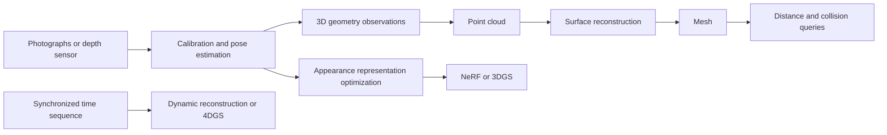

# 01 Understanding 3D Vision Through Mechanical Intuition

[中文](../01_foundations.md) | English

[Back to the learning guide](../../README.en.md) · Next chapter: [Point Clouds and Meshes](02_pointcloud_mesh.md) · [Glossary](glossary.md)

**Goal**: Explain what a 3D file records, turn a depth pixel into a 3D point, and check for mistakes in units and coordinates. You do not need neural networks or a GPU yet.

**Verification date: 2026-10-03.** This chapter is public teaching material. The numerical examples are constructed teaching inputs, not scan measurements; the examples have not been run on the reader's machine. Statements about software behavior are limited by the versions and official references listed at the end.

## 1 Separate Six Questions First

Given a photograph of an object, you can ask at least six different questions:

| Question | Required result | Common representation or method |
|---|---|---|
| Where is the surface? | A set of 3D positions | Depth map, point cloud |
| How is the surface connected continuously? | Vertices and faces | Triangle mesh |
| Is a spatial position inside or outside the object? | Inside/outside relationship and distance | SDF, occupancy field |
| How do fingers bend, and how does hand shape vary? | Controllable hand geometry | MANO |
| What would another camera position see? | A novel-view image | NeRF, 3D Gaussian Splatting |
| How does the scene change over time? | Geometry or appearance that varies over time | Dynamic mesh, 4D representation, 4DGS |

A **representation** is a way to store an object, an **algorithm** is a method to obtain or process it, and **software** is a tool that runs algorithms. A point cloud is a representation, ICP is a registration algorithm, and CloudCompare is software that can perform registration. Keep these three ideas distinct.



This is a diagram of conceptual relationships, not the only pipeline that every task must follow. An existing CAD mesh can be rendered or used for distance calculations directly; 3DGS does not require a high-quality mesh first either.

## 2 How Point Clouds, Meshes, and SDFs Differ

### 2.1 A Point Cloud Contains Surface Samples

Write positions measured by a coordinate measuring machine as a table, with one point per row:

```text
x       y       z       [optional: r g b, nx ny nz, time, confidence]
0.010   0.020   0.300
0.011   0.020   0.301
...
```

Mathematically, write $P=\{\mathbf p_i\}_{i=1}^{N}$, where each $\mathbf p_i\in\mathbb R^3$. These points usually sample visible surfaces; they do not automatically represent the solid interior. Whether a real surface exists between two nearby points requires a separate judgment. A gap could be a real hole or a missed scan.

### 2.2 A Mesh Adds Connections Between Points

A triangle mesh usually stores two arrays:

- `vertices`: `N × 3` floating-point coordinates
- `faces`: `M × 3` integer indices; for example, `[0, 3, 8]` means that vertices 0, 3, and 8 form a triangle

Normals, colors, UV coordinates, or materials can be added for display. Normals describe surface orientation; UV coordinates map a 3D surface to a 2D texture. A mesh can be an open shell or enclose a closed surface. Having triangles does not establish a valid solid, and certainly does not mean that CAD dimensions, tolerances, surface types, or assembly constraints have all been preserved.

**Mechanical analogy**: Once an exact CAD cylindrical surface is discretized into a mesh, it consists of a finite number of planar patches. Smaller triangles can reduce discretization error, but cannot recover details that were never measured. [Open3D mesh tutorial](https://www.open3d.org/docs/0.19.0/tutorial/geometry/mesh.html)

### 2.3 An SDF Stores Signed Distance to the Surface

This tutorial uses positive values outside the object, negative values inside, and zero on the surface. For a closed surface $\partial\Omega$:

$$
\phi(\mathbf x)=
\begin{cases}
+d(\mathbf x,\partial\Omega),&\mathbf x\text{ is outside}\\\\
-d(\mathbf x,\partial\Omega),&\mathbf x\text{ is inside}
\end{cases}
$$

Other software may use the opposite sign, so check the convention when reading data. An SDF can be stored in a voxel grid or computed by a neural network; “implicit” does not automatically mean “deep learning.” An occupancy field answers inside/outside or probability questions, and may not provide actual distance. A TSDF truncates distances near the surface and is useful for fusing multiple depth frames.

For open, intersecting, or non-closed meshes, an inside/outside sign may lack a reliable definition. Check the mesh before collision or contact queries; unsigned distance alone cannot tell you whether there is penetration. [Open3D distance queries and their assumptions](https://www.open3d.org/docs/0.19.0/tutorial/geometry/distance_queries.html)

### 2.4 SfM and MVS Are Processes

- **SfM, Structure from Motion**: Uses matched features in overlapping images to jointly estimate camera positions and a smaller set of 3D feature points. Common outputs are camera parameters and a sparse point cloud.
- **MVS, Multi-View Stereo**: Uses multiple views with known or estimated poses to recover denser surface observations, often using depth maps or a dense point cloud as intermediate or final results.
- **Surface reconstruction**: Then produces a mesh from points, normals, or volumetric data.

Ordinary monocular SfM without a scale reference has a global scale ambiguity: scaling the whole scene and camera translations together leaves the projected images unchanged. To measure millimeters, you need a known dimension, a known baseline, or other scale information. You cannot simply treat reconstruction coordinates as meters. [COLMAP workflow](https://colmap.github.io/tutorial.html), [COLMAP model alignment notes](https://colmap.github.io/faq.html)

## 3 Coordinates and Units Are the First Quality Check

### 3.1 Every Point Needs a Coordinate Frame

Common frames include world `W`, camera `C`, object `O`, hand root `H`, and robot base `B`. The same physical point has different numerical coordinates in different frames. This tutorial uses column vectors and writes:

$$
\mathbf p_A = R_{A\leftarrow B}\mathbf p_B+\mathbf t_{A\leftarrow B}
$$

Read this as “transform a point expressed in B into coordinates in A.” The corresponding homogeneous matrix is:

$$
T_{A\leftarrow B}=\begin{bmatrix}R&\mathbf t\\\\0&1\end{bmatrix},\qquad
\begin{bmatrix}\mathbf p_A\\\\1\end{bmatrix}=T_{A\leftarrow B}\begin{bmatrix}\mathbf p_B\\\\1\end{bmatrix}
$$

For composed transforms, $T_{A\leftarrow C}=T_{A\leftarrow B}T_{B\leftarrow C}$. They act from right to left. The reverse transform uses the inverse matrix, not merely a negated translation:

$$
T^{-1}=\begin{bmatrix}R^\top&-R^\top\mathbf t\\\\0&1\end{bmatrix}
$$

This assumes that $R$ is a rotation matrix: $R^\top R=I$ and $\det(R)=1$. Scaling or reflection within a matrix requires separate handling.

### 3.2 A Practical Convention

This chapter uses camera axes with $x$ pointing right in the image, $y$ pointing down, and $z$ pointing forward from the camera; image coordinates $(u,v)$ are column and row. This agrees with COLMAP camera coordinates and differs from some graphics camera conventions. COLMAP exports **world-to-camera** poses, with camera center $\mathbf C_W=-R^\top\mathbf t$; the translation vector `t` is not directly the camera's world position. [COLMAP output format](https://colmap.github.io/format.html)

When recording rotations, also specify: axis-angle or Euler angles? Radians or degrees? Which Euler order? Is a quaternion `wxyz` or `xyzw`? Has the quaternion been normalized?

### 3.3 Minimum Metadata for Each Dataset

```text
length_unit: m
angle_unit: rad
point_frame: camera_0
camera_axes: x_right_y_down_z_forward
transform_name: T_world_from_camera
transform_direction: camera_to_world
vector_convention: column
image_size: width, height
pixel_center_convention: specify explicitly
camera_model: specific model, such as pinhole or fisheye
intrinsics_and_distortion: for the current resolution
color_depth_alignment: whether aligned; which pixel grid
```

This is a teaching metadata checklist, not a universal software standard. Naming a file `meters.ply` cannot replace validation: measure a known length with a ruler and compare it with the corresponding length in the file. After automatic view scaling in a viewer, millimeter and meter models may look identical.

## 4 How a Camera Turns 3D Points into Pixels

### 4.1 Start with Pinhole Projection

A point farther in front of a camera appears smaller in the image. First transform a world point into camera coordinates $(X_C,Y_C,Z_C)$, then divide by depth:

$$
u=f_x\frac{X_C}{Z_C}+c_x,\qquad
v=f_y\frac{Y_C}{Z_C}+c_y
$$

$u$ is the horizontal pixel coordinate and $v$ is the vertical pixel coordinate. $f_x,f_y$ are focal lengths in pixels; $c_x,c_y$ are the principal point. The intrinsic matrix without skew is:

$$K=\begin{bmatrix}f_x&0&c_x\\\\0&f_y&c_y\\\\0&0&1\end{bmatrix}$$

Combined, $Z_C[u,v,1]^\top=K[R\mid\mathbf t][X_W,Y_W,Z_W,1]^\top$. **Intrinsics** describe how the camera projects; **extrinsics** describe where it is relative to the world. Intrinsics alone do not give world coordinates.

### 4.2 Moving the Camera Cannot Compensate for Distortion

Real lenses have radial, tangential, and other distortion. Use undistorted coordinates in the pinhole formula, or combine it with the distortion function of the selected camera model. Do not assume that ordinary pinhole distortion coefficients apply to a fisheye model. OpenCV's `calibrateCamera`, `undistort`, and `projectPoints` address different stages, not the same operation. [OpenCV camera calibration and projection models](https://docs.opencv.org/4.13.0/d9/d0c/group__calib3d.html)

**Update intrinsics when resizing or cropping images.** For example, if both width and height are halved, transform the focal lengths and principal-point coordinates according to the pixel-coordinate convention being used. If you first remove $a$ columns from the left and $b$ rows from the top, subtract $(a,b)$ from the principal point accordingly. A precise implementation must also account for pixel-center conventions; do not mix sampling conventions from different libraries.

### 4.3 A Minimal Calibration Workflow

1. Fix capture resolution, focal length, and focus settings; print the calibration board and measure its actual cell size.
2. Photograph it at multiple positions, orientations, and distances, covering the image edges. Keep sharp images and avoid having every view face the camera straight on.
3. Extract calibration points and estimate intrinsics and distortion; save the model name, units, and image size.
4. Inspect reprojection errors and their distribution for each image; look for systematic errors near the edges.
5. Independently check using images excluded from calibration or known dimensions.
6. If RGB and depth come from different cameras, separately calibrate their relative pose; dynamic scenes also require time synchronization.

A low average reprojection error is only one check. One number alone cannot establish millimeter accuracy in spatial measurements. [OpenCV calibration tutorial](https://docs.opencv.org/4.x/dc/dbb/tutorial_py_calibration.html)

## 5 Depth Is Not Every Kind of Distance

### 5.1 Axial Depth and Ray Range

In pinhole back-projection, **axial depth** $z$ is the point's coordinate along the camera's $Z$ axis. **Ray range** $r$ is the straight-line distance from the camera's optical center to the point. They are equal only on the optical axis.

For undistorted normalized coordinates $x_n=(u-c_x)/f_x$ and $y_n=(v-c_y)/f_y$:

$$
\mathbf p_C=z[x_n,y_n,1]^\top,\quad
r=z\sqrt{1+x_n^2+y_n^2}
$$

If the sensor provides $r$, first calculate $z=r/\sqrt{1+x_n^2+y_n^2}$. A device or file calling a value `depth` cannot replace its format specification. Disparity, inverse depth, and normalized grayscale depth cannot be inserted directly into metric formulas either.

### 5.2 RGB-D Back-Projection

Let raw depth be `d`, with `s` storage units per meter. Then:

$$
z=d/s,\qquad X_C=(u-c_x)z/f_x,\qquad Y_C=(v-c_y)z/f_y
$$

If `d=1000` means 1 meter, `s=1000`; if floating-point inputs are already in meters, `s=1`. Open3D 0.19.0's `create_from_depth_image` explicitly uses this relationship. [Open3D PointCloud API](https://www.open3d.org/docs/0.19.0/python_api/open3d.geometry.PointCloud.html#open3d.geometry.PointCloud.create_from_depth_image)

Before assigning colors, ensure that the RGB pixel actually corresponds to the depth point. Equal image dimensions do not establish alignment. With RGB-D extrinsics, transform the point to the color camera's frame, project it to sample color, and handle occlusion. Before combining multiple point-cloud frames, transform every frame into a common coordinate system.

## 6 Exercise A: Calculate by Hand, Then Generate Nine Points

**Input**: A teaching camera with `fx=fy=100 px`, `cx=cy=1 px`, a 3×3 image, axial depth `d=1000` for every pixel, and `depth_scale=1000`. Integer pixel coordinates denote pixel centers here, with no distortion or additional extrinsics.

**Output**: An ASCII PLY containing nine points and no triangle faces. It uses only the Python standard library; no dependency installation or data download is needed.

### Steps

1. Calculate the center pixel `(1,1)` by hand: the point should be `(0,0,1)` meters.
2. Calculate the right-hand pixel `(2,1)`: the point should be `(0.01,0,1)` meters.
3. Save the original teaching code below as `backproject_nine_points.py` and run `python backproject_nine_points.py` in a separate exercise folder.
4. Open the generated file in CloudCompare or MeshLab, rotate the view, and check that it contains nine points on a plane.

```python
from pathlib import Path
from math import sqrt

fx = fy = 100.0
cx = cy = 1.0
scale = 1000.0
points = []
for v in range(3):
    for u in range(3):
        z = 1000.0 / scale
        points.append(((u - cx) * z / fx, (v - cy) * z / fy, z))

assert points[4] == (0.0, 0.0, 1.0)
assert abs(points[5][0] - 0.01) < 1e-12
assert len(points) == 9
out = Path("nine_points_m.ply")
# Mode x stops if the file already exists, avoiding overwriting original data.
with out.open("x", encoding="ascii") as f:
    f.write("ply\nformat ascii 1.0\ncomment length_unit_m\n")
    f.write("element vertex 9\nproperty float x\nproperty float y\n")
    f.write("property float z\nend_header\n")
    for p in points:
        f.write("%.8f %.8f %.8f\n" % p)
print("points:", len(points), "center:", points[4])
print("off-axis range:", sqrt(sum(a * a for a in points[5])))
```

**Success checks**: There are nine points, all with `z=1`; `x/y` can only be `-0.01, 0, 0.01`; the bounding width and height are each 0.02 meters. The right-hand point's distance from the optical center is slightly greater than 1 meter. These are formula-derived expectations, not records of a user's experiment. When this tutorial was written, the standard-library example was run in a separate temporary environment and its nine coordinates and 0.02-meter bounds were checked; it has not been run on the reader's machine, and GUI display was not verified. For the separation of points and faces in PLY, see the [Stanford PLY tools documentation](https://graphics.stanford.edu/software/vrip/plyusage.html).

**Troubleshooting**: If the points are invisible, first reset the camera or fit the view and increase the point size. This file has no faces, so the absence of a solid surface in a mesh tool is expected. Do not run Poisson on these nine points; the exercise only verifies projection relationships.

## 7 What File Extensions Do Not Tell You

| File | Common contents | Required checks |
|---|---|---|
| `.ply` | Point attributes; may also contain faces and custom attributes | Whether the header has `face`; property names, data types, and units; ordinary point clouds and Gaussian parameters are not interchangeable |
| `.obj` | Vertices, faces, normals, UVs; may reference `.mtl` | Whether faces actually exist; index rules; whether materials/textures were saved together; axes and scale |
| `.stl` | Triangle surface | Units need an external convention; usually does not preserve standard textures/materials or assembly semantics; whether it is closed |
| `.npz` | Multiple named NumPy arrays | Meaning, shape, and dtype of each key; frames, units, joint order, and time; it is not a MANO-specific format |
| `.blend` | Blender scene project | External resources, scene units, version, and camera/light/object transforms |

Renaming `.ply` to `.obj` does not convert its contents. A 3DGS PLY may contain training parameters such as `opacity`, `scale_*`, `rot_*`, and `f_dc_*`, but the precise fields, activation functions, and conventions depend on the implementation. Even if an ordinary point-cloud viewer reads `x/y/z`, that does not mean it renders the Gaussians correctly. [NeRF and 3DGS](04_nerf_3dgs.md)

For a NumPy array archive, use `np.load(path, allow_pickle=False)` and inspect `files` and the shapes of its arrays. Rejecting pickle objects by default has security value; do not casually switch to `allow_pickle=True` to open a file of unknown origin. [NumPy savez](https://numpy.org/doc/stable/reference/generated/numpy.savez.html), [NumPy load security notes](https://numpy.org/doc/stable/reference/generated/numpy.load.html)

## 8 From “Looks Right” to “Can Be Trusted”

- Visualization answers whether something looks plausible; measurement answers how far it differs from a reference. Both are needed.
- A model having physical units does not mean its accuracy reaches that unit's scale.
- Dense point counts do not establish accuracy; repeated sampling and interpolation can also increase point counts.
- Realistic textures do not establish accurate geometry; neural rendering can explain training images using incorrect geometry.
- Geometric proximity does not establish contact force. The same visible shape can correspond to different material stiffness, preload, friction, and hidden constraints. Force estimation also requires sensing, material/dynamics models, and additional assumptions.

**Readiness questions**: Can you explain why “1 meter of depth is not always 1 meter of distance,” why “the translation in camera extrinsics is not the camera position,” and why “some PLY files contain faces and others do not”? If so, continue to [Point Clouds and Meshes in Practice](02_pointcloud_mesh.md).

## Sources and Version Boundaries

All references below were checked on **2026-10-03**. The derivations, numerical exercises, and workflow checklists were written for this tutorial. Links verify interfaces or conventions; they do not imply that the corresponding software was run.

1. Open3D **0.19.0**: [PointCloud API](https://www.open3d.org/docs/0.19.0/python_api/open3d.geometry.PointCloud.html), [mesh tutorial](https://www.open3d.org/docs/0.19.0/tutorial/geometry/mesh.html), [distance queries](https://www.open3d.org/docs/0.19.0/tutorial/geometry/distance_queries.html)
2. OpenCV: The `4.x` calibration API pointed to **4.13.0** on the verification date; [calibration API](https://docs.opencv.org/4.13.0/d9/d0c/group__calib3d.html), [calibration tutorial](https://docs.opencv.org/4.x/dc/dbb/tutorial_py_calibration.html). Check parameters for different camera models and versions.
3. COLMAP rolling official documentation: [tutorial](https://colmap.github.io/tutorial.html), [output format](https://colmap.github.io/format.html), [FAQ](https://colmap.github.io/faq.html). Record the installed version/commit separately for reproducible experiments.
4. NumPy rolling official documentation: [savez](https://numpy.org/doc/stable/reference/generated/numpy.savez.html), [load](https://numpy.org/doc/stable/reference/generated/numpy.load.html). This chapter does not depend on recently added interfaces.
5. Stanford: [PLY tools](https://graphics.stanford.edu/software/vrip/plyusage.html), [scan dataset notes](https://graphics.stanford.edu/data/3Dscanrep/)
6. Blender: [official import/export manual](https://docs.blender.org/manual/en/latest/files/import_export/index.html). Verify file-reading/writing capabilities and normal/material preservation in the version actually used.

---

[Back to home](../../README.en.md) · [Coordinates and Calibration](08_robot_frames_calibration.md) · [Robotics Applications](09_robot_perception_action.md) · [ROS 2 / MuJoCo](10_ros2_mujoco.md)
