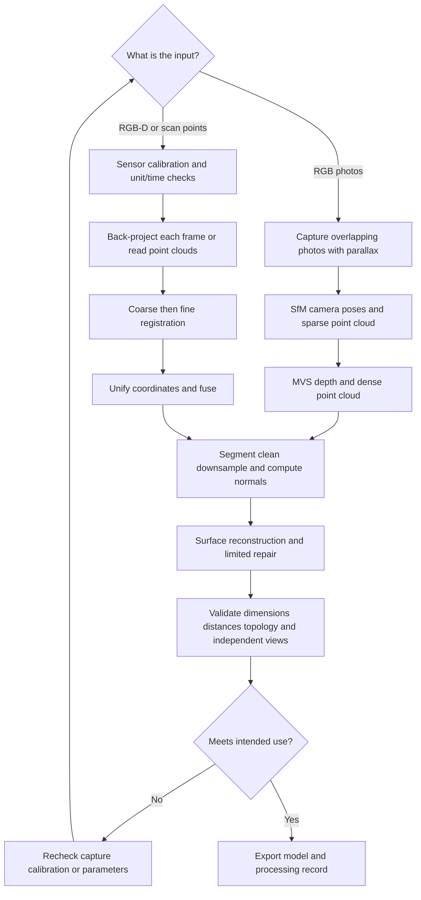

# 02 The Complete Workflow from Point Cloud to Mesh

[中文](../02_pointcloud_mesh.md) | English

[Back to the guide](../../README.en.md) · Prerequisite: [3D Foundations](01_foundations.md) · Next chapter: [MANO Hand Model](03_mano_hand.md)

**Goal**: Choose a route appropriate to your input and connect data capture, calibration, registration, cleaning, surface reconstruction, and validation into a process that can be reviewed. Start with a small experiment that requires no downloads, then work with real scans.

**Verification date: 2026-10-03.** This chapter recommends a learning path, not guaranteed performance on a reader's hardware. No software was installed, no scan data was downloaded, and no examples were run on the reader's machine. Commands and APIs were written against official references; dependencies in the actual environment still need validation.

## 1 Choose Tools First

| Tool | Best first task | Windows | macOS | Boundaries |
|---|---|---|---|---|
| CloudCompare | Open point clouds, measure dimensions, crop, register, and color by distance | Officially supported; choose a matching release package | Officially supported; check package architecture and system requirements | The `ccViewer` viewer differs from full CloudCompare; menus and plugins depend on the version |
| MeshLab | Inspect and clean meshes, reconstruct surfaces, simplify meshes | Official Win 64 package | Official download page lists arm64 and x86_64 | Keep the original file; filters may change dimensions or topology |
| Open3D | Repeat point-cloud and mesh processing with Python | 0.19.0 documentation lists Windows 10+ 64-bit | 0.19.0 documentation lists macOS 10.15+; check Python and architecture | This chapter uses CPU geometry APIs; successful import does not verify GUI or GPU backends |
| Blender | View surfaces; adjust materials, lighting, cameras, and animation | Choose a version using official hardware requirements | 5.x requires Apple Silicon; see 4.5 LTS for Intel Macs | Useful for modeling and presentation; rendering quality does not prove dimensional accuracy |
| COLMAP | Recover cameras and sparse structure from overlapping photos | Follow official build/release instructions | Supported steps can be performed as applicable | Built-in dense reconstruction has CUDA requirements; a Mac having a GPU does not imply it can run these steps |

Sources: [CloudCompare official project](https://github.com/CloudCompare/CloudCompare), [platform notes](https://github.com/CloudCompare/CloudCompare#compilation), [MeshLab downloads](https://www.meshlab.net/), [Open3D 0.19.0 getting started](https://www.open3d.org/docs/0.19.0/getting_started.html), [Blender hardware requirements](https://www.blender.org/download/requirements/), [COLMAP functionality without CUDA](https://colmap.github.io/faq.html#available-functionality-without-gpu-cuda).

**Suggested tool combination**: Choose either CloudCompare or MeshLab for manual inspection, Open3D for automation, and add Blender when you need presentation images. Learn COLMAP separately for photo reconstruction. Macs can fully support learning point clouds, meshes, and CPU geometry processing; assess research training that depends on CUDA separately, and distinguish GPU backends.

### Environment Records and a Minimal Check

The Open3D examples target **0.19.0**, whose installation page lists Python 3.8–3.12. A supported 3.11 or 3.12 environment is a reasonable learning starting point. Avoid upgrading to an unlisted combination just because it is newer. If Open3D is already installed, run the official verification command:

```bash
python -c "import open3d as o3d; print(o3d.__version__)"
```

This checks only import and version, not every algorithm or display driver. Environments using `py` on Windows or `python3` on macOS are common, but make sure the interpreter and installed package belong to the same environment. Follow the [official installation page](https://www.open3d.org/docs/0.19.0/getting_started.html); this tutorial has not installed it for you.

For each experiment, save the operating system, CPU/GPU and drivers, Python and Open3D versions, input checksums, units, key parameters, and output statistics. **A documentation version is not a verified environment lockfile.**

## 2 Two Main Routes Based on Your Input



### Route A: Existing Photos

1. **Choose a static object**: Start with an opaque, richly textured object with little reflection. Transparent, mirror-like, plain white, or repetitively textured objects make matching and depth recovery difficult.
2. **Capture multiple angles**: Adjacent photographs should share substantial visible areas and include parallax that supports triangulation. Pure rotation in place is useful for panoramas, but usually insufficient for a complete object with reliable depth.
3. **Keep imaging consistent**: Minimize motion blur, abrupt exposure changes, and focal-length changes; cover the top and sides. One orbit does not mean that the bottom was observed.
4. **Run SfM**: Check how many images registered, whether the reconstruction split into multiple models, whether the camera trajectory is abnormal, and whether matches primarily lie on the background.
5. **Run MVS**: Inspect the dense point cloud, not just the final textured presentation. If sparse reconstruction failed, fix the inputs first; continuing to dense reconstruction usually does not help.
6. **Establish scale**: Use an independent known length or other scale information, then validate with another length that was not used to set scale.
7. **Keep camera parameters**: They are needed later for textures, NeRF/3DGS, and independent-view evaluation.

In turntable capture, “fixed background, rotating object” conflicts with the usual static-scene assumption. Segment the object, use an appropriate capture setup, and inspect estimated cameras; an arbitrary video cannot simply be treated as ideal input. [COLMAP official tutorial](https://colmap.github.io/tutorial.html)

### Route B: Existing RGB-D or Scanned Point Clouds

1. Confirm depth meaning, units, valid/invalid values, resolution, and intrinsics; check RGB-D alignment first.
2. Keep the scanned object stationary during capture and record each frame's timestamp and exposure settings; fingers moving between frames produce ghosting during fusion.
3. Preserve raw data and crop only working copies. Remove background and obvious erroneous points first while retaining small valid structures.
4. Back-project each frame into its own camera frame, then transform to common coordinates using extrinsics or estimated poses.
5. Without reliable poses, perform coarse registration before fine ICP registration; multiple frames also require handling accumulated drift and loop closure.
6. Choose point-cloud combination/fusion, or integrate multiple depth frames into a TSDF and extract a mesh. These are not identical workflows.
7. Validate with frames excluded from optimization and known dimensions.

Open3D's RGB-D integration tutorial explicitly requires camera intrinsics and per-frame poses; TSDF is not an automatic repair tool that removes the need for calibration. [RGB-D integration example](https://www.open3d.org/docs/0.19.0/tutorial/pipelines/rgbd_integration.html)

## 3 Registration Aligns the Same Surface

### Coarse Registration and ICP

**Coarse registration** provides a sufficiently close initial pose, using markers, mechanical positioning, multiple point correspondences, or global feature matching. **ICP** repeatedly finds correspondences, estimates a small rigid transform, and updates the correspondences. It mainly performs local optimization and does not guarantee a correct alignment from arbitrary initial poses.

The intuitive objective of point-to-point ICP is to minimize distances between matched points:

$$\min_{R,\mathbf t}\sum_{(i,j)\in\mathcal C}\|R\mathbf p_i+\mathbf t-\mathbf q_j\|^2$$

The point-to-plane version uses target-point normals to constrain distances along the surface normal. Normal directions and local geometry quality therefore matter. [Open3D ICP tutorial](https://www.open3d.org/docs/0.19.0/tutorial/pipelines/icp_registration.html)

**Check four things every time**:

- Whether the transform direction is `source → target`
- Whether the registration distance threshold matches the coordinate units
- Whether there is sufficient overlap for registration and whether the background misleads alignment
- Match coverage, residuals, and their spatial distribution together, rather than a single RMSE

Planes, cylinders, and repeated geometry can constrain some motion directions weakly. Incorrect alignment can also yield a low residual; attaching one small patch to another does not establish correct whole-object registration. For real data with known scale, do not casually allow scaling to “improve alignment,” since it can hide unit or calibration errors.

## 4 Cleaning and Normals: Every Step Can Damage Real Detail

| Operation | Purpose | How to interpret key parameters | Common misuse |
|---|---|---|---|
| Cropping/segmentation | Remove background | Region and object boundary | Removing contact regions or thin parts |
| Voxel downsampling | Reduce and even out density | `voxel_size` is a spatial length | Wrong units; mixing both sides of a thin wall |
| Statistical outlier filtering | Remove clearly isolated noise | Neighbor count and statistical threshold | Treating real sparse structures as noise |
| Radius filtering | Remove points with too few neighbors | Neighborhood radius and minimum neighbors | Applying one setting to data with large density variations |
| Normal estimation | Provide local surface directions | Neighborhood scale | Too small follows noise; too large crosses sharp edges |
| Normal orientation | Make nearby orientations consistent | Camera position or consistency propagation | Normals exist but have inconsistent signs, causing flipped reconstruction |

Inspect original point spacing and the object's smallest feature scale before setting parameters. A few multiples of point spacing can be an initial trial, but no fixed millimeter value works for every scene. Record input/output point counts, deleted regions, and scale changes at every step. [Outlier removal](https://www.open3d.org/docs/0.19.0/tutorial/geometry/pointcloud_outlier_removal.html), [point clouds and normals](https://www.open3d.org/docs/0.19.0/tutorial/geometry/pointcloud.html)

## 5 How Triangle Faces Are Reconstructed from a Point Cloud

### 5.1 Three Common Choices

- **Poisson**: Recovers a smooth surface from oriented normals. Useful for continuous surfaces, but may fill unobserved regions; creating a face does not mean the region was actually seen.
- **Ball Pivoting**: Uses a “ball” with specified radii to find triangles connecting nearby points. It depends on point density and normals; radius choices affect holes and bridging.
- **Mesh extraction after TSDF fusion**: Suitable for multiple depth frames with camera poses, using each frame's spatial observations. Pose errors can still create thick edges and ghosting.

Open3D also offers Alpha Shapes. Beginners should first use one method and understand its failure modes, without trying to tune all methods simultaneously. [Official surface reconstruction tutorial](https://www.open3d.org/docs/0.19.0/tutorial/geometry/surface_reconstruction.html)

### 5.2 Do Not Immediately Fill Holes and Smooth After Reconstruction

1. Locate missing faces: a real hole, occlusion, and reflection failure need different treatment.
2. Check for false connections across thin rods, finger gaps, and hole boundaries; overlay the original points.
3. Check normal consistency, self-intersections, non-manifold edges, and duplicate faces.
4. If holes must be filled, label the added surface as inferred; do not treat it as measurement ground truth.
5. Remeasure key dimensions after simplification/smoothing. Smoothing can shrink an object, and simplification can erase edges.
6. Export for the intended use: visualization may allow open surfaces, whereas printing or some distance/volume calculations usually need suitable closed topology.

## 6 Exercise B: From Point Cloud to Mesh with a Synthetic Sphere

**Input**: A program-generated triangulated sphere with radius 0.05 meters, followed by sampling 4,000 points on its surface. This is synthetic teaching geometry, with no dataset-license download step.

**Output**: `sphere_points.ply`, `sphere_reconstructed.ply`, and terminal statistics. The exercise demonstrates API composition and validation thinking; it does not simulate real sensor error distributions.

**Prerequisite**: A Python environment you have prepared that can import NumPy and Open3D 0.19.0. This tutorial combines code based on the official [sphere/sampling mesh API](https://www.open3d.org/docs/0.19.0/python_api/open3d.geometry.TriangleMesh.html) and [Poisson tutorial](https://www.open3d.org/docs/0.19.0/tutorial/geometry/surface_reconstruction.html); it has not been run on the reader's machine.

### Steps

1. Create a new empty exercise directory and save the code as `sphere_to_mesh.py`.
2. Run `python sphere_to_mesh.py`; no GPU is needed and it does not trigger automatic example-data downloads.
3. Open the two outputs separately in MeshLab or CloudCompare; one has no faces and the other has faces.
4. Compare the reconstructed sphere with the original analytic radius and record statistics, instead of judging only whether it looks round.
5. Optionally change `depth=6` to `5`, run in a new output directory, and compare face counts and errors; higher values are not necessarily worth the memory cost.

```python
from pathlib import Path
import numpy as np
import open3d as o3d

# Use a separate directory for each experiment; stop if it already exists.
out_dir = Path("sphere_run_depth6")
out_dir.mkdir(exist_ok=False)
print("Open3D:", o3d.__version__)
o3d.utility.random.seed(7)
radius = 0.05  # Teaching convention: meters.
reference = o3d.geometry.TriangleMesh.create_sphere(
    radius=radius, resolution=40
)
reference.compute_vertex_normals()
pcd = reference.sample_points_uniformly(number_of_points=4000)
xyz = np.asarray(pcd.points)
# The synthetic sphere's center and analytic normals are known.
# Do not copy this shortcut for real data.
pcd.normals = o3d.utility.Vector3dVector(
    xyz / np.linalg.norm(xyz, axis=1, keepdims=True)
)
assert len(xyz) == 4000 and np.isfinite(xyz).all()
mesh, density = o3d.geometry.TriangleMesh.create_from_point_cloud_poisson(
    pcd, depth=6
)
mesh.compute_vertex_normals()
verts = np.asarray(mesh.vertices)
assert len(verts) > 0 and len(mesh.triangles) > 0
assert np.isfinite(verts).all()

radial_error = np.abs(np.linalg.norm(verts, axis=1) - radius)
print("points / vertices / faces:", len(xyz), len(verts), len(mesh.triangles))
print("reconstruction extent [m]:", mesh.get_axis_aligned_bounding_box().get_extent())
print("median / p95 radial error [m]:", np.quantile(radial_error, [0.5, 0.95]))
print("watertight:", mesh.is_watertight())
print("self_intersecting:", mesh.is_self_intersecting())
print("density range:", float(np.min(density)), float(np.max(density)))
assert o3d.io.write_point_cloud(str(out_dir / "sphere_points.ply"), pcd)
assert o3d.io.write_triangle_mesh(str(out_dir / "sphere_reconstructed.ply"), mesh)

# Optional: uncomment with a working graphics environment.
# Numerical processing does not depend on this window.
# o3d.visualization.draw_geometries([mesh])
```

### Success Checks

- The output directory contains a point cloud and mesh that can be reopened; the point count is 4,000, and the mesh has vertices and triangles.
- All three bounding-box extents should be close to the 0.10-meter sphere diameter; radial error should be small relative to the 0.05-meter radius.
- Use “95% of vertex radial errors below 5% of the radius” as a teaching troubleshooting threshold for this exercise, **not a software guarantee or measurement acceptance standard**. If exceeded, check units, normals, and abnormal connected components.
- Record actual watertightness, self-intersection, and error results instead of assuming a pass. The source sphere is itself a triangulated approximation and introduces discretization error.

Poisson's returned `density` measures reconstruction support density, not probabilistic sensor confidence. For real processing, consult the official method for trimming low-density regions, but do not automatically delete real thin structures merely to improve appearance.

For the random-seed API, see the [Open3D v0.19.0 official binding source](https://github.com/isl-org/Open3D/blob/v0.19.0/cpp/pybind/utility/random.cpp). A fixed seed helps repeat sampling but does not promise bitwise agreement across versions, platforms, or parallel solvers.

**Visualization record**: Save three images from the same viewpoint showing “sampled points, reconstructed mesh, and error coloring,” with software versions and parameters. This repository's workflow diagrams do not claim to be actual rendered results from this experiment.

## 7 A Practical Acceptance Checklist

### Geometry and Measurement

- Check scale with at least one known length excluded from scale setting.
- Check geometry using observations excluded from registration/reconstruction, to avoid evaluating only training data.
- Report distance distributions: median, 95th percentile, and abnormal regions, rather than only a mean.
- Distinguish point-to-point distances from point-to-triangle distances; different sampling densities affect point-to-point values.
- If using bidirectional distances, state the observation-to-model and model-to-observation directions separately. The latter helps reveal invented surfaces and insufficient coverage, but occluded regions need separate interpretation.

### Topology and Downstream Use

- Empty faces, isolated components, duplicate faces, non-manifold edges, self-intersections, and normal consistency
- Whether face count matches detail needs, and whether reducing faces destroyed critical holes or grooves
- Collision and visual models can use different resolutions, but check clearance errors introduced by simplification.
- Check closure before calculating volume or inside/outside signs; do not claim a solid volume directly from an arbitrary point cloud.

### Reproducibility

- Preserve raw data as read-only and use new outputs for each processing stage.
- Record parameters in actual length units and keep software versions and coordinate transforms.
- Reimport outputs and recheck units, axes, colors/textures, and face counts.
- Explicitly mark completed regions unsupported by observations.

## 8 First Checks for Common Problems

| Symptom | Check first |
|---|---|
| Model is 1,000 times too large/small | Meters versus millimeters, depth scale, import/export scale |
| Object has doubled edges | Movement between frames, wrong poses, unsynchronized time, depth-RGB misalignment |
| ICP seems converged but position is wrong | Initialization, symmetry, overlap, background correspondences |
| Poisson produces a “cap” | Unobserved regions, normal orientation, support density |
| Both sides of a thin sheet merge | Point spacing, voxel size, normal neighborhood, sensor resolution |
| Graphics window fails but files can be generated | Remote/headless environment, display driver; distinguish numerical computation from GUI |
| Mesh looks beautiful but dimensions are wrong | Missing independent scale validation; shape changes from smoothing or resampling |

For more issues across tools, see [Troubleshooting](07_troubleshooting.md).

## 9 Licensing and Publication

**Code licenses, model licenses, capture-data licenses, and constraints on exported results are separate layers.** A publicly downloadable library does not imply that its example scans, pretrained weights, or third-party models can be redistributed together. Favor original teaching code, parameters, and download instructions in public repositories; link to official data/models and confirm licenses before deciding whether to include them.

This chapter's synthetic sphere does not depend on third-party scan data. If you switch to Stanford Bunny, first read the [scan repository's usage notes](https://graphics.stanford.edu/data/3Dscanrep/); “it appeared in an Open3D example” is not a substitute for reviewing its license. Capturing real hands also requires appropriate authorization and privacy handling.

## Sources and Version Boundaries

All access dates are **2026-10-03**.

1. [Open3D 0.19.0 installation](https://www.open3d.org/docs/0.19.0/getting_started.html): platforms, Python range, and verification command
2. [PointCloud tutorial](https://www.open3d.org/docs/0.19.0/tutorial/geometry/pointcloud.html), [outlier tutorial](https://www.open3d.org/docs/0.19.0/tutorial/geometry/pointcloud_outlier_removal.html): cleaning and normals
3. [ICP tutorial](https://www.open3d.org/docs/0.19.0/tutorial/pipelines/icp_registration.html), [global registration](https://www.open3d.org/docs/0.19.0/tutorial/pipelines/global_registration.html): local/global registration
4. [Surface reconstruction](https://www.open3d.org/docs/0.19.0/tutorial/geometry/surface_reconstruction.html), [RGB-D integration](https://www.open3d.org/docs/0.19.0/tutorial/pipelines/rgbd_integration.html), [TriangleMesh API](https://www.open3d.org/docs/0.19.0/python_api/open3d.geometry.TriangleMesh.html): exercise APIs and reconstruction routes
5. [CloudCompare official releases](https://github.com/CloudCompare/CloudCompare/releases): the page listed v2.13.2 as latest stable and v2.14.beta as a prerelease on the access date; no GUI menus were verified locally.
6. [MeshLab official site](https://www.meshlab.net/): its download section displayed 2025.07 and Windows/macOS architectures on the access date; recheck filter names after upgrades.
7. [Blender hardware requirements](https://www.blender.org/download/requirements/): macOS requires Apple Silicon starting with 5.0; 4.5 LTS is the last series supporting Intel Macs. Check system/GPU requirements for the specific version.
8. [COLMAP tutorial](https://colmap.github.io/tutorial.html), [FAQ](https://colmap.github.io/faq.html): rolling documentation; actual command options may change between versions. This chapter does not provide a complete set of training commands without a fixed version.

---

[Back to home](../../README.en.md) · [Coordinates and Calibration](08_robot_frames_calibration.md) · [Robotics Applications](09_robot_perception_action.md) · [ROS 2 / MuJoCo](10_ros2_mujoco.md)
