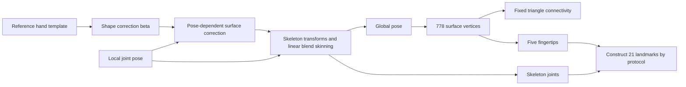

# 03 MANO: From Parameters to a Hand Mesh

[中文](../03_mano_hand.md) | English

[Back to the guide](../../README.en.md) · Prerequisites: [Coordinates and Cameras](01_foundations.md) / [Point Clouds and Meshes](02_pointcloud_mesh.md) · Next: [NeRF and 3DGS](04_nerf_3dgs.md)

**In one sentence**: MANO is a learned model of human hand shape and pose. Given shape, joint pose, and global pose, it generates a hand mesh with fixed topology; estimating those parameters from photos requires separate observations, predictors, or fitting algorithms.

**Verification date: 2026-10-03.** This chapter primarily refers to standard MANO topology and the MANO implementation in the official `vchoutas/smplx` repository. Examples have not been executed on the reader's machine. This tutorial includes no MANO model files, does not accept licenses on the reader's behalf, and makes no claim to have obtained real hand measurements.

## 1 Distinguish Three Layers First

| Layer | What it does | Input and output |
|---|---|---|
| MANO model | Generates a hand surface with valid topology from a small number of parameters | Parameters → mesh and skeleton |
| Hand estimation network | Predicts parameters or a mesh from images | RGB/RGB-D → parameters, keypoints, or vertices |
| Optimization fitter | Adjusts parameters to better explain observations | Initial estimate + images/keypoints/scans → optimized parameters |

Downloading MANO itself does not automatically turn a phone video into a correct 3D hand. MANO is a representation that can be fitted; forward generation and inverse estimation are separate problems.

A mechanical analogy is a “deformable template driven by a skeleton”: the skeleton controls motion, the surface deforms with it, and learned corrective terms make bent fingers look more like real hands. It is not a finite-element model of muscles, tendons, and soft tissue. [MANO project page](https://mano.is.tue.mpg.de/)

## 2 Which Parameters Do You Actually Control?

| Parameter | Common size | Intuitive meaning | Check first |
|---|---|---|---|
| `betas` / $\beta$ | Commonly 10 values | Hand-shape variations, such as coupled changes in finger length and palm shape | Shape-space version and component count |
| `hand_pose` / $\theta$ | Full local axis-angle is often `15 × 3 = 45` | Local rotations for 15 joints across five fingers | Joint order, local axes, radians, mean pose |
| PCA pose coefficients | `K` values | Express correlated finger bending through a low-dimensional combination | `use_pca`, `num_pca_comps` |
| `global_orient` | 3D axis-angle in this implementation | Global rotation of the entire hand | Rotation center and camera/world transforms |
| `transl` | 3 values | Global translation of the entire hand | Length units and frame consistent with the model |

A `betas` component generally does not mean “the first one is index-finger length.” These are coefficients of statistical shape bases; one component can affect several regions simultaneously. Zero coefficients represent the reference shape, not a precise recovery of everyone's average real dimensions.

Full axis-angle pose is often described as **48 dimensions**: 3 global rotation values plus 45 local rotation values. The three translation values are usually stored separately. Some wrappers concatenate these fields, and others use rotation matrices instead of axis-angle, so array length alone cannot identify meaning.

PCA pose is another input mode. For example, `K=6` does not mean only six joints remain; six coefficients jointly control the 45-dimensional local pose. An axis-angle vector's direction is the rotation axis and its magnitude is the rotation angle; it is not three independent Euler angles. Follow the [official MANO implementation](https://github.com/vchoutas/smplx/blob/main/smplx/body_models.py) for fields and mean-pose handling.

## 3 778 Vertices, 16 Joints, and 21 Points

### 3.1 Vertices Are Not Joints

The standard MANO mesh has **778 vertices and 1,538 triangle faces**. Vertices are discrete skin-surface positions; joints are skeletal kinematic nodes. More vertices do not mean more motion degrees of freedom. Under standard topology, vertex indices correspond across poses, but matching indices only establish template correspondence, not exact tracking of a real skin material point. [Topology description in original research using MANO](https://openaccess.thecvf.com/content/CVPR2021/papers/Hu_Model-Aware_Gesture-to-Gesture_Translation_CVPR_2021_paper.pdf)

### 3.2 16 and 21 Are Compatible

- **16 skeleton nodes**: The wrist root plus three joints for each of five fingers
- **21 common hand landmarks**: Those 16 nodes plus five fingertip surface points
- Fingertips are usually extracted from designated mesh vertices or constructed by a convention; they do not add five independent moving joints.
- Datasets reorder these 21 points. The shape `[21,3]` does not identify which point is number 5.

**Implementation trap**: As of the verification date, the two lines in official `smplx`'s `MANO.forward` that automatically call `vertex_joint_selector` to append fingertips are commented out. You therefore cannot assume that `output.joints` already has 21 points. `vertex_ids.py` separately lists the MANO fingertip mapping. Inspect the shape first, then construct points according to an explicit protocol; do not append them twice. [MANO.forward source](https://github.com/vchoutas/smplx/blob/main/smplx/body_models.py), [fingertip mapping](https://github.com/vchoutas/smplx/blob/main/smplx/vertex_ids.py)

This chapter's exercise adopts its own explicit output convention: **the 16 original MANO skeleton points first, followed by thumb, index, middle, ring, and pinky fingertips**. It does not claim to match any arbitrary dataset's 21-point order.

### 3.3 How Skeleton Points Are Obtained

The model's joint regressor obtains skeleton positions from the shape-dependent rest template, after which the kinematic chain produces posed joints. Without justification, do not multiply that same rest-pose regressor directly by arbitrary deformed vertices and assume the result equals the model's kinematic joint output. [MANO paper model section](https://arxiv.org/html/2201.02610v1#S3.SS3), [official skinning implementation](https://github.com/vchoutas/smplx/blob/main/smplx/lbs.py)

## 4 From Intuition to a Formula

Think of the forward process in four steps:



In compact form:

$$
T(\beta,\theta)=\bar T+B_S(\beta)+B_P(\theta),\qquad
V=\operatorname{LBS}(T,J(\beta),\theta,W)
$$

- $\bar T$: Template vertices
- $B_S$: Hand-shape deformation
- $B_P$: Additional surface corrections caused by bending and other poses
- $J$: Skeleton; $W$: Skinning weights describing each bone's influence on each vertex
- LBS: Apply weighted bone transformations to surface vertices

This explains why many vertices move together when one pose parameter changes, and why shape changes while topology remains fixed. A library may already put global rotation into the root node and add translation at the end; avoid applying it twice when connecting camera or world transforms. [Romero et al., 2017, Embodied Hands](https://arxiv.org/html/2201.02610v1)

## 5 Clarify Software Routes and Licenses First

### 5.1 Three Tools and Their Roles

1. **Python + official `smplx` + PyTorch**: Parameter forward passes, fitting, and research-code integration. Start with small CPU batches; a GPU is not necessary for understanding the model.
2. **MeshLab / CloudCompare**: Inspect geometry in exported static OBJ/PLY files. They do not automatically recover MANO parameters discarded by those files.
3. **Blender**: Present meshes, cameras, materials, and animations. Importing a static OBJ does not import a MANO model with editable parameters or a fully rigged skeleton.

On both Windows and macOS, check compatibility among the Python, PyTorch, and `smplx` versions and dependencies you use. This chapter does not promise that old MANO download packages or arbitrary third-party implementations run directly in every new environment. A loading error is not a reason to switch to a modified model of unknown origin.

### 5.2 Public Code Does Not Mean Unrestricted Commercial Use or Model Distribution

- MANO's official model/data terms contain non-commercial and distribution restrictions; downloading/using them may also constitute acceptance of the terms.
- The official `smplx` repository itself has a specific non-commercial scientific research license; do not assume MIT/Apache.
- A third-party wrapper's open-source code license does not override licenses for MANO weights, scan data, fitted parameters, or other restricted content.
- Check applicable terms for using/distributing generated meshes, animations, and fitting results too; do not claim universally that exporting removes restrictions.

This knowledge base contains explanations and calling examples only; **it does not upload MANO `.pkl/.npz` models, third-party scans, restricted derivative results, or raw images of real people**. Readers obtain models themselves from the official website under applicable terms and store them in a controlled location. A private repository is not a reason to ignore distribution terms. [MANO license text](https://mano.is.tue.mpg.de/license.html), [smplx license text](https://github.com/vchoutas/smplx/blob/main/LICENSE)

## 6 Exercise C: Generate Three Synthetic Hands from Parameters

**Purpose**: Change only pose or shape at a time and observe output changes; check the 16/21-point conventions. This is neither reconstruction from photos nor generation of human ground truth.

**Input**: `MANO_RIGHT.pkl` that the reader has already obtained lawfully, plus a locally available NumPy, PyTorch, and official `smplx` environment.

**Output**: An NPZ containing parameters, vertices, and landmarks, plus three static OBJs in a local exercise directory. Applicable licenses govern the outputs; they should not be submitted directly to a public repository.

**Version boundary**: The code follows the official `main` interface on the verification date, but `main` changes. Record the actual package version/commit before execution. This chapter provides no unverified dependency lockfile and does not claim that a model was loaded and run.

### Steps

1. Read and confirm the model and implementation's applicable licenses, then prepare the model following the official process; the reader performs this step.
2. Create a separate local experiment directory and make sure `private_models/mano/MANO_RIGHT.pkl` points to your lawful model copy. Keep the model directory out of public version control.
3. Save the code as `mano_forward_demo.py`; first run the read-only version check: `python -c "import torch, smplx; print(torch.__version__); print(smplx.__file__)"`.
4. Run `python mano_forward_demo.py`.
5. Open the three OBJs separately in MeshLab/Blender and compare baseline, pose change, and shape change. Change one factor at a time.

```python
from pathlib import Path
from importlib.metadata import version
import numpy as np
import torch
import smplx
from smplx.vertex_ids import vertex_ids

model_dir = Path("private_models/mano")
assert (model_dir / "MANO_RIGHT.pkl").is_file(), "Prepare a lawful official model first"
# Load only trusted model files; PKL deserialization can execute code.
out_dir = Path("mano_forward_run")
out_dir.mkdir(exist_ok=False)
print("torch:", torch.__version__, "smplx:", version("smplx"))

model = smplx.MANO(
    model_path=str(model_dir), is_rhand=True,
    use_pca=False, flat_hand_mean=True,
    num_betas=10, batch_size=3
).cpu()

betas = torch.zeros((3, 10), dtype=torch.float32)
pose = torch.zeros((3, 45), dtype=torch.float32)
global_orient = torch.zeros((3, 3), dtype=torch.float32)
translation = torch.zeros((3, 3), dtype=torch.float32)
pose[1, 0] = 0.25  # First local axis-angle component, in radians; check its joint and axis.
betas[2, 0] = 1.0  # First shape component; does not mean lengthening one finger by 1 meter.

with torch.no_grad():
    result = model(
        betas=betas, hand_pose=pose,
        global_orient=global_orient, transl=translation,
        return_verts=True
    )
verts = result.vertices.detach().cpu().numpy()
j16 = result.joints.detach().cpu().numpy()
faces = np.asarray(model.faces, dtype=np.int64)
assert verts.shape == (3, 778, 3), verts.shape
assert j16.shape == (3, 16, 3), "Interface/joint mapping changed; verify before appending fingertips"
assert faces.shape == (1538, 3), faces.shape
assert np.isfinite(verts).all() and np.isfinite(j16).all()
assert faces.min() >= 0 and faces.max() < 778

tip_names = ["thumb", "index", "middle", "ring", "pinky"]
tip_ids = [vertex_ids["mano"][name] for name in tip_names]
j21 = np.concatenate([j16, verts[:, tip_ids, :]], axis=1)
assert j21.shape == (3, 21, 3)
assert np.allclose(j21[:, 16:, :], verts[:, tip_ids, :])

np.savez(
    out_dir / "forward_demo.npz",
    vertices=verts, faces=faces, joints16=j16, landmarks21=j21,
    betas=betas.numpy(), hand_pose_axis_angle=pose.numpy(),
    global_orient_axis_angle=global_orient.numpy(), transl=translation.numpy(),
    handedness=np.array("right"), use_pca=np.array(False),
    flat_hand_mean=np.array(True), length_unit=np.array("model_native_verify_before_use"),
    landmark_order=np.array("MANO16_then_thumb_index_middle_ring_pinky_tips")
)
# OBJ preserves only static geometry here, without MANO parameters, colors, or rigging.
for i, label in enumerate(["baseline", "pose_changed", "shape_changed"]):
    with (out_dir / f"{label}.obj").open("x", encoding="ascii") as f:
        for v in verts[i]:
            f.write("v %.8f %.8f %.8f\n" % tuple(v))
        for tri in faces:
            f.write("f %d %d %d\n" % tuple(tri + 1))  # Positive OBJ indices start at 1.
print("vertices, faces, landmarks:", verts.shape, faces.shape, j21.shape)
print("pose vertex change:", np.max(np.abs(verts[1] - verts[0])))
print("shape vertex change:", np.max(np.abs(verts[2] - verts[0])))
```

### Success Checks

- All three hands have identical vertex counts and face indices, while coordinates change after pose/shape changes.
- Inspect the 16 skeleton points and five appended fingertips separately; fingertips lie exactly on the specified vertices.
- Outputs contain no NaN/Inf, and face indices are valid; the shape-change magnitude should be nonzero.
- `flat_hand_mean=True` explicitly sets mean handling for zero local pose. Switching to `False` can make zero input produce an already bent mean pose; do not treat it as equivalent to the original result.
- This example provisionally labels length as `model_native_verify_before_use` to avoid assuming units. Before connecting a real camera or dataset, check the model source, wrapper scaling, and plausible hand dimensions, then unify units to meters.

**Note**: Record the model-file version as well. The official site says MANO v1.1 changed the shape-basis scale, while v1.2 fixed code without changing model files. Identical `beta` values cannot be reused unconditionally across incompatible versions. [MANO version history](https://mano.is.tue.mpg.de/)

## 7 A Complete Workflow for Fitting MANO to Real Images or Scans

### 7.1 Start with Observations

1. **Define the input**: Monocular RGB, multi-view RGB, RGB-D, or a 3D scan? This determines what is observable and what requires priors.
2. **Capture and calibrate**: Unify camera intrinsics, extrinsics, time, and units; handle informed authorization and data privacy before capturing real people.
3. **Segmentation and keypoints**: Obtain the hand region, 2D/3D keypoints, and their confidence. Keep occluded points marked uncertain rather than presenting them as reliable annotations.
4. **Handedness and semantic mapping**: Check mirroring, cropping, and dataset joint order; map observations to an explicit MANO landmark protocol.
5. **Initialize**: Provide approximate global placement and a plausible pose, from an existing predictor or manual coarse placement. The forward model does not perform this step itself.

### 7.2 Optimization Order

6. Coarsely align global position and orientation first, then gradually adjust finger poses.
7. With multiple frames of the same person, share or stably estimate shape parameters; do not let `beta` vary sharply every frame to absorb pose errors.
8. Add appropriate data terms and priors, such as 2D reprojection, 3D keypoints, scan-to-model distance, silhouette, pose priors, and temporal smoothing; specify each term's units and weight.
9. For hand-object interaction, additionally model object geometry, relative pose, and non-penetration/contact constraints; image error alone should not allow occluded fingers to pass arbitrarily through the object.
10. Inspect each frame, occluded periods, out-of-frame motion, and fast movement; record failure frames instead of selecting only attractive frames.

A conceptual objective can be written as:

$$
E=\lambda_{2D}E_{2D}+\lambda_{3D}E_{3D}
+\lambda_{shape}E_{shape}+\lambda_{pose}E_{pose}+\lambda_{time}E_{time}
$$

This organizes the ideas; **it is not a loss recipe that applies directly to every dataset**. Magnitudes in pixels, meters, and dimensionless priors cannot be compared directly; normalize and choose weights according to observation noise and the implementation. Temporal smoothing reduces jitter but may also erase real fast movement.

### 7.3 Independent Validation and Export

11. Check projections into views/frames excluded from fitting; alignment in input images alone cannot prove correct 3D.
12. Report keypoint errors, surface errors, camera/scale errors, and contact-region errors separately; specify coordinate alignment.
13. State whether errors use absolute coordinates or wrist/rigid alignment. Allowing additional rotation, translation, or even scale alignment changes the metric's meaning.
14. When exporting parameters, save model version, handedness, joint order, PCA/mean settings, units, camera parameters, and timestamps; static mesh export cannot replace this metadata.

**Monocular uncertainty**: Occluded finger joints, absolute scale, depth along the viewing direction, and shape/pose interactions are ambiguous. Priors can provide a plausible explanation, but plausibility does not establish a unique true state. [MANO paper and failure cases](https://arxiv.org/html/2201.02610v1)

## 8 Misunderstandings to Avoid in Mechanical and Robotics Tasks

### MANO Parameters Are Not Robot Joint Angles

The joint axes, degrees of freedom, bone lengths, root frames, and limits differ. Directly inserting MANO's 45-dimensional axis-angle into a robotic-hand controller is usually semantically wrong. Motion retargeting requires robot kinematics, task objectives, limits, and collision constraints; first determine whether your objective is fingertip trajectories, grasp shape, or task contact.

### Hand-Object Proximity Does Not Determine Force

Surface distance can suggest candidates for possible contact; penetration can warn of model inconsistency. Neither uniquely determines normal force, tangential force, pressure distribution, or friction state.

A simple counterexample: even with the same observed compression $\delta$, different stiffness values $k$ in the simplified spring model $F=k\delta$ produce different forces. Reality may also include preload, viscoelasticity, hidden supports, and dynamic effects. Force estimation must introduce additional measurements or explicit physical/statistical assumptions, then be validated separately.

### A 778-Vertex Surface Is Not Detailed Soft-Tissue Ground Truth

It helps unify topology, express poses, and organize data, but local fingertip contact deformation, skin folds, fingernails, and unusual individual shapes may exceed its representational capacity. Subdividing a mesh only adds discrete points; it cannot create observational evidence or model degrees of freedom.

## 9 First Checks When Something Goes Wrong

| Symptom | High-priority checks |
|---|---|
| Zero-parameter hand is not straight | `flat_hand_mean`, PCA mean, coefficients versus full axis-angle input |
| Result looks mirrored | Left/right model, image mirroring, reflection in coordinate transforms |
| Hand position is far off | Root-relative versus absolute coordinates, repeated global rotation, translation units |
| Lines between 21 points look tangled | Original joint order differs from the target dataset order |
| Duplicate fingertips or 26 points | Wrapper already appended fingertips, and they were appended again |
| Fits photo but fingers on the back look implausible | Occlusion and monocular ambiguity; check independent views and priors |
| Cannot adjust beta after OBJ export | OBJ did not preserve parameters; return to NPZ and the matching model version |
| PKL loading fails | Official source, file version, dependency compatibility; do not load unfamiliar pickle files as a “fix” |

## Sources and Version Boundaries

All access dates are **2026-10-03**.

1. Romero, Tzionas, and Black, **2017**, *Embodied Hands: Modeling and Capturing Hands and Bodies Together*: [project page](https://mano.is.tue.mpg.de/), [full paper](https://arxiv.org/html/2201.02610v1). The arXiv upload year of 2022 does not change the 2017 publication year.
2. Official `vchoutas/smplx`: [repository](https://github.com/vchoutas/smplx), [MANO implementation](https://github.com/vchoutas/smplx/blob/main/smplx/body_models.py), [skinning code](https://github.com/vchoutas/smplx/blob/main/smplx/lbs.py), [fingertip indices](https://github.com/vchoutas/smplx/blob/main/smplx/vertex_ids.py). This chapter checked `main` on the access date; pin your own version/commit for execution.
3. Hu et al., CVPR 2021, *Model-Aware Gesture-to-Gesture Translation*: [original CVF paper](https://openaccess.thecvf.com/content/CVPR2021/papers/Hu_Model-Aware_Gesture-to-Gesture_Translation_CVPR_2021_paper.pdf), verifying standard MANO topology counts.
4. [MANO model/data license](https://mano.is.tue.mpg.de/license.html), [smplx code license](https://github.com/vchoutas/smplx/blob/main/LICENSE). These explanations do not replace the license text; uses outside the license require separate authorization.
5. [NumPy safe loading notes](https://numpy.org/doc/stable/reference/generated/numpy.load.html). The numerical NPZ in this exercise can be read with `allow_pickle=False`; official model PKLs should come only from trusted sources permitted by the applicable license.

---

[Back to home](../../README.en.md) · [Coordinates and Calibration](08_robot_frames_calibration.md) · [Robotics Applications](09_robot_perception_action.md) · [ROS 2 / MuJoCo](10_ros2_mujoco.md)
