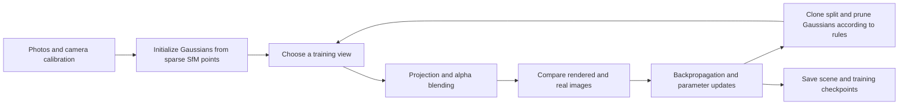

[中文](../04_nerf_3dgs.md) | English

# 04 | NeRF and 3D Gaussian Splatting: Turning Photos into a Scene You Can View from New Angles

> For readers with a mechanical engineering background: first think of this as an inverse problem of “adjusting many parameters until rendered images match photographs.” Software information in this chapter was checked on **2026-10-03**; the equations are teaching simplifications, not a line-by-line description of any particular CUDA kernel.

## 1. What Problem Do They Solve?

Given multiple photos of the same static scene, along with each photo's camera intrinsics and pose, learn a scene representation that can also generate images when the camera moves to a position that was never photographed. This is called **novel view synthesis**.

This differs from recovering the exact CAD surface of every part. A good image fit is useful evidence, but by itself it cannot prove that dimensions, internal structure, mass, or friction are correct.

| Representation | What it mainly stores | Typical image generation method | What you can directly use it for |
|---|---|---|---|
| Ordinary point cloud | Discrete positions, optionally colors/normals | Drawing points or splats | Measurement, registration, geometry processing |
| Triangle mesh | Vertices, triangle connectivity, optional textures | Triangle rasterization | Surface editing; collision with additional information |
| Original NeRF | Neural network parameters | Sampling along camera rays and volume rendering | Continuous spatial queries, novel view rendering |
| Classic 3DGS | Gaussians with color, shape, and transparency | Projecting ellipses and blending them | High-quality view browsing, visual assets |

Do not read this table as mutually exclusive capabilities: point clouds can be rendered, meshes can be estimated from photos, and NeRF/GS can help extract geometry. The distinction is in their **default optimization objectives and native data structures**.

## 2. NeRF: A Queryable Function in Space

The original NeRF can be abbreviated as:

$$
f_\theta(\mathbf x,\mathbf d)\to(\sigma,\mathbf c)
$$

- $\mathbf x=(x,y,z)$: where to query
- $\mathbf d$: the viewing direction
- $\sigma$: the extinction/density parameter in volume rendering, not a material density in kg/m³
- $\mathbf c$: the color at this position along this viewing direction
- $\theta$: the network parameters to optimize

For a pixel, cast a ray from the camera and sample it at several depths. Each sampled position contributes color, while parts in front occlude parts behind. Accumulating these contributions gives the pixel color. Supervision from the photographed color gradually updates the network.

**Mechanical engineering analogy:** In finite element analysis, you first choose a parameterized field and then solve for its coefficients through equations. Here, you also choose a field representation, but supervision mainly comes from photographs and the objective is usually to reproduce appearance. This analogy does not mean NeRF solves mechanical equations.

“Original NeRF” does not represent every later method. Later methods may accelerate computation with hash grids, voxel features, small networks, and so on. It is inaccurate to say that every NeRF is simply a large MLP, or to treat the speed in one paper as the speed of every implementation. [Original NeRF project and paper](https://www.matthewtancik.com/nerf)

## 3. Classic 3DGS: What Parameters Does a Gaussian Store?

Think of a Gaussian as an oriented, sized, colored, semitransparent ellipsoidal cloud of fog. Many such clouds form an image after projection. It is neither a real particle nor a solid ellipsoidal collision body.

| Parameter | Notation | Intuition | What may happen during optimization |
|---|---|---|---|
| Center position | $\mu\in\mathbb R^3$ | Where the cloud sits | Moves to a position that better explains the images |
| Three-axis scale | $s_x,s_y,s_z>0$ | Length, width, thickness | Flattens into a sheet or stretches into a strip |
| Rotation | Unit quaternion $q$ | Ellipsoid orientation | Aligns with local appearance structure |
| Opacity | $o\in[0,1]$ | How much background it blocks near its center | Becomes transparent or more prominent |
| Color coefficients | Spherical harmonic (SH) coefficients | Color from different viewing directions | Approximates view-dependent appearance |

The covariance matrix is constructed from scale and rotation:

$$
\Sigma=R(q)\,\mathrm{diag}(s_x^2,s_y^2,s_z^2)\,R(q)^T
$$

This corresponds to an unnormalized spatial kernel:

$$
G(\mathbf x)=\exp[-\tfrac12(\mathbf x-\mu)^T\Sigma^{-1}(\mathbf x-\mu)]
$$

Here, covariance primarily controls shape. **It should not automatically be interpreted as sensor measurement uncertainty.** Shape parameters are not an inertia tensor either.

Classic implementations commonly use degree-three SH, with 16 coefficients per color channel. Counting stored scalars gives position 3 + scale 3 + quaternion 4 + opacity 1 + SH 48 = **59 scalars per Gaussian**. Actual files, training state, and GPU memory contain extra data, and the quaternion has a normalization constraint. Do not treat 59 as the number of independent degrees of freedom.

Internally, implementations usually store logarithmic scales and opacity logits, then use exp/sigmoid to obtain valid ranges. Editing `scale_0` in a PLY as though it were “meters,” or `opacity` as though it were a value from 0 to 1, may be entirely wrong. [Classic paper](https://arxiv.org/html/2308.04079v1), [official parameters and PLY implementation](https://github.com/graphdeco-inria/gaussian-splatting/blob/main/scene/gaussian_model.py)

## 4. How Do 3D Gaussians Become an Image?

### 4.1 Projection: An Ellipsoid Becomes an Ellipse on the Screen

1. Use extrinsics to transform the Gaussian center from world to camera coordinates
2. Use intrinsics to project the center into pixel coordinates
3. Use the projection function's local Jacobian to approximately transform the 3D covariance into a 2D covariance

If $R_{cw}$ is the world-to-camera rotation and $J$ is the 2×3 perspective projection Jacobian:

$$
\Sigma_{2D}\approx J R_{cw}\Sigma R_{cw}^T J^T
$$

This is a local approximation. It does not say that the perspective projection of any huge ellipsoid can be represented exactly by one Gaussian. Real renderers also handle filtering, numerical stability, frustum culling, and screen tiling. [gsplat rasterization documentation](https://docs.gsplat.studio/main/apis/rasterization.html)

### 4.2 Blending: Clouds in Front Occlude Those Behind

For pixel $p$, a Gaussian's screen coverage determines its effective alpha:

$$
\alpha_i(p)\approx o_i\exp[-\tfrac12(p-\mu'_i)^T\Sigma_{2D,i}^{-1}(p-\mu'_i)]
$$

Process from front to back:

$$
C(p)=\sum_i T_i(p)\alpha_i(p)c_i(\mathbf d)+T_{\rm end}(p)c_{\rm bg},\qquad
T_i(p)=\prod_{j<i}(1-\alpha_j(p))
$$

**Calculate by hand:** The front layer is red with alpha=0.6; the back layer is blue with alpha=0.5; the background is black. The result is 0.6 red + 0.4×0.5 blue = (0.6, 0, 0.2). The remaining background transmittance of 0.2 reaches the black background. Swapping the front and back layers changes the result.

This explains why you cannot simply average the RGB values of overlapping Gaussians. Classic implementations use tile-based depth sorting and approximate visibility handling; intersecting, very large, or very long Gaussians may produce sorting artifacts.

## 5. Training: Mostly Correcting Pixels, Without Point-by-Point Answers

The classic image loss can be written as:

$$
\mathcal L=(1-\lambda)\mathcal L_1+\lambda\mathcal L_{D\text{-}SSIM}
$$

L1 constrains pixel differences, while D-SSIM constrains local structural similarity. Different implementations may additionally use depth, scale, normal, or other regularization terms. Do not attribute an extension's losses to the original algorithm.

The rough meaning of a gradient is: “If this parameter changes slightly, which way will the image error change?” For example, when an object edge lies too far to the right, the optimizer may move a center or change scale, opacity, or color to reduce the error. **Images constrain only the final result, so different geometric changes can sometimes hide the same error.** This is the core reason that appearance fitting is not equivalent to reliable geometry.

### The Number of Gaussians Also Changes

- **Clone:** Add representation capacity when an existing Gaussian is small but still explains local detail poorly
- **Split:** Divide a large Gaussian into smaller ones when it covers a complex region
- **Prune:** Delete unsuitable Gaussians, such as those with low contribution; exact criteria depend on the implementation
- **Opacity reset:** Some training strategies periodically lower opacity to help redistribute contributions

These are discrete strategies interleaved with gradient optimization, rather than “backpropagation naturally producing a new point.” New Gaussians are not newly acquired real measurement points either. [Official density control code](https://github.com/graphdeco-inria/gaussian-splatting/blob/main/scene/gaussian_model.py), [training loop](https://github.com/graphdeco-inria/gaussian-splatting/blob/main/train.py)

## 6. Distinguish Training, Inference, and Online Reconstruction

| Stage | Input | Does it update the scene? | Main costs |
|---|---|---|---|
| Training/optimization | Many photos, cameras, initial points | Yes | Repeated rendering, gradients, optimizer, adding/removing Gaussians |
| Inference/rendering | Trained scene, one camera pose | Usually no | Projection, sorting, blending |
| Online reconstruction/SLAM | Incoming images and other sensors | Yes | Pose estimation, data association, map updates, etc. |

Classic official 3DGS generally uses camera poses that have already been solved. “Training Gaussians” and “also correcting cameras” are not the same default task. Other systems may optimize them jointly; check the implementation.

“Real-time” in the paper title mainly refers to rendering an existing model. It does not automatically imply real-time training, a real-time capture-to-result process, or deterministic robot control periods and worst-case latency. To discuss real-time performance in a particular system, record resolution, GPU, scene size, loading/sorting costs, and tail latency yourself.

## 7. Three Misunderstandings About PLY, Meshes, and Robots

### PLY Does Not Mean an Ordinary Point Cloud

PLY is a container format. A file may store only XYZ/RGB; it may contain `face` elements and form a mesh; or it may store SH, opacity, scale, and rotation as custom vertex properties and form a Gaussian asset. Ordinary point cloud software may display only Gaussian centers and lose the appearance; exporting again may erase custom properties. Keep the original and inspect the header first.

### Converting GS to a Mesh Does Not Mean Recovering a Perfect Solid

Extraction methods may create meshes through depth fusion, density isosurfaces, surface constraints, or dedicated Gaussian representations. Occlusion, floaters, view-dependent appearance, thick clouds, and unknown back surfaces affect the surface. Even a closed output may contain algorithmic hole filling rather than observed facts. Before metrology or contact use, validate with a scale reference and independent geometric measurements.

### The Visual Layer Is Not the Physics Layer

GS can describe “what the robot camera sees.” Physics simulation in MuJoCo and similar tools also needs collision geometry, mass, inertia, joints, friction, contact parameters, and more. The layers can be combined after registration to a common coordinate system, but rendering loss does not automatically provide real contact-force ground truth. [MuJoCo modeling documentation](https://mujoco.readthedocs.io/en/stable/modeling.html)

Record visual quality evidence, scale/geometry evidence, and the sources of physical parameters separately for each asset. Avoid letting one “reconstruction succeeded” label hide three different acceptance questions.

## 8. Short Exercises

1. Draw how the projection of a flat Gaussian differs from the front and the side
2. Recalculate the two-layer alpha example in Section 4 with front and back swapped, and explain why the color changes
3. Inspect a PLY header: is it an ordinary point cloud, a mesh, or a Gaussian asset? Can you tell from the `.ply` extension alone?
4. Why is high PSNR still insufficient if you want to measure a metal bearing's diameter? Write down the scale information and independent validation you would add

Next: [4DGS](05_4dgs.md) · [Practical Recipes](06_workflows.md) · [Troubleshooting](07_troubleshooting.md)

[Back to Home](../../README.en.md) · [Coordinates and Calibration](08_robot_frames_calibration.md) · [Robot Applications](09_robot_perception_action.md) · [ROS 2 / MuJoCo](10_ros2_mujoco.md)
