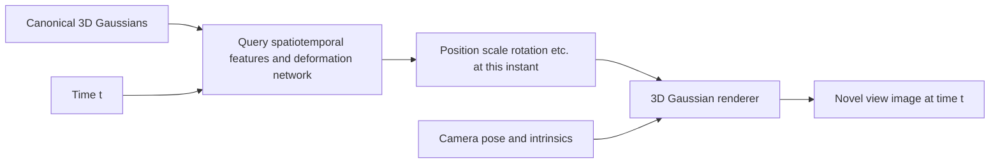

[中文](../05_4dgs.md) | English

# 05 | 4D Gaussian Splatting: Making a Scene Change over Time

> Software and papers checked on **2026-10-03**. This chapter explains families of methods; [Chapter 06](06_workflows.md#d-hustvl-4dgaussians-start-by-reproducing-a-synthetic-sequence) gives the workflow for one specific implementation. Do not use one method's installation commands to run another method with the same name.

## 1. What Is the Fourth Dimension?

Here it is usually time: $(x,y,z,t)$. You no longer ask only “what does it look like from this camera?” You also ask “at what time?”

Static 3DGS assumes the scene remains essentially unchanged across photos. If a person is walking, training the whole video as a static scene may produce ghosting, a semitransparent person, or trails. More training steps cannot repair this incorrect model assumption.

4D methods learn a representation from observed images $I_{v,t}$ that depends on both view $v$ and time $t$. **A video naturally contains time, but it may not provide enough information from multiple views at the same instant.**

## 2. “4DGS” Has at Least Two Important Meanings

### A. Canonical 3D Gaussians + Temporal Deformation

Store a set of Gaussians in a canonical state, then use $D_\theta(\mathbf x,t)$ to predict changes over time, for example:

$$
\mu_i(t)=\mu_i^0+\Delta\mu_i(t)
$$

Scale and rotation may also change; some methods/settings allow color or opacity changes. An ordinary 3D Gaussian rasterizer then renders this instant.

[Wu et al.'s 4D-GS](https://arxiv.org/html/2310.08528v3) and [hustvl/4DGaussians](https://github.com/hustvl/4DGaussians) follow this route: they use spatiotemporal feature planes and a small network to express Gaussian deformation. This is not simply training each frame independently and saving a collection of unrelated 3DGS models.

### B. Native 4D Spatiotemporal Gaussians

Another route defines Gaussians directly in spacetime: their means are four-dimensional and their covariances are 4×4. Cross terms between time and space express motion relationships. Given time $t$, a conditional distribution yields the spatial Gaussian to render, combined with its weight at that time.

Partitioning the covariance into space/time blocks, the conditional Gaussian equations from probability theory help explain this:

$$
\mu_{x\mid t}=\mu_x+\Sigma_{xt}\Sigma_{tt}^{-1}(t-\mu_t)
$$

$$
\Sigma_{x\mid t}=\Sigma_{xx}-\Sigma_{xt}\Sigma_{tt}^{-1}\Sigma_{tx}
$$

For one complete Gaussian, the conditional center is linear in time; many spatiotemporal Gaussians and their associated modeling mechanisms can jointly represent complex motion. Do not treat these equations as the implementation definition of every 4DGS method. [Yang et al.'s native 4DGS project](https://fudan-zvg.github.io/4d-gaussian-splatting/), [paper](https://arxiv.org/html/2310.10642v2)

### Check These Four Things When Choosing a Paper

1. Does “four-dimensional” refer to input coordinates, neural features, or the dimensionality of the Gaussians themselves?
2. Are Gaussian identities maintained across time? Are their trajectories subject to physical/geometric constraints?
3. Does the input require synchronized multiple cameras, a moving single camera, or generated video?
4. Does evaluation concern novel views, novel times, tracking, or interactive physical responses?

Identical terminology does not guarantee identical data formats, loss functions, exported files, or licenses.

## 3. Plan Capture as a Mechanical Experiment

### Recommended Order for Beginners

Synthetic sequences with supplied calibration → short synchronized multi-view sequences from fixed cameras → more complex motion → dynamic monocular sequences from a moving camera.

For your first capture experiment, consider a textured object moving slowly within a limited range, fixed cameras, stable lighting, and a sufficiently textured background. Avoid starting with transparent liquid, mirror-like metal, rapid hand waving, video with severe rolling shutter, or an arbitrarily moving phone.

### Capture Checklist

| Item | What to record/verify | Consequence of ignoring it |
|---|---|---|
| Intrinsics | Focal length, principal point, distortion, resolution for each camera; lock zoom/focus | Views cannot align |
| Extrinsics | Relative camera positions and orientations; whether a fixed mount moved | Model treats camera errors as deformation |
| Synchronization | Hardware triggers/timestamps, clock offsets, dropped frames, exposure times | Different object states share the same label |
| Exposure | Shutter duration, gain, white balance, light flicker | Motion blur and inconsistent color |
| View coverage | Whether multiple cameras see the dynamic subject, contact regions, and back surfaces | Occluded regions are unobservable |
| Scale | Ruler, known baseline, or calibration object dimensions | World units are not meters |
| Data identity | One-to-one correspondence of camera_id, frame_id, timestamps, and files | Incorrect sorting or time order |

**Order of magnitude for synchronization error:** If local speed is roughly 1 m/s and cameras differ by 10 ms, the point may be displaced by about 1 cm. This is an estimate using $\Delta x\approx v\Delta t$, not a performance specification for any particular camera.

Identical names such as `frame_00010.jpg` do not prove two cameras are synchronized. Running the same frame extraction command on two videos separately does not prove synchronization either. First align timestamps or a jointly visible event, then establish a common index and record how dropped frames are handled.

SfM in dynamic scenes can also mistake object motion for camera motion. Fixed multi-camera setups can estimate cameras using images from the same instant, a static background, or independent calibration. Feeding all dynamic frames together into static COLMAP is not a reliable general solution.

## 4. Why Is Dynamic Monocular Reconstruction Particularly Difficult?

Many depths are possible along the viewing ray of one pixel. When a single camera observes object changes over time, image changes may arise from:

- Camera motion
- Object motion or deformation
- Changing lighting/reflections
- Changing occlusion

Multiple explanations can generate very similar training images. A neural network can use smoothness, depth, optical flow, human body structure, or other priors to choose an explanation, but that does not make it the uniquely correct motion.

The hustvl paper also reports limitations involving novel view overfitting in dynamic monocular scenes and correlations between camera and object motion. In practical projects, treat depth supervision, calibration, synchronization, and independent validation as ways to address observability, rather than merely searching for “stronger training parameters.” [Paper's limitations discussion](https://arxiv.org/html/2310.08528v3)

## 5. Training and Export: Time Is Not an Ordinary Filename

Typical training alternately samples images from particular views and times, obtains the Gaussians for that instant, then renders and optimizes. It may also use temporal smoothness, spatial regularization, and coarse/fine stages.

Save these together:

- Canonical Gaussian parameters
- Deformation network/spatiotemporal feature weights
- Time normalization and camera parameters
- Configuration, code version, and necessary data path information

One hustvl `point_cloud.ply` is insufficient to recover the complete dynamic model; corresponding deformation model files are also needed. Exporting a sequence of static Gaussian PLY files, one per timestamp, can support frame-by-frame display, but those files are not the original dynamic model and do not automatically guarantee interpolation, editing, or correspondence across frames. [Official save/load code](https://github.com/hustvl/4DGaussians/blob/master/scene/__init__.py), [per-time export script](https://github.com/hustvl/4DGaussians/blob/master/export_perframe_3DGS.py)

## 6. How to Accept a 4D Result

Do not judge only a beautiful video that changes both camera and time. Separate the two variables:

1. **Fix time and change the camera:** Check whether the model is only a “cardboard set” for training views
2. **Fix the camera and change time:** Check flicker, drift, trails, and sudden disappearance
3. **Independent camera holdout:** Exclude all supervision images from one camera during training, then test novel views
4. **Independent time holdout:** Hold out certain time intervals and state whether evaluation tests interpolation or extrapolation
5. **Geometry/motion validation:** Compare with independent depth, markers, or other measurements, and state the scale and alignment method

Pay particular attention: as of the check date, hustvl's `multipleview_dataset.py` selects a few time points from the same cameras for its default test set, while training uses all time points. **The default test label does not mean an independent holdout set.** Its output metrics cannot directly establish generalization; you must explicitly change the split and confirm that these samples are absent from training. [Data split source](https://github.com/hustvl/4DGaussians/blob/master/scene/multipleview_dataset.py)

## 7. Connections to Robots, MANO, and MuJoCo

- **MANO:** MANO provides a hand's parameterized shape/pose and mesh structure; dynamic Gaussians can express richer appearance. They can be combined, but binding, coordinate systems, and occlusion handling must be explicit
- **Tracking:** Gaussian trajectories from a deformation network are not necessarily trajectories of the same real material points on a surface; appearance loss may “explain” motion through color, transparency, or scale changes
- **MuJoCo:** Replaying “motion already recorded” is different from predicting “what will happen under a new force.” Real interaction also needs dynamics, contact, and control models
- **Force GT:** Ordinary 4D rendering training alone does not produce trustworthy contact-force ground truth. Force sensors, validated dynamics models, or other measurements still need to be established separately

Short exercise: If a hand touches a cup, list three physical quantities that video alone cannot uniquely determine, then list the sensors or experimental constraints you would add.

[Back to Home](../../README.en.md) · [Coordinates and Calibration](08_robot_frames_calibration.md) · [Robot Applications](09_robot_perception_action.md) · [ROS 2 / MuJoCo](10_ros2_mujoco.md)
