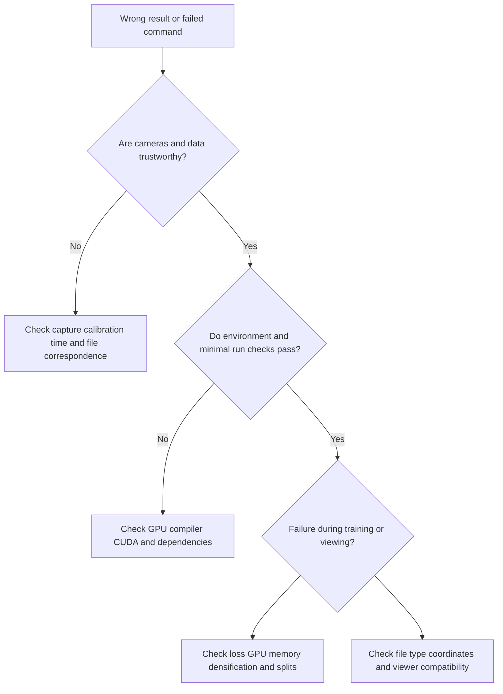

[中文](../07_troubleshooting.md) | English

# 07 | Troubleshooting: Find the Failing Layer before Changing Parameters

> Software details checked on **2026-10-03**. These are diagnostic paths and check commands, not claims that this repository has reproduced these failures on your machine.



## 1. Cameras and COLMAP

| Symptom | First check | Next step |
|---|---|---|
| Only a few photos register | Blur, duplicates, missing texture, insufficient overlap | Reconstruct a clear subset and add views with parallax; do not start GS training directly |
| Camera positions fly apart or split into multiple models | Dynamic subjects, zoom, repeated textures, turntable background | Separate static/dynamic issues, group intrinsics by real camera, and inspect matches |
| Object looks like a sheet of paper | Camera only rotating in place, very small baseline | Add translation and higher/lower views; pure rotation does not provide reliable triangulation depth |
| Training remains misaligned after undistortion | Whether photos and intrinsics come from the same output | Do not mix original photos with undistorted cameras; update intrinsics after scaling/cropping |
| Incorrect model orientation/scale | World coordinate definition, extrinsic direction, scale reference | Monocular SfM is not inherently metric; unify using a known scale and rigid transform |
| `unrecognised option` | Whether the installed version matches the online documentation | Check local `-h`; do not copy flags from another version |

On the check date, COLMAP documentation uses `FeatureExtraction.use_gpu` and `FeatureMatching.use_gpu`; older scripts may still pass `SiftExtraction.use_gpu` / `SiftMatching.use_gpu`. Similarly, general options such as maximum image size may move to another namespace. Change only options with an explicit counterpart in local help. [COLMAP CLI](https://colmap.github.io/cli.html), [graphdeco convert.py](https://github.com/graphdeco-inria/gaussian-splatting/blob/main/convert.py)

**Low reprojection error does not guarantee that everything is correct.** Incorrect but self-consistent matches of repeated textures, scale freedom, or weak baselines may still pass some numerical checks. Also inspect camera layout, the point cloud, and actual known dimensions.

## 2. CUDA, Compilation, and Dependencies

| Symptom | Common layer | What to do first |
|---|---|---|
| `torch.cuda.is_available()` is False | CPU wheel, driver, invisible GPU, wrong environment | Record torch/runtime, `nvidia-smi`, and the current Python path |
| Missing `nvcc` / `CUDA_HOME` | Development toolkit not installed or selected | Distinguish runtime libraries from the compiler toolkit; configure according to the target framework's compatibility table |
| Windows cannot find `cl.exe` | C++ compiler environment | Use a matching x64 developer terminal; check `where cl` |
| `no kernel image` / unsupported architecture | GPU architecture does not match wheel/extension | Verify that the toolchain supports the target architecture; do not simply add an arbitrary architecture number |
| `undefined symbol` / CUDA extension import failure | Mixed torch/CUDA/compiler ABIs | Rebuild the corresponding extension in the same environment; first preserve the original environment and logs |
| Conda/pip dependency resolution fails | Historical Python incompatible with newer dependencies | Pin the version combination for the repository being reproduced, rather than forcing individual upgrades |
| First Splatfacto launch takes a long time | Possibly the first gsplat compilation | Inspect compilation logs and CPU/GPU activity; silence alone does not mean it has hung |

```bash
# Check in the same terminal and environment actually used for training
python -c "import sys; print(sys.executable)"
python -m pip check
python -c "import torch; print(torch.__version__); print(torch.version.cuda); print(torch.cuda.is_available())"
nvcc --version
nvidia-smi
```

Do not download an arbitrary CUDA `.so`/`.pyd` from the internet as a replacement. It may mismatch the current ABI and may pose security risks. Use three separate environments for official 3DGS, Nerfstudio, and hustvl; record commits and submodule versions. [Official 3DGS installation requirements](https://github.com/graphdeco-inria/gaussian-splatting#optimizer), [Nerfstudio installation](https://docs.nerf.studio/quickstart/installation.html)

Mac Metal/MPS is not CUDA. Changing `device='cuda'` to `mps` does not automatically port a custom CUDA rasterizer.

## 3. Out of GPU Memory: Do Not Suspect a Broken GPU First

GPU memory is occupied by image caches, trainable parameters, gradients, Adam state, temporary rasterization buffers, and densification. Training usually requires more GPU memory than simply viewing the same final model.

Try these in order from lower to higher risk:

1. Close other programs using the GPU and check whether failure always occurs at the same stage
2. Reduce training image resolution and verify that the required details remain
3. Official 3DGS can use `--data_device cpu` to reduce input image cache usage; this is not CPU training
4. Reduce initial points or verify the process with a small region/short sequence
5. Then inspect implementation-specific parameters such as densification frequency, stopping time, and thresholds; changes may alter quality and depart from paper settings

If training starts but runs out of memory after densification, focus on Gaussian count and peak buffer usage. If it runs out of memory while loading images, inspect the image cache first. Do not change five parameters at once, or the cause will be hard to identify. [graphdeco memory notes](https://github.com/graphdeco-inria/gaussian-splatting#faq)

## 4. Training Runs, but Images Are Poor

| Symptom | First suspect | Discouraged first reaction |
|---|---|---|
| Floating “clouds” around the scene | Calibration errors, dynamic objects, weak texture/occluded regions | Unlimited densification |
| Spikes and elongated Gaussians | Insufficient observations, scale degeneracy, optimization settings | Treating them as real slender geometry |
| Good training views, broken side views | Overfitting, insufficient view coverage | Showing only training views |
| Ghosted edges | Blur, exposure changes, camera misalignment, dynamic scenes | Only increasing SH degree |
| Suddenly all black or exploding scale | NaNs, background/coordinate/unit errors, abnormal inputs | Overwriting the last good checkpoint |
| Attractive metal surfaces but strange geometry | View-dependent appearance fitted by nonphysical solutions | Certifying dimensions from rendered appearance |

Splatfacto offers options such as scale regularization, but fix data and calibration first; check parameter names using the current `ns-train splatfacto --help`. No regularizer can recover an unobserved back surface out of nothing. [Splatfacto quality and regularization](https://docs.nerf.studio/nerfology/methods/splat.html#quality-and-regularization)

## 5. The File Opens but Displays Incorrectly

First identify the file, then ask why the software “draws it wrong.” A PLY header may have these features:

- Only `x y z` and `red green blue`: a common ordinary colored point cloud
- `element face` and vertex indices: possibly a mesh
- `f_dc_*`, `f_rest_*`, `opacity`, `scale_*`, `rot_*`: a common Gaussian PLY

These are common patterns, not a universal standard across the ecosystem. The following uses the standard library to read the header without reading the entire large file:

```python
from pathlib import Path
p = Path('exports/scene_demo/splat.ply')
with p.open('rb') as f:
    for _ in range(256):
        line = f.readline(4096)
        if not line:
            break
        print(line.decode('ascii', errors='replace').rstrip())
        if line.strip() == b'end_header':
            break
```

When an ordinary point cloud viewer draws only Gaussian centers, sparse or incorrectly colored output does not necessarily mean training failed. Exporting again through an ordinary PLY editor may also discard SH/scale properties. Always preserve the original model. [Official PLY property implementation](https://github.com/graphdeco-inria/gaussian-splatting/blob/main/scene/gaussian_model.py)

Other common problems:

- **Only the PLY was copied:** The deformation network is missing for dynamic models; configuration or camera files may be missing for some viewers
- **Photos cannot be found after moving the model:** Configuration contains an old data path; point it to the data rather than fabricating an empty directory
- **Mirrored/upside-down images or cameras outside the scene:** Check C2W/W2C, quaternion component order, axis directions, and row/column conventions
- **Exported mesh is empty:** First establish whether the current training method supports that export route; a generic flag cannot produce a reliable surface from any arbitrary GS or NeRF

## 6. Dynamic Results: Trails, Jerks, and Drift

Check in order:

1. Do camera_id and frame paths correspond strictly? Are hidden files/thumbnails in `cam01` affecting frame counts?
2. Is the kth frame from each camera actually the same instant? Are there dropped frames or variable frame rates?
3. Did cameras move, zoom, or refocus during recording?
4. Was only the first frame undistorted while subsequent original images still contain distortion?
5. Is time playback stable from a fixed camera? Is changing the camera stable at frozen time?
6. Is there severe monocular ambiguity between camera trajectory and object motion?
7. Do parameter/regularization changes merely improve training images while making independent views worse?

On the check date, hustvl's general COLMAP loader constructs default time from image indices; it is not a precise time synchronizer. Its custom multipleview loader also assumes shared focal length, fixed extrinsics, and fixed naming. Do not equate “successfully loaded” with “experiment data have correct semantics.” [dataset_readers.py](https://github.com/hustvl/4DGaussians/blob/master/scene/dataset_readers.py), [multipleview_dataset.py](https://github.com/hustvl/4DGaussians/blob/master/scene/multipleview_dataset.py)

## 7. False Positives in Metrics and Robot Integration

- **PSNR improves, but dimensions are wrong:** Image metrics do not establish scale calibration; add independent dimension/depth validation
- **Excellent test metrics:** Check the actual train/test file lists; a set named test may overlap train
- **Fast rendering means closed-loop control is possible:** Sensor, state estimation, communication, synchronization, and control tail latency are still missing; measure the end-to-end budget
- **A closed mesh means correct collision:** Check contact surfaces, simplification errors, units, collision bodies, mass, and inertia
- **Gaussians move with the hand, so they give real material-point trajectories:** Color, transparency, and scale changes can also explain images; independent tracking evidence is needed
- **Simulation gives contact forces, so they are measured GT:** Simulation outputs depend on parameters and models; distinguish simulated labels from real measurements

When aligning visual rendering with MuJoCo's physics layer, record at least the common world coordinate system, metric units, object poses, camera intrinsics/extrinsics, and the relationship between the two timelines. First validate with a small test scene of known geometry, then integrate complex assets.

## 8. Provide Minimal Diagnostic Information When Asking for Help

For a public issue, include the OS, GPU, driver/runtime/toolkit, Python/torch, repository commit, submodule commits, complete command, earliest error and necessary logs, input directory structure, and checks already performed.

Do not publish tokens, private server addresses, images/logs containing personal information, or unauthorized data. Begin with the first exception, rather than showing only the final “build failed” line. Before sharing a minimal dataset, verify authorization for the photos and model.

Return to: [Workflows](06_workflows.md) · [3DGS Principles](04_nerf_3dgs.md) · [4DGS Principles](05_4dgs.md)

[Back to Home](../../README.en.md) · [Coordinates and Calibration](08_robot_frames_calibration.md) · [Robot Applications](09_robot_perception_action.md) · [ROS 2 / MuJoCo](10_ros2_mujoco.md)
