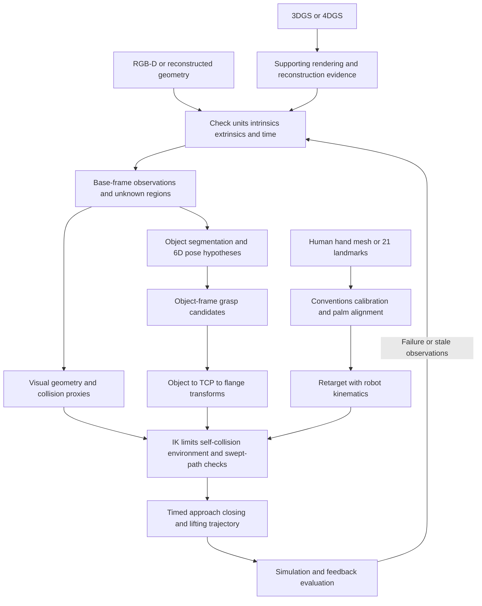

# 09 From 3D Perception to Robot Actions

[中文](../09_robot_perception_action.md) | [English](09_robot_perception_action.md)

[Back to entry](../../README.en.md) · Prerequisites: [Point clouds and meshes](02_pointcloud_mesh.md), [MANO](03_mano_hand.md), [Frames and calibration](08_robot_frames_calibration.md) · Next: [ROS 2 and MuJoCo](10_ros2_mujoco.md)

**Goal**: turn observations of an object or human hand into inspectable robot targets, and understand the conditions still needed for geometry, grasping, motion planning, and contact.

**Verified against sources: 2026-10-03.** Official pages and code were consulted. The matrices below are original synthetic examples; see [examples](../../examples/README.en.md) for the CPU scripts' execution status. This chapter did not execute GPU training, MANO inference, MoveIt integration, real robot control, or external API integration. Pose arithmetic is not a completed grasp.

## 1 Define what each stage delivers

A depth image is an observation. A robot needs targets with frames, units, timestamps, and validity information, together with its own model and current state. An `N×3` point array is not a motion command.



This diagram is the tutorial's own workflow design. The table proposes data contracts rather than a particular library's fixed API.

| Stage | Input | Output and required metadata | First check |
|---|---|---|---|
| Observation to geometry | Depth, validity mask, intrinsics, camera extrinsics, exposure time | Base-frame point cloud; metres; timestamp; observed coverage | Invalid depths removed; known length correct |
| Segmentation and pose | RGB-D/cloud, object CAD or explicit model assumptions | Instance identity, `T_B_O`, hypotheses/confidence, symmetry convention, residuals | Target separated from background; correct model origin |
| Collision assets | Observations, CAD, robot model, known table | Obstacles, unknown-space policy, collision proxies, margins, update time | Unseen back surfaces not assumed empty |
| Grasp candidates | Object geometry, gripper dimensions, task requirements | `T_O_TCP`, opening width, approach direction, pregrasp distance, score | Width/finger length suitable; score meaning clear |
| Motion planning | Candidate, `T_F_TCP`, current joints, limits, collision scene | Joint path and timing, failure reasons, scene version | Whole path and grasped object checked |
| Hand retargeting | Named landmarks, palm pose, robot kinematics | `q(t)` ordered by joint name, residuals, constraint violations | Evaluate by forward kinematics |
| Action evaluation | Commands and joint/vision/contact feedback | Actual errors, task outcome, recovery/termination reason | Success defined before experimentation |

`B` is the robot base, `C` the camera, `O` the object, `F` the flange, and `TCP` the tool centre point. Throughout this chapter, **`T_A_B` maps column-vector coordinates from B into A**: `p_A = T_A_B p_B`. A pose includes orientation as well as position.

To keep frame names legible in equations, the destination frame is a superscript and the source frame a subscript: for example, ${}^{B}T_{\mathrm{TCP}}$ in an equation means `T_B_TCP` in the prose.

## 2 Turn depth and meshes into usable geometry

### 2.1 First obtain correct observed points

For a distortion-corrected pinhole model with optical-axis depth `z`:

$$z=d/s,\quad x=(u-c_x)z/f_x,\quad y=(v-c_y)z/f_y,\quad \bar p_B={}^{B}T_C\bar p_C.$$

Here `s` is the number of raw depth units per metre. Open3D 0.19.0's `create_from_depth_image` uses this back-projection relation; its `depth_scale` is a divisor. Dividing metre-valued depth by 1000 again shrinks the scene by 1000. Another format may define a similarly named field as a multiplier: check the original specification. [Open3D depth API](https://www.open3d.org/docs/0.19.0/python_api/open3d.geometry.PointCloud.html#open3d.geometry.PointCloud.create_from_depth_image), [BOP depth format](https://github.com/thodan/bop_toolkit/blob/master/docs/bop_datasets_format.md).

**Minimal synthetic check**: with `fx=fy=500`, `cx=320`, `cy=240`, pixel `(u,v)=(370,240)` and valid depth `z=0.8 m` produce `p_C=(0.08,0,0.8) m`. The central pixel produces `(0,0,0.8)`. If the value is `800`, first determine whether it means millimetres or metres. A plausible-looking object is insufficient evidence of scale. See [depth_to_robot_demo.py](../../examples/depth_to_robot_demo.py) for a complete coordinate exercise.

Segmentation, outlier filtering, downsampling, and mesh reconstruction are covered in Chapter 02. Robot use adds requirements: preserve removed regions, occlusion coverage, and timestamps. Smoothing may remove thin rods or close narrow gaps. A single frame provides no evidence of the back surface; multiple-frame fusion still requires checks for calibration errors and motion ghosts.

### 2.2 Evaluate visual and collision geometry separately

**Visual geometry** serves inspection and rendering, possibly with detailed textures and many triangles. **Collision geometry** serves distance/contact queries and needs explicit shape, scale, pose, and coverage. Mass, inertia, friction, actuators, and contact parameters belong to the dynamics model. MuJoCo geom properties separately configure collision, friction, and mass-related settings; attractive textures cannot supply those fields. [MuJoCo geom reference](https://mujoco.readthedocs.io/en/stable/XMLreference.html#body-geom).

Start with measured boxes, spheres, cylinders/capsules, or other simple proxies. Approximate a complex rigid object with multiple convex parts: a cup's convex hull fills its opening, and a ring's hull blocks its hole. Insertion or handle grasping requires the relevant concavity to be preserved. Ordinary MuJoCo mesh geoms use convexified collision geometry, so a concave rendered shape does not establish concave collision behaviour. Other paths such as rigid flex have separate modeling requirements; see Chapter 10. [MuJoCo modeling](https://mujoco.readthedocs.io/en/stable/modeling.html).

**Proxy exercise**: use a visual mesh and an equal-size collision box for a synthetic `60×40×30 mm` object. Add an explicitly chosen demonstration margin of `3 mm`, producing conservative full dimensions `66×46×36 mm`. Record this as a modeling margin, not the object's real size. Check coverage for fingers, camera brackets, and cables too. Choose margins using depth, calibration, model, and tracking errors; 3 millimetres is not a universal recommendation. Excessive margins can block valid grasps, so treat intended target contact separately from obstacle avoidance.

### 2.3 Unknown space is not free space

An area with no points may be empty, occluded, out of range, affected by reflection, or removed by filtering. An occupancy map should distinguish **occupied, observed free, and unknown**; OctoMap explicitly represents these categories. Update free regions only along valid measurement rays under a reliable sensor model. Do not clear space behind an object or behind invalid depth. [OctoMap official overview](https://octomap.github.io/).

The tutorial's conservative policy is to obtain more observations before entering unknown space, or mark it as forbidden. Other tasks may use explicit, validated exploration policies, which must be documented. Hole filling produces an estimate; a repaired mesh does not establish that its back surface was measured.

The **swept volume** is the union of space occupied by the robot and carried object along the entire path. Collision-free endpoints do not prevent an elbow from hitting the table midway. Rotating a long object makes its corners sweep a large area. Check approach, closing, and lifting, and update attached-object geometry after grasping. Discrete path checks depend on sampling intervals; current MoveIt OMPL documentation describes intermediate-state discretization and warns that coarse resolution can miss small obstacles. [MoveIt OMPL configuration](https://moveit.picknik.ai/main/doc/examples/ompl_interface/ompl_interface_tutorial.html).

## 3 From object 6D pose to grasp candidates

### 3.1 Pose, instance, and confidence

“6D” means three translation and three rotation degrees of freedom. Rotation can be encoded as a quaternion or matrix; storage need not contain six numbers. With known CAD, image correspondences can initialize a pose, followed by depth/cloud alignment. ICP refines alignment under suitable conditions; it cannot automatically repair segmentation or resolve all symmetries. See [Chapter 02](02_pointcloud_mesh.md). A model-free workflow also needs a defined object frame and scale.

A textureless cylinder's rotation around its axis may be indistinguishable in the current observation; a box may have discrete rotational symmetries. Retain equivalent hypotheses or a symmetry set `S`, treating `T_B_O S` as potentially equivalent poses rather than claiming an arbitrary yaw is precisely measured. BOP model metadata describes discrete and continuous symmetries separately. [BOP model format](https://github.com/thodan/bop_toolkit/blob/master/docs/bop_datasets_format.md).

Grasping and the task determine whether a symmetry is useful: side grasping a cylinder may permit several yaw angles, whereas inserting a keyed part requires locating the keyway. Geometric symmetry does not imply symmetry of material, load, or semantics. Maintain instance identity over time: correct poses for two similar boxes may still lead to grasping the wrong target.

Include observation time, visible fraction, registration/reprojection residuals, failure flags, and the meaning of confidence. An uncalibrated network score is not automatically a “90% probability of grasp success.” A low residual may also reflect symmetry or background alignment. Use held-out data to compare scores with actual errors; obtain another observation or return failure when requirements are unmet.

### 3.2 A candidate is a set of conditions

Describe candidates in the **object frame**: for example, approach a box from above, close two fingers on its sides, and open slightly wider than the object. Store `T_O_TCP`, gripper opening, local approach axis, pregrasp distance, expected contact surfaces, and task constraints. Explain whether a score measures geometry, comes from a learned model, or represents simulation results. For the synthetic box, a 0.06 m grasp width, 0.07 m commanded opening, and 0.08 m maximum opening pass only the width check; finger clearance and closure contact still need evaluation.

First reject unsuitable candidates using gripper opening and finger length. Then check whether the approach intersects the table, other objects, or unknown areas. Two contact points and their normals provide a geometric heuristic for a parallel gripper; proximity alone does not establish friction, torque balance, or stable contact. Simulation also depends on assumed friction, mass, control, and contact models. [MuJoCo contact and slip discussion](https://mujoco.readthedocs.io/en/stable/modeling.html#preventing-slip).

## 4 Compute TCP and flange targets from the object

### 4.1 Meaning of the chain

Perception supplies `T_B_O`; the candidate supplies `T_O_TCP`. Tool calibration supplies fixed `T_F_TCP`: the TCP's position and orientation relative to the flange. Therefore:

$${}^{B}T_{\mathrm{TCP}}={}^{B}T_O\,{}^{O}T_{\mathrm{TCP}},\qquad
{}^{B}T_F={}^{B}T_{\mathrm{TCP}}({}^{F}T_{\mathrm{TCP}})^{-1}.$$

If the controller already has the TCP configured and accepts TCP targets, send `T_B_TCP`. Use `T_B_F` when the interface accepts flange targets. Verify the target link/frame to avoid applying tool compensation twice. The inverse is:

$$[R,t]^{-1}=[R^\top,-R^\top t].$$

### 4.2 Worked example with nonidentity rotations

Lengths are metres; rotations are right-handed active rotations acting on column vectors. Choose:

$${}^{B}T_O=[R_z(90^\circ),(0.40,0.20,0.10)],$$
$${}^{O}T_{\mathrm{TCP}}=[R_x(90^\circ),(0.02,0,0.06)],$$
$${}^{F}T_{\mathrm{TCP}}=[R_y(90^\circ),(0,0,0.10)].$$

Composition gives:

$${}^{B}R_{\mathrm{TCP}}=\begin{bmatrix}0&0&1\\\\1&0&0\\\\0&1&0\end{bmatrix},\quad
{}^{B}t_{\mathrm{TCP}}=\begin{bmatrix}0.40\\\\0.22\\\\0.16\end{bmatrix}.$$

After tool compensation:

$${}^{B}R_F=\begin{bmatrix}1&0&0\\\\0&0&-1\\\\0&1&0\end{bmatrix},\quad
{}^{B}t_F=\begin{bmatrix}0.40\\\\0.32\\\\0.16\end{bmatrix}.$$

TCP local `+x` points along base `+y`. The tool offset also rotates, so the flange position is not obtained by subtracting 0.10 from the TCP's base-frame `z`. Check `T_B_F T_F_TCP = T_B_TCP`, `RᵀR=I`, and `det(R)=1`. This computes coordinates; it has not solved IK or checked collisions. [grasp_pose_demo.py](../../examples/grasp_pose_demo.py) and [rigid_transform_demo.py](../../examples/rigid_transform_demo.py) provide CPU exercises; the source defines each script's exact inputs.

If this example specifies retreat by 0.05 metres along TCP local `-z`, use `T_O_TCP_pre=T_O_TCP [I,(0,0,-0.05)]`. The third column of `R_B_TCP` is base `+x`, so the pregrasp TCP position is `(0.35,0.22,0.16)`. Record the retreat direction in each candidate; grippers need not all use `z` as the approach axis.

## 5 A target pose is not an executable trajectory

Inverse kinematics (IK) takes robot kinematics, a target link pose, and an initial joint state and may produce joint solutions. Report missing solutions, solver timeouts, out-of-limit solutions, and different branches reached from different seeds. The official MoveIt example presents solver success and joint-limit checking separately; `setJointGroupPositions` itself does not enforce limits. [MoveIt kinematics example](https://moveit.picknik.ai/main/doc/examples/robot_model_and_robot_state/robot_model_and_robot_state_tutorial.html).

Check the following gates:

1. Solve IK for pregrasp, grasp, and lift poses. Record the end link, seed, and tolerances; use forward kinematics to measure the resulting target error.
2. Check limits, self-collision, environment collision, and path constraints. Include palm, elbow, tool, and grasped object. IK success passes only the kinematic gate.
3. Plan the whole path from the current joint state, checking swept space and unknown areas. The approach must follow the specified direction; correct endpoint poses are insufficient.
4. Add velocity, acceleration, and actuator capability limits to obtain a timed joint trajectory. A feasible static path is not executable at arbitrary speed.
5. Refresh observations and current state, evaluate perception-to-execution delay, and use feedback to judge closing, contact, lifting, and slipping.

MoveIt Planning Scene distinguishes self-collision from environment collision; environment checks can use padding. Its Allowed Collision Matrix ignores specified collision pairs. Allow only explicitly intended fingertip/target contact instead of broadly disabling checks to obtain a plan. [MoveIt Planning Scene](https://moveit.picknik.ai/main/doc/examples/planning_scene/planning_scene_tutorial.html).

**Open-loop limits**: estimating a pose once and replaying a trajectory does not correct object motion, calibration errors, execution errors, or slipping. Start by verifying coordinates and paths in a synthetic static scene. Contact needs suitable joint, vision, or force/tactile feedback and termination logic. A screenshot showing an object 5 centimetres above the table does not establish stable grasping; evaluate under predefined holding time, load, and disturbance conditions.

## 6 Retarget MANO/21 landmarks to a robot hand

### 6.1 Establish the data convention first

The MANO skin mesh, kinematic landmarks, and robot joint commands are different data. Sixteen skeleton nodes plus five fingertips can define a 21-point protocol, but `[21,3]` does not establish ordering. At verification time, the automatic fingertip-appending call in official `smplx` `MANO.forward` remained commented out. Inspect actual output and the mapper instead of assuming 21 points. [Official MANO forward](https://github.com/vchoutas/smplx/blob/main/smplx/body_models.py).

For Chapter 03's convention—original 16 points followed by five fingertips—the official vertex mapping is `744,320,443,554,671` for thumb, index, middle, ring, and little finger. This assumes standard topology. Map another 21-point dataset by **name** rather than copying array indices. [Official fingertip mapping](https://github.com/vchoutas/smplx/blob/main/smplx/vertex_ids.py).

The input contract should record handedness, landmark names/order, frame, metres/millimetres, whether global orientation is already applied, timestamps, per-point confidence, occlusion, and model version. Monocular scale predictions are not automatically physical measurements. Model access and licensing are covered in Chapter 03; this repository includes no MANO models or real-person images.

### 6.2 Calibrate scale and palm orientation

Transform observations into a common frame, subtract wrist translation, and estimate scale from reliable palm width or finger-segment lengths. Human and robot fingers may have different proportions. The goal is to meet task requirements rather than copy every point with uniform scaling.

One explicit, original palm convention is: `x` points from little-finger MCP to index MCP; project the wrist-to-middle-MCP vector onto the plane perpendicular to `x`, then normalize it as `y`; set `z=x×y`. These axes form a right-handed rotation matrix. Calibrate left and right hands separately and fix the expected palm-normal direction. Return invalid when landmarks are missing or nearly collinear; do not let noise flip the frame by 180 degrees.

Inputs are named palm landmarks and the robot's reference open-hand pose. Outputs are fixed human-palm-to-robot-palm alignment, scale rules, and calibration residuals. Test held-out open-hand, fist, and pinch poses: opening should extend fingers, pinching should bring the correct pair together, and palm rotation should not become finger bending. This axis convention is a teaching choice, not a claim about MANO's or another dataset's native convention.

### 6.3 Optimize with robot forward kinematics

A robot hand differs from a human hand in degrees of freedom, joint axes, couplings/tendons, and range. Do not write MANO local axis-angle values directly into robot joints. Use forward kinematics `f_i(q)` from the robot's URDF/MJCF to match calibrated points or fingertip vectors:

$$\min_q \sum_i w_i\|f_i(q)-\hat p_i\|^2
+\lambda\|q-q_{t-1}\|^2,\quad q_{\min}\le q\le q_{\max}.$$

This is a teaching objective. A practical system also needs palm pose, coupling, velocity, self-collision distance, and object-contact constraints. Weights `w_i` can reduce the influence of occluded points. Smoothing introduces lag, which must be measured. Export joints by name and reorder them for the driver/simulator; the official `dex-retargeting` README warns that different URDF users can produce different joint orders. [dex-retargeting](https://github.com/dexsuite/dex-retargeting).

**Minimal exercise without model assets**: create named wrist, MCP, and fingertip coordinates. For a two-link planar robot finger, set `l1=0.04 m`, `l2=0.025 m`, and `q1=q2=π/4`. Forward kinematics gives:

$$x=l_1\cos q_1+l_2\cos(q_1+q_2)=0.028284,\quad
y=l_1\sin q_1+l_2\sin(q_1+q_2)=0.053284.$$

A target 0.09 metres from the root exceeds maximum reach 0.065 metres and should be reported unreachable. Changing the limit to `q2≤π/6` also invalidates the original pose. Clipping `q2` changes fingertip position, so recompute the residual. This exercise needs no MANO weights or hand video and does not implement complete dexterous-hand retargeting.

### 6.4 Preserving contact requires more than matching appearance

A human pinch near an object surface does not establish that the robot can contact the same surface. Store contact points, normals, finger identities, and contact intervals in object coordinates. After retargeting, check fingertip-to-surface distances, penetration, and contact transitions. The robot must meet these targets within its own feasible range; report task residuals when they cannot all be satisfied.

Surface intersection is geometric. Stable holding also involves normal force, friction, centre of mass, torque, actuators, and control. Rigid fingertip proxies do not automatically reproduce human soft tissue. Next, evaluate contact and slipping in a simulation with explicit physical parameters. Distinguish desired, estimated, simulated, and measured contacts. [MuJoCo contact parameters](https://mujoco.readthedocs.io/en/stable/XMLreference.html#body-geom).

## 7 Where 3DGS and 4DGS help

The original 3DGS method targets radiance fields and novel-view rendering, helping display reconstructions, inspect scenes, and examine viewpoint coverage. Original 4DGS adds time-dependent deformation for dynamic rendering, providing visual evidence over time. Each needs its own data and training conditions; see Chapters 04/05. [Original 3DGS project](https://repo-sam.inria.fr/fungraph/3d-gaussian-splatting/), [Original 4DGS project](https://guanjunwu.github.io/4dgs/).

From their output definitions, this tutorial makes the following engineering inference: Gaussian centres, covariance, and opacity are not ready-made solid collision bodies, and similar renderings do not establish accurate contact surfaces. A 4DGS deformation trajectory does not automatically prove persistent object identity, nonpenetration, or contact forces. If extracting depth/surfaces/segmentation, preserve the extraction algorithm and thresholds, then evaluate scale, surfaces, and unknown regions independently. Establish and validate tracking, collision, and physical parameters separately when needed. Gaussian covariance is not automatically a robot measurement uncertainty estimate.

## 8 Software and a minimal practice sequence

| Level | Needed software/assets | Minimal input → output | Evidence of completion |
|---|---|---|---|
| CPU coordinate exercise | Python; dependencies declared by repository scripts | Synthetic matrices/depth → points and TCP/flange targets | Consistent forward/inverse transforms, numbers, units |
| Geometry processing | Open3D; optional CloudCompare/MeshLab | Small cloud/known CAD → cleaned geometry and simple collision proxy | Dimensions, coverage, surface-error record |
| Grasping and planning | Robot URDF/SRDF, tool calibration, MoveIt 2 | Candidate+current joints+scene → IK/path or failure | FK error, limits, whole-path collision checks |
| Hand retargeting | Authorized hand inputs, named mapping, kinematics and optimizer; dex-retargeting is a reference | Calibrated landmarks → robot joint sequence | Residuals, limits, self-collision, time lag |
| Contact evaluation | MuJoCo model, mass/inertia/friction/actuators, controller | Trajectory and model → simulated state/contact/outcome | Repeated trials, parameter perturbations, failure logs |

Tool responsibilities: [Open3D](https://www.open3d.org/docs/0.19.0/getting_started.html), [MoveIt 2](https://moveit.picknik.ai/main/doc/examples/robot_model_and_robot_state/robot_model_and_robot_state_tutorial.html), [dex-retargeting](https://github.com/dexsuite/dex-retargeting), [MuJoCo](https://mujoco.readthedocs.io/en/stable/modeling.html). These are staged requirements, not a request to install everything at once. Platform/version conditions appear in Chapters 02/06/10.

From the repository root, try:

```bash
python3 examples/rigid_transform_demo.py
python3 examples/depth_to_robot_demo.py
python3 examples/grasp_pose_demo.py
```

See [examples/README.en.md](../../examples/README.en.md) for options, artifacts, and execution status. Save CPU results first, then build a synthetic table-and-box simulation scene. These steps deliver numerically correct targets and planning/simulation evidence under a specified model. Real robot calibration, drivers, feedback, and acceptance testing remain separate work.

## 9 Evaluate the entire chain

The following is the tutorial's proposed experiment design. Choose thresholds from object size, gripper tolerance, and task requirements, and record them before trials.

| Dimension | Report | Common omission |
|---|---|---|
| Geometry | Known-length error; median/tail surface distance; coverage; proxy error | Attractive texture and one-way cloud distance can hide missing surfaces |
| Pose | Translation error; symmetry-aware rotation/surface error; failure rate and confidence calibration | Equivalent geometry need not imply equivalent task orientation |
| Time | Exposure-to-command latency distribution; synchronization error; stale-data fraction | Mean latency hides long tails and dropped frames |
| Retargeting | Fingertip/vector error; palm error; limit/self-collision rates; preserved contacts; lag | Similar-looking gestures may violate robot constraints |
| Planning | IK success rate; FK error; minimum distance; path/timing violations | TCP-only checks omit arm and attached object |
| Task | Successes/total trials; specified holding time; placement error; drops/collisions/recoveries | Selected successful videos mix simulation and measured outcomes |

BOP implements symmetry-aware MSSD (surface distance), MSPD (projection distance), and VSD, which evaluates visible surfaces. Choose a protocol suited to the observations and task and record visibility and thresholds. A small image projection error alone does not establish adequate 3D grasp clearance. [BOP pose-error implementation](https://github.com/thodan/bop_toolkit/blob/master/bop_toolkit_lib/pose_error.py).

**Timing calculation**: an object moving at `0.1 m/s` with `0.2 s` perception-to-execution delay may translate `20 mm`. This constant-speed estimate excludes rotation, jitter, and stopping distance. Store observation and execution times as separate fields.

### Failure table: locate the broken contract

| Symptom | Possible cause | Evidence to inspect | Next action |
|---|---|---|---|
| Object position wrong by 1000 | Depth/CAD units mixed | Known length and raw values | Correct units and recompute all transforms |
| TCP aligned but flange offset | Wrong tool rotation/inverse or compensation twice | Recompose `T_B_F T_F_TCP` | Check interface target link and tool calibration |
| Pose jumps between equivalent angles | Symmetry/occlusion | Multiple hypotheses, visible faces, task features | Symmetry-aware selection or another feature view |
| Clear endpoints, collision midway | Coarse path sampling or TCP-only checks | Intermediate states and full-robot swept volume | Refine checking and replan |
| Robot enters blank cloud area | Unknown treated as free | Raw depth and ray coverage | Observe more or forbid entry |
| Cannot insert into cup opening | One convex hull filled concavity | Show visual and collision assets together | Use suitable multipart proxies and recheck |
| IK succeeds but action unusable | Limits/collision/branch/speed issue | FK, constraints, full trajectory | Change candidate/seed or reduce task requirements |
| Human opens hand, robot moves incorrectly | Ordering, handedness, or palm-axis error | Named points and isolated joint motions | Repair mapping and repeat calibration checks |
| Fingers approach but cannot hold | Length/contact/friction/load mismatch | Surface distance, contact and slip logs | Revise task targets and physical model |
| Attractive rendering, drifting action | Scale, identity, or timing unverified | Independent measurements, tracking, latency | Validate each before connecting the action chain |

## 10 Exercises and deliverables

1. **Coordinates**: reproduce Section 4, deliberately reverse matrix order or subtract base-frame `z`, and explain the error. Deliver input matrices, targets, recomposition error, and a diagram.
2. **Unknown and swept space**: retain only a box's front-face points and mark its back unknown. Sketch the swept region when turning while carrying a long box. Compare entering unknown space with obtaining another observation.
3. **Symmetric grasps**: generate cylinder candidates around its axis, then add a keyway insertion task. Explain which are geometrically equivalent and which are not task-equivalent.
4. **Retargeting**: calibrate the palm from synthetic named points, then perform the two-link finger exercise. Add unreachable targets and limits. Deliver joint values by name, FK residuals, failure flags, and timestamps.
5. **Simulation plan**: in Chapter 10's environment, choose a box, simple gripper proxies, and a synthetic table. Specify holding time and success criteria in advance. Record physical parameters and actual execution status; mark unexecuted steps explicitly.

A reproducible handoff includes input sources/checksums, versions, frames/units, time semantics, calibration residuals, unknown-space policy, visual/collision assets, grasp candidates, path/constraint results, contact/task logs, and failures. GPU training, real robot operation, and external interfaces that were not executed remain future validation items.
