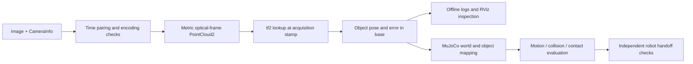

# 10 | Connecting 3D perception to ROS2 and MuJoCo

[中文](../10_ros2_mujoco.md) · [Home](../../README.en.md) · Prerequisites: [08 Frames and calibration](08_robot_frames_calibration.md), [09 Perception to action](09_robot_perception_action.md)

> Documentation checked: 2026-10-03. All ROS2, NumPy, cv_bridge, and MuJoCo snippets are syntax/documentation examples only, not executed. No dependencies were installed and no robot was connected or commanded. See [VALIDATION.en.md](../../VALIDATION.en.md) for standard-library offline execution records.

## 1. Start offline, then connect messages and physics

The goal is a checkable interface: camera messages → metric point cloud → robot coordinates at a specified time → object/tool poses → simulation replay and evaluation. ROS2 supplies messaging, clocks, and coordinate relationships. MuJoCo simulates motion and contact under a supplied model. Mass, friction, and controller parameters need separate measurement.



Run the standard-library frame/depth exercises in [08](08_robot_frames_calibration.md), then:

```bash
python3 examples/grasp_pose_demo.py
```

Input consists of a synthetic object pose, relative grasp pose, and tool mounting offset. Output checks TCP/flange transforms. This does not solve IK, plan trajectories, or send control commands.

## 2. Software and version contract

Python interfaces here follow the **ROS2 Jazzy API branch**. Jazzy lists Ubuntu 24.04 on amd64/arm64 as Tier 1; this does not establish support for every camera or robot driver. Match distribution, OS, Python, RMW, drivers, messages, and tf2. Do not mechanically combine Rolling and other distribution examples. [Official REP-2000 platform matrix](https://raw.githubusercontent.com/ros-infrastructure/rep/master/rep-2000.rst)

| Software | Responsibility | Record |
|---|---|---|
| ROS2 / `rclpy` / `sensor_msgs` | Nodes and messages | Distribution, OS, RMW, package versions |
| `image_geometry` / `cv_bridge` / `image_pipeline` | Image decoding, camera models, rectification | Encoding, raw/rectified, ROI, registration |
| `tf2_ros` / `tf2_sensor_msgs` | Coordinate transport at specified times | Frame tree, static calibration, cache coverage |
| `sensor_msgs_py` | PointCloud2 serialization and parsing | Fields, types, strides, invalid-value policy |
| Official MuJoCo `mujoco` Python package | MJCF models and simulation | Exact version, XML/assets, timestep/solver |

There is no universal installation command here. Check the target distribution and hardware driver instructions. MuJoCo's online `stable` pages change: record the installed version and consult its matching documentation. A feature in current online documentation is not a promise about every installed version.

## 3. Three messages, three sets of checks

### `sensor_msgs/Image`

`header.stamp` is acquisition time; `header.frame_id` should identify the matching optical frame. `height,width,encoding,is_bigendian,step,data` define the pixel layout. Do not treat arbitrary `data` as contiguous floats: rows can have padding and encodings differ. Reject an Image/CameraInfo frame mismatch for investigation. [Official Image definition](https://raw.githubusercontent.com/ros2/common_interfaces/jazzy/sensor_msgs/msg/Image.msg)

REP-118 specifies canonical 32-bit floating depth along optical Z in meters. Its OpenNI unsigned 16-bit representation uses millimeters and zero as invalid. Real drivers may declare device-specific scales: `16UC1` identifies storage, so still check the driver contract. [Official REP-118 source](https://raw.githubusercontent.com/ros-infrastructure/rep/master/rep-0118.rst)

**cv_bridge + NumPy syntax/documentation only; not executed.** Input is a depth Image with a confirmed unit contract; output is a metric 2D array and validity mask:

```python
import numpy as np
from cv_bridge import CvBridge

bridge = CvBridge()

def decode_depth(msg, uint16_scale_m):
    raw = bridge.imgmsg_to_cv2(msg, desired_encoding="passthrough")
    if msg.encoding == "32FC1":
        z_m = raw.astype(np.float32)  # Interface assumes float depth is meters
    elif msg.encoding == "16UC1":
        if not np.isfinite(uint16_scale_m) or uint16_scale_m <= 0:
            raise ValueError("missing/invalid driver depth scale")
        z_m = raw.astype(np.float32) * uint16_scale_m
    else:
        raise ValueError(f"unsupported depth encoding: {msg.encoding}")
    valid = np.isfinite(z_m) & (z_m > 0)
    return z_m, valid
```

Use `uint16_scale_m=0.001` only after confirming millimeter raw values. Apply the device's valid-range limits as well. Invalid pixels should not become nearby obstacles or trusted surfaces.

### `sensor_msgs/CameraInfo`

Raw images use `k` and matching `d/distortion_model`; rectified images use effective intrinsics from `p`, with correct treatment of `r`, ROI, and binning. `k[0]==0` can indicate an uncalibrated camera. Reject reliable metric reconstruction using missing calibration. RGB intrinsics do not apply to unregistered depth pixels. [Official CameraInfo definition](https://raw.githubusercontent.com/ros2/common_interfaces/jazzy/sensor_msgs/msg/CameraInfo.msg)

This minimum unprojection is **NumPy + ROS2 syntax/documentation only; not executed**. It applies only to aligned monocular rectified depth, without ROI/binning and with `p[3]=p[7]=0`. Other modes need a validated camera model. Reuse NumPy from the previous snippet:

```python
from sensor_msgs_py.point_cloud2 import create_cloud_xyz32
from std_msgs.msg import Header

def rectified_cloud(depth_msg, info, z_m, valid):
    if (not depth_msg.header.frame_id
            or depth_msg.header.frame_id != info.header.frame_id):
        raise ValueError("Image/CameraInfo frame mismatch")
    if (z_m.shape != (info.height, info.width) or valid.shape != z_m.shape
            or not np.isfinite(info.k[0]) or info.k[0] <= 0):
        raise ValueError("image size or calibration mismatch")
    if info.binning_x not in (0, 1) or info.binning_y not in (0, 1):
        raise ValueError("this example does not handle binning")
    if info.roi.width or info.roi.height or info.p[3] or info.p[7]:
        raise ValueError("this example requires full-frame monocular P")
    fx, fy, cx, cy = info.p[0], info.p[5], info.p[2], info.p[6]
    if not np.isfinite([fx, fy, cx, cy]).all() or fx <= 0 or fy <= 0:
        raise ValueError("invalid rectified focal length")
    v, u = np.nonzero(valid)
    z = z_m[v, u]
    xyz = np.column_stack(((u-cx)*z/fx, (v-cy)*z/fy, z))
    header = Header(stamp=depth_msg.header.stamp,
                    frame_id=depth_msg.header.frame_id)
    return create_cloud_xyz32(header, xyz)
```

Pair acquisition times before calling this function; it does not implement synchronization. If rectification changes the coordinate frame, the emitted frame name must identify that rectified frame. Do not label rotated coordinates with an unrelated unrotated optical frame.

### `sensor_msgs/PointCloud2`

PointCloud2 is a binary message with `fields`, `point_step`, `row_step`, endianness, and a header. Do not assume every point occupies 12 bytes. Organized clouds can have height>1; filtering/rebuilding can discard pixel indexing. `is_dense` does not replace checking actual validity. [Official PointCloud2 definition](https://raw.githubusercontent.com/ros2/common_interfaces/jazzy/sensor_msgs/msg/PointCloud2.msg)

Parse with `sensor_msgs_py.point_cloud2`. The checked Jazzy Python `read_points` implementation returns a structured NumPy array; some older examples expect a generator. Verify the installed API. [Official Python point-cloud utilities](https://raw.githubusercontent.com/ros2/common_interfaces/jazzy/sensor_msgs_py/sensor_msgs_py/point_cloud2.py)

## 4. Synchronization, QoS, and the tf tree

RGB, depth, CameraInfo, and robot states require a time contract. Exact synchronization pairs matching stamps. Approximate synchronization admits an explicit time window but does not correct clock offsets. Map clocks to a common basis before pairing, and record the actual paired offset. [Official message_filters Jazzy implementation](https://raw.githubusercontent.com/ros2/message_filters/jazzy/src/message_filters/__init__.py)

Pair per-frame CameraInfo with its image when the driver publishes it that way. For cached static calibration, validate frame, mode, resolution, and calibration version. Earlier publication does not automatically invalidate fixed intrinsics, but mode changes can.

Sensor QoS commonly uses best effort with a bounded queue. A reliable subscriber can fail to receive from a best-effort publisher. Synchronizer inputs also need compatible QoS; overly deep queues increase age. Inspect actual publisher/subscriber settings. [Official QoS documentation source](https://raw.githubusercontent.com/ros2/ros2_documentation/jazzy/source/Concepts/Intermediate/About-Quality-of-Service-Settings.rst)

Keep one parent per frame and one owner per published transform:

```text
base_link --dynamic--> flange --fixed calibration--> camera_link --fixed--> camera_optical_frame
                                   or
base_link --fixed calibration--> camera_link --fixed--> camera_optical_frame
```

End-frame-to-camera mounting can be static; moving base-to-end-frame transforms need time-stamped updates. In ROS TransformStamped, parent=`header.frame_id`, child=`child_frame_id` corresponds to this book's `T_parent_child`. Avoid including optical-axis conversion in both the mounting calibration and a second tf edge.

For an explicit bridge, let G=`flange`, C=`camera_optical_frame`, and L=`camera_link`. Eye-in-hand calibration in [08](08_robot_frames_calibration.md) returns `T_G_C`. If the driver already supplies `T_L_C`, publish the mounting edge as:

```text
T_G_L = T_G_C inverse(T_L_C)
Check: T_G_L T_L_C = T_G_C
```

The G→L→C chain then equals the calibration result. If L is omitted and C has no existing parent, publishing `T_G_C` directly as G→C is also possible; never assign two parents to C. For eye-to-hand, use the same bridge: `T_B_L = T_B_C inverse(T_L_C)`.

## 5. Transport a point cloud at acquisition time

`lookup_transform(target, source, time)` supplies `T_target_source(time)`. Zero time requests latest. A moving camera requires the image/cloud acquisition stamp, rather than `Time()`. [Official tf2 Buffer Jazzy API](https://raw.githubusercontent.com/ros2/geometry2/jazzy/tf2_ros_py/tf2_ros/buffer.py)

**ROS2 syntax/documentation only; not executed.** Input is an existing metric optical-frame point cloud; output is a base-frame cloud at the same acquisition time. Missing TF causes a drop. A production pipeline can use bounded queuing or asynchronous waiting, with age checked again afterward. The 200 ms limit is a teaching configuration, not a universal robot threshold.

```python
import rclpy
from rclpy.node import Node
from rclpy.time import Time
from rclpy.duration import Duration
from rclpy.qos import qos_profile_sensor_data
from sensor_msgs.msg import PointCloud2
from tf2_ros import Buffer, TransformListener, TransformException
from tf2_sensor_msgs.tf2_sensor_msgs import do_transform_cloud

class CloudTransport(Node):
    def __init__(self):
        super().__init__("cloud_transport_demo")
        self.buffer = Buffer(node=self)
        self.listener = TransformListener(self.buffer, self)
        self.pub = self.create_publisher(
            PointCloud2, "/perception/cloud_base", qos_profile_sensor_data)
        self.sub = self.create_subscription(
            PointCloud2, "/camera/points", self.on_cloud,
            qos_profile_sensor_data)
        self.last_now_ns = None

    def on_cloud(self, msg):
        now_ns = self.get_clock().now().nanoseconds
        reset = self.last_now_ns is not None and now_ns < self.last_now_ns
        self.last_now_ns = now_ns
        if reset:
            self.buffer.clear()
            self.get_logger().warning("clock reset: discard observation")
            return
        stamp = Time.from_msg(msg.header.stamp)
        age_ns = now_ns - stamp.nanoseconds
        if (not msg.header.frame_id or stamp.nanoseconds == 0
                or age_ns < 0 or age_ns > 200_000_000):
            self.get_logger().warning("missing, future, or stale input")
            return
        if not {"x", "y", "z"}.issubset({f.name for f in msg.fields}):
            self.get_logger().warning("missing xyz fields")
            return
        try:
            tf = self.buffer.lookup_transform(
                "base_link", msg.header.frame_id, stamp,
                timeout=Duration(seconds=0.0))
        except TransformException as exc:
            self.get_logger().warning(f"drop: transform unavailable: {exc}")
            return
        out = do_transform_cloud(msg, tf)
        out.header.frame_id = "base_link"
        out.header.stamp = msg.header.stamp  # Preserve observation time
        self.pub.publish(out)

# Only usable in an existing Jazzy environment; not executed here.
def main():
    rclpy.init()
    node = CloudTransport()
    try:
        rclpy.spin(node)
    finally:
        node.destroy_node()
        rclpy.shutdown()
```

A zero acquisition stamp can be valid at simulation startup but tf2 interprets it as latest, so this teaching interface waits for nonzero simulation time. Node clock and message stamps must share a domain: bags/simulation use `use_sim_time` and `/clock`; hardware needs clock mapping. After backward jumps, also clear image-pair queues, tracker history, and pending actions; reacquire static/dynamic TF and calibration state. This snippet only covers cloud/TF handling.

`do_transform_cloud` transforms xyz while retaining other fields. Normals or velocity vectors need their own rotations; the helper does not perform every semantic conversion. [Official tf2_sensor_msgs implementation](https://raw.githubusercontent.com/ros2/geometry2/jazzy/tf2_sensor_msgs/tf2_sensor_msgs/tf2_sensor_msgs.py)

For one `PointStamped`, fill the original optical frame and acquisition stamp, query `base_link ← optical`, and use `tf2_geometry_msgs.do_transform_point`, preserving observation time. Changing only the header does not transform coordinates. Transforming an old point into a moving body “now” is a different operation: define source/target times, a fixed world frame, and assumptions about object motion. An exact-stamp TF lookup does not predict object motion.

## 6. MuJoCo assets, bodies, and geoms

| Element | Role | Integration requirement |
|---|---|---|
| `<asset><mesh>` | Reusable triangulated resource | Scale, license, local origin, normals |
| `<body>` | Local kinematic frame and inertial carrier | Parent, joints, object pose |
| `<geom>` | Appearance/collision shape or resource instance | Body-relative pose and collision selection |
| `<inertial>` | Mass, center of mass, inertia | Independent measurement or stated estimate |
| `<site>` | Tool/target/sensor reference | Not physical collision geometry |

Standard mesh collisions use the mesh's **convex hull**, while rendering can show the nonconvex mesh. Cup openings, tray recesses, and finger gaps can be filled by that hull. Represent collision with multiple convex pieces or primitives and inspect critical clearances. SDF plugins have separate requirements; their existence does not make ordinary triangle meshes accurate concave colliders. [Official collision/decomposition documentation](https://mujoco.readthedocs.io/en/stable/computation/index.html#collision-detection)

MJCF body `pos/quat` is relative to its parent; geom pose is relative to its body. Asset scaling changes geometry, not every robot length or mass parameter. Mesh compilation includes centering and inertia-axis processing; account for compiler offsets when combining source vertices and runtime poses. Box `size` contains half dimensions. [Official XML mesh/geom/body definitions](https://mujoco.readthedocs.io/en/stable/XMLreference.html)

### Before importing a ROS pose

```text
T_world_object = T_world_base T_base_object
T_world_geom = T_world_object T_object_geom
```

Measure or explicitly define `T_world_base`; base coordinates are not automatically world coordinates. Identify the offset between the perception object's origin and the simulation body's origin. MuJoCo `quat` order is **w x y z**; ROS Quaternion fields are commonly assembled as **x y z w**. Read named fields, reorder, normalize, and reject near-zero/nonfinite quaternions. q and −q describe the same rotation. [Official MuJoCo orientation documentation](https://mujoco.readthedocs.io/en/stable/modeling.html#frame-orientations)

## 7. Minimum mocap replay: a kinematic check

[examples/mujoco_pose_demo.xml](../../examples/mujoco_pose_demo.xml) is an optional MJCF documentation example, **not compiled or run by MuJoCo**. Mocap bodies must be world children without joints; their poses come from `data.mocap_pos/quat`. Their position is prescribed, so following a target does not validate a controller, mass, or contact model.

This independent model is **MuJoCo MJCF syntax/documentation only; not executed**. Blue visual and transparent collision boxes share one body. Explicit inertia prevents visual geometry from duplicating mass contributions:

```xml
<mujoco model="pose_replay_demo">
  <compiler angle="radian" inertiafromgeom="auto"/>
  <option timestep="0.002" gravity="0 0 -9.81"/>
  <worldbody>
    <geom name="floor" type="plane" size="1 1 0.1"/>
    <body name="tracked_object" mocap="true" pos="0.4 0 0.2">
      <inertial pos="0 0 0" mass="0.1"
                diaginertia="0.00003 0.00003 0.00003"/>
      <geom name="object_visual" type="box" size="0.03 0.02 0.02"
            contype="0" conaffinity="0" group="2" rgba="0.2 0.6 1 1"/>
      <geom name="object_collision" type="box" size="0.03 0.02 0.02"
            contype="1" conaffinity="1" group="3" rgba="1 0.2 0.2 0"
            friction="0.6 0.005 0.0001"/>
    </body>
  </worldbody>
</mujoco>
```

Explicit `<contact><pair>` can separately enable contact; do not reference visual geoms there if they should never collide. Groups help visualization and do not replace collision flags. Mass, friction, and timestep values here are teaching placeholders. Floor/mocap geometry replay is not a dynamics/contact benchmark.

**MuJoCo syntax/documentation only; not executed.** Input is the repository XML with `tracked_object`, and a prescribed offline trajectory already expressed in world coordinates:

```python
import math
import mujoco

model = mujoco.MjModel.from_xml_path("examples/mujoco_pose_demo.xml")
data = mujoco.MjData(model)
body_id = mujoco.mj_name2id(model, mujoco.mjtObj.mjOBJ_BODY, "tracked_object")
if body_id < 0:
    raise ValueError("tracked_object not found")
mocap_id = int(model.body_mocapid[body_id])
if mocap_id < 0:
    raise ValueError("body is not mocap")

for k in range(500):
    t = k * model.opt.timestep
    data.mocap_pos[mocap_id] = [0.4, 0.05 * math.sin(t), 0.2]
    data.mocap_quat[mocap_id] = [1.0, 0.0, 0.0, 0.0]  # wxyz
    mujoco.mj_step(model, data)
mujoco.mj_forward(model, data)  # Derived quantities at final state
final_pos = data.xpos[body_id].copy()
print(final_pos)
```

`mj_forward` updates derived quantities at the current state without advancing time; `mj_step` advances simulation. Copy logged arrays because views can change with the simulation. [Official Python API](https://mujoco.readthedocs.io/en/stable/python.html)

For free-object falling, sliding, or grasping, use a dynamic body with appropriate joints and inertia, driven through the actual actuator/controller. Mocap can supply a reference target; repeatedly overwriting the evaluated dynamic object's pose defeats that evaluation. Driving a prescribed kinematic object into others without force feedback can produce unrealistic contact.

## 8. Measure more than appearance

Check units, origins, axes, tool length, and visual/collision geometry before dynamics. NeRF, 3DGS, MANO, and other visual assets do not automatically supply identified mass, inertia, friction, or actuator parameters.

| Layer | Record | Reproducible experiment |
|---|---|---|
| Pose transport | Translation/angle error, latency, rejection reasons | Unit axes, fixed points, moving-camera replay |
| Collision | Clearance, penetration, contacting geom pair | Recesses, table edges, gaps between fingers |
| Dynamics | Center of mass, mass, falling/sliding trajectory | Known object mass and independent measurements |
| Control | Tracking error, saturation, settling time | Multiple starts and payloads |
| Task | Success rate, failure types, trial count | Held-out poses and friction/mass/extrinsic/latency perturbations |

MuJoCo's three `friction` values govern sliding, torsional, and rolling behavior; `condim` determines contact dimensions, and `solref/solimp` shape constraint dynamics. Compare smaller timesteps to detect numerical sensitivity. Vary parameters around measured values and uncertainty intervals; tuning until visible penetration disappears is not parameter identification. [Official contact parameter explanation](https://mujoco.readthedocs.io/en/stable/modeling.html#solver-parameters)

`data.ncon` counts current contacts; contact count does not prove stable grasping or measured force. `mj_contactForce(model,data,contact_id,result6)` returns force/torque in the **contact frame**. Transform it before comparison with world/sensor-frame measurements, and verify contact ordering and signs. [Official mj_contactForce API](https://mujoco.readthedocs.io/en/stable/APIreference/APIfunctions.html#mj-contactforce)

Save model/asset versions, random seed, sensor/control rates, solver/timestep, input logs, evaluation scripts, and failures. Simulation time differs from wall time. Perception, control, and publication rates can differ, so define interpolation and maximum delays at each boundary.

## 9. Handoff from offline work to a real robot

Progress through synthetic calculations → recorded-data replay → RViz/tf alignment → simulation geometry/contact evaluation → independent physical measurements → constrained robot trials. Keep logs that allow each step to be revisited.

The handoff contract includes `T_base_tcp` or the controller's required flange pose, units/quaternion order, acquisition stamp, target expiry, error bound, and tool version. Pose alone still requires IK, path/environment collision checks, joint/velocity/acceleration limits, and the controller's execution/feedback interface. See [09](09_robot_perception_action.md).

Start hardware trials with independently measured static targets, small low-speed paths, and a defined workspace. Verify emergency/normal stopping, target-expiry rejection, and the response to sensor loss. Keep clearance for unknown occluded regions. A mocap replay pose is not an actuator command; these examples contain no hardware-control interface.

## 10. Troubleshooting and exercises

| Symptom | Investigation order |
|---|---|
| Topic exists but callback is silent | QoS, namespace, type, synchronization queue |
| TF extrapolation error | Stamp/clock domain, cache, publication delay, replay clock |
| Point-cloud trails during motion | Latest lookup, pairing offset, rolling shutter, latency |
| Correct depth shape, wrong scale | Encoding, driver scale, duplicate mm-to-m conversion |
| Image/cloud centers disagree | Raw/rectified, ROI/binning, RGB-depth registration |
| MuJoCo orientation is wrong | xyzw/wxyz, local parent frame, optical conversion |
| Cup opening filled or fingers touch empty space | Mesh convex hull, coarse collision model |
| Simulation grasps work but real objects slip | Parameter identification, controller, unmodeled contact and uncertainty |

1. Write topic contracts covering type, frame, units, acquisition time, QoS, and maximum age.
2. Inject missing TF, stale stamps, zero/NaN depth, and clock rollback; identify states to reject/reset and explain why.
3. Convert identity ROS quaternion `(x,y,z,w)=(0,0,0,1)` to MuJoCo; then check unit-axis rotation for +90° about z.
4. Draw a U-shaped object and compare one mesh hull against three collision boxes. Mark visually plausible yet physically wrong regions.
5. Design a free-object sliding experiment with mass, friction, timestep, initial velocity, and measurement error. Explain why mocap tracking cannot validate it.

Completion means messages have traceable frame+stamp+units, invalid observations are rejected, and every simulation asset has checkable visual, collision, and dynamics assumptions. Return to [09 Perception to action](09_robot_perception_action.md) to combine the workflow.
